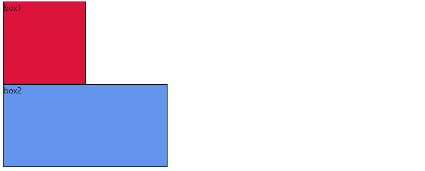

# HTML

+ [공식문서(mozilla)](https://developer.mozilla.org/ko/)

## 1. HTML 이란

+ **HTML** 은 Hyper Text Markup Language 로 웹페이지를 구조화(작성)하기 위한 언어 ([공식문서](https://developer.mozilla.org/ko/docs/Web/HTML))
+ **Hyper Text** : 하이퍼링크를 클릭을 통해 문서 간 이동이 가능한 Text
+ **Markup Language** : 태그 등을 이용해 문서나 데이터 구조를 명시하는 언어 (HTML, Markdown 등) 
  + markdown : #, ##, ###, +, 1. 등
  + HTML :  \<head> \</head> ,  \<body>, \<footer> \<h1> 등


### [1] 웹표준

#### (1) 현재의 웹표준

+ 현재의 웹표준은 **구조 + 디자인 + 기능**을 명확히 구분해서 작성하도록 되어있음

  + **구조** : HTML로 내용작성. (여기는 로고, 여기는 검색창, 여기는 이미지 등)
  + **디자인** : CSS로 작성. (글자는 녹색, 전체 크기는 브라우저의 xx%, 중간에 위치 등)
  + **기능** : Javascript로 작성. (클릭이나 새로고침 등의 사용자 행동에 대해, 브라우저가 어떻게 동작해야 하는지)

+ HTML이 표준 이름이고, HTML5는 버전이름이지만, 통합된 첫 HTML의 의미라서 버전으로(HTML5)로 나타내는 경우도 있음

  + 현재 HTML이란 모두 HTML5를 의미함

  


#### (2) 브라우저 / 역사

+  HTML 문서를 브라우저가 해석한 화면이 우리가 보는 화면

+ 여러 브라우저(chrome, edge, firerfox, safary) 회사들이 독립적으로 HTML을 발전시키기 시작하여, 서로간에 호환이 안되는 문제 발생

  + W3C(World Wide Web Consortium) 에서 HTML 표준을 정의

  + W3C의 HTML 정의가 신기술 개발 속도를 따라갈 수 없어서, **WHATWG**가 만들어지고, 이의 HTML 정의가 표준이 됨

    

#### (3) 개발환경설정 및 크롬개발자도구

+ Vscode의 확장프로그램

  + **Open in browser** : HTML 파일을 브라우저에서 쉽게 열기 위한 확장 프로그램 (alt +b)

  + **Auto rename tag** : 태그 수정 시 일치하는 태그도 한 번에 수정하기 위한 확장 프로그램

  + **Highlight matching tage** : 일치하는 태그를 하이라이팅 해주는 확장 프로그램

    

+ 크롬개발자도구

  + Elements : DOM 탐색과 CSS 확인 및 변경
    + Styles : 요소에 적용된 CSS 확인
    + Computed : 스타일이 적용된 최종 결과
    + Event Listeners : 해당 요소에 적용된 이벤트 (Javascript)
  + 그외 여럿
  + HTML로 작성된 내용만 브라우저에 보이도록 하는 코드
    + console에 ```document.head.parentNode.removeChild(document.head) ``` 입력 (헤드(디자인된부분) 지우라고 명령)


## 2. HTML 기본 구조

### [1] 요소 (Element)

+ HTML에서 시작/종료 태그(tag)와 그 사이 내용(contents)을 의미

+ 시작/종료 태그를 잘 확인해야 함 (잘못된 경우 오류를 반환하지 않음)

  

#### (1) 내용이 없는 태그

+ br, hr, img, input, link, meta


#### (2) 속성 (Attribute)

+ 요소의 시작 태그에 작성함

  + \<a href="url">\</a> : href가 속성명, url이 속성값

    

+ 태그와 상관없이 사용 가능한 속성 (HTML global attribute)도 있음

  + **id** : 문서 전체에서 유일한 고유 식별자 지정 ( 중복가능하지만 권장하지 않음 )
  + **class** : 공백으로 구분된 해당 요소의 클래스 목록
  + **data-\*** : 페이지에 개인 사용자 정의 데이터를 저장하기 위해 사용
  + style : inline 스타일
  + title : 요소에 대한 추가 정보 지정
  + tabindex : 요소의 탭 순서


### [2] 기본 구조

+ html : 문서의 최상위(root) 요소

+ head : 문서의 메타데이터 요소로 브라우저에 나타나지 않음

  + 문서 제목, 인코딩, 스타일, 외부파일 로딩

  + title : 브라우저 상단의 이름

  + meta : 문서 레벨 메타데이터 요소

  + link : 외부 리소스 연결 요소 (CSS 파일 등)

  + script : 스크립트 요소(JavaScript 파일/ 코드)

  + style : CSS 작성

    

+ body : 문서의 본문 요소로 실제 화면 구성 내용 

+ footer : 문서 전체나 섹션의 마지막 부분


### [3] DOM (Document Object Model) 트리

+ HTML 요소 (문서, Document) 를 브라우저에서 렌더링 하기 위한 구조 

+ 문서 객체 모델(The Document Object Model, 이하 DOM) 은 HTML, XML 문서의 프로그래밍 interface 이다. DOM은 문서의 구조화된 표현(structured representation)을 제공하며 프로그래밍 언어가 DOM 구조에 접근할 수 있는 방법을 제공하여 그들이 문서 구조, 스타일, 내용 등을 변경할 수 있게 돕는다  / [공식문서](https://developer.mozilla.org/ko/docs/Web/API/Document_Object_Model/Introduction) 참고

  

+ 참고

  + BOM (Browser Object Model) : 브라우저 전체 (주소창, 스크롤, 내용 등 모두)를 관리하기 위한 것


## 3. HTML 태그

### [1] 시맨틱 태그

+ 시맨틱은 의미라는 뜻으로, 이는 의미를 담아 놓은 태그를 의미
  + 기존의 블록영역 구분을 위한 div 태그를 대체
+ 검색엔진최적화(SEO) : 웹사이트가 검색 결과에 더 잘 보이도록 최적화하는 과정 ([공식문서](https://developer.mozilla.org/ko/docs/Glossary/SEO))
  + 이를 위해 시맨틱 태그를 잘 활용해야 함 : 색인(indexing)하길 원했던 콘텐츠만 크롤러가 긁어가게 됨


+ 종류
  + header : 문서 전체나 섹션의 머리말
  + nav
  + aside : 사이드에 위치한 공간 (메인 내용과 관련성 적은 내용)
  + section : 문서의 일반적인 구분, 컨텐츠의 그룹을 표현
  + article : 문서, 페이지, 사이트 안에서 독립적으로 구분되는 영역
  + footer : 문서 전체나 섹션의 마지막 부분


+ 시맨틱이 아닌 태그는 div, span 등


## 4. HTML 문서 구조화

+ 여러 관점의 요소로 볼 수 있음 (아래 요소들은 중복가능)


### [1] 블럭/인라인 요소


### [2] 텍스트 요소

| 태그             | 설명                                                         |
| ---------------- | ------------------------------------------------------------ |
| ```a```          | ```href``` 속성을 활용하여 다른 URL로 연결하는 하이퍼링크 생성 |
| ```b / strong``` | 볼드 / 강조하고자 하는 요소                                  |
| ```i / em```     | 이탤릭 / 강조하고자 하는 요소                                |
| ```br```         | 텍스트 내 줄바꿈                                             |
| ```img```        | ```src``` 속성을 이용해 이미지 표현                          |
| ```span```       | 의미 없는 인라인 컨테이너 (```div```는 블록 컨테이너)        |
|                  |                                                              |


### [3] 그룹컨텐츠

| 태그             | 설명                                                    |
| ---------------- | ------------------------------------------------------- |
| ```p```          | 하나의 문단 (paragraph)                                 |
| ```hr```         | 수평선 ( 문단 레벨 요소에서의 주제의 분리 )             |
| ```ol```         | 순서 있는 리스트                                        |
| ```ul```         | 순서 없는 리스트                                        |
| ```pre```        | HTML에 작성한 내용을 그대로 표현                        |
| ```blockquote``` | 텍스트가 긴 인용문으로 주로 들여쓰기를 한 것으로 표현됨 |
| ```div```        | 의미 없는 블록 레벨 컨테이너                            |


### [4] Table

#### (1) 큰 영역

+ ```thead``` (header) : 내용들의 이름을 나타내는 태그
+ ```tbody``` (body) : 내용 값들있는 부분을 나타내는 태그
+ `tfoot` (footer) : 총계와 같은 것이 있는 마지막 부분을 나타내는 태그


#### (2) 세부 영역(구성)

+ `tr` : 행 작성

+ `td` : 열 작성으로 tr 태그 내부에 원하는 열 개수만큼 작성

  + ```<td colspan="2">``` 와 같 	이 속성을 이용해, 여러 열을 하나로 만들 수 있음

+ `th` : thead 작성시 td 대신 활용

+ `caption` : table의 제목

+ 예시

  ```HTML
  <table>
      <thead>
      	<tr>
          	<th> 이름 </th>
              <th> 과목 </th>
              <th> 점수 </th>
          </tr>
      </thead>
  
      
      <tbody>
          <tr>
              <td> 김철수 </td>
              <td> 수학 </td>
              <td> 100 </td>
      	</tr>
      </tbody>
      
      
      <tfoot>
      	<tr>
          	<td> 평균 </td>
              <td colspan="2"> 100 </td>
          </tr>
      </tfoot>
      
  </table>
  ```

  

  

+ ### [5] form (상당히 중요)

+ form 요소는 사용자로부터 입력받은 정보를 서버로 제출하기 위한 요소(영역)


#### (1) 기본속성

+ action : form 을 처리할 서버의 URL

+ method : form을 제출할 때 사용할 HTTP 메서드 ( GET/POST )

  + POST : 내용 감출 때 이용 ( 우리가 입력한 내용이 주소창에 그대로 적혀지는데 이를 가리는 것 )

    

+ enctype : method가 post인 경우 데이터의 유형 (내가 서버로 전송하려고 하는 데이터들을 어떤 형태로 encoding을 해서 보내줄 것인가)

  + application/x-www-form-urlencoded : 기본값

  + multipart/form-data : 파일 전송시 (input type이 file 인 경우)

    


### [6] input

#### (1) 속성

+ name : form control에 적용되는 이름 (name="value" 페어로 전송됨)

  + name 적어주면 쿼리스트링에 q=name(검색어)로 같이 들어감

+ value : form control에 적용되는 값 (name="value" 페어로 전송됨)

+ id : id도 지정 가능

+ placeholder : 입력 전 상자에 채워질 글

+ required, readonly, autofocus, autocomplete, disabled 등

+ type 

   | 값  |   설명 |
   |------|-----------|
   |submit | 제출버튼|
   


  

#### (2) form 과 input 예

```HTML
<form action="URL">
<input type="text" name="input value">
<input type="submit">
</form>
```


#### (3) input label
+ label의 for과 요소의 id를 일치시키면, 해당 label의 text 클릭시, 요소를 선택함
+ 
```html
<label for="id"> text </label>
<input id="id" type=text name="name" placeholder="입력해주세요">

```


#### (4) input 유형

placeholder


### [7] Select [문서](https://developer.mozilla.org/ko/docs/Web/HTML/Element/select)

+ 선택지 만들기
+ 


# CSS

## 1. CSS
+ CSS는 html 요소를 선택하고, 스타일을 지정함


### [1] CSS 구문
 + CSS는 선택자(Selector), 속성(property), 값(value) 로 이루어 짐

   + 선택자 : html 요소 선택
   + 속성 : 스타일 기능 종류 선택
   + 값 : 어떻게 스타일 기능을 변경할지 값 부여

  ```html
  example
  
  ```


### [2] CSS 정의 방법

### [3] 선택자 (Selector) 종류 및 심화까지

### [4] CSS 기본 스타일

#### (1) [크기단위](https://developer.mozilla.org/ko/docs/Learn/CSS/Building_blocks/Values_and_units)


#### (2) [font size](https://developer.mozilla.org/ko/docs/Web/CSS/font-size)


#### (3) 색상 등

+ [color](https://developer.mozilla.org/ko/docs/Web/CSS/color_value)


#### 


### [5] 


### [6]

## 2. CSS 원칙 1,2,3
+ Normal flow

### [1] Box model (원칙 1)
+ 모든 요소는 box model (직사각형)임
+ 위에서 아래로, 좌에서 우로 쌓임

#### (1) Box model 구성
+ contents
+ padding
+ border
+ margin

#### (2) 입력방식

+ 기본적으로 상우하좌 순인 시계방향으로 값을 설정해줘야 함

+ 4개 입력시 : 상우하좌(시계방향)
+ 3개 입력시 : 상 /좌우 /하 (확인필요)
+ 2개 입력시 : 상하 / 좌우
+ 1개 입력시 : 전체


#### (3) Size
+ Border-box : border까지 길이 총합
+ Content-box : content의 길이

+ 예


#### (4) Margin collapse (마진 병합)
+ 형제요소 간 : 위쪽 요소의 bottom margin과 아래 요소의 top margin 간의 상쇄 발생

+ 부모자식요소 간 : 


### [2] Display (원칙 2)


### [3] Position (원칙3)

#### (1) position :

+ static : position 속성을 지정해주지 않은 경우

+ relative : Normal flow 위치에서부터 상대적으로 움직임
+ absolute : static이 아닌 (position을 지정해준 부모요소) 가장 가까운 부모요소 기준으로 움직임 (Normal flow 벗어남)
+ fiex : 화면 상의 위치(viewport)를 기준으로 고정됨 (Normal flow 벗어남)


## 3. CSS Layout

### [1] Float

+ 지금은 잘 쓰이지 않음
+ 말 그대로 대상 요소를 부유(뜨게) 만듦

#### (1) 속성 / 값

+ ```float : left; ```  왼쪽으로 뜨게 함

+ ```float : right; ``` 오른쪽으로 뜨게 함

  

#### (2) float 후에 다음 줄부터 채우도록 하는 방법

+ 기본적으로 ```float : left``` 를 하면, 그 바로 뒤부터 대상이 채워짐

+ 아래 줄에 대상이 채워지게 하려면, 부모 요소를 만들어야 함

+ ```::after``` 이용

  ```html
  # sol 1
  .left{
  	float : left;
  }
  
  .clearfix::after{
  	display:block;
  	content="";
  	clear : both;
  }
  
  <div class = "clearfix">
      <div class="box left"> box1 </div>
  </div>
  	<div class="box left"> box2 </div>
  
  
  # sol 2 : 이렇게 하면, 부모요소의 높이가 0 이되어서, 부모요소의 border 같은 거 없어짐. 그래서 안쓰임
  .clear-left{
  	clear : left;
  }
  
  .left{
  	float : left;
  }
  <div>
     <div class="box left"> box1 </div> 
  </div>
     <div class="box clear-left"> box2</div>
  ```

  

#### (3) 특징

+ float가 적용되면 높이가 0이됨
+ 

### [2] flex

#### (1) justify-content

+ 각 줄 사이의 간격에 적용이 됨

+ 

#### (2) align-content

+ 각 줄 사이의 간격에 적용이 됨


#### (3) align-items

+ 전체 컨테이너 안에서 모든 요소들의 정렬에 적용이 됨
+ align-items-start : cross axis 를 기준으로 위에서 부터 채움
+ align-items-end : cross axis 를 기준으로 아래에서 부터 채움
+ align-items-center : cross axis 를 기준으로 중앙으로 정렬함
+ align-items-baseline : cross axis 를 텍스트 baseline에 기준
+ align-items-stretch : (기본값) cross axis를 기준으로 컨테이너를 가득채움


#### (4) flex-grow

+ 남은 영역을 아이템에 분배


#### (5) order


## 4. Bootstrap

+ ```color : primary, secondary, success, danger, warning, info, light, dark, link ``` / [색참고](https://getbootstrap.com/docs/5.1/components/buttons/)
+ 반드시 CDN Link를 불러와야 사용이 가능함 / [Download 공식문서](https://getbootstrap.com/docs/5.1/getting-started/download/)

```html
<link href="https://cdn.jsdelivr.net/npm/bootstrap@5.1.3/dist/css/bootstrap.min.css" rel="stylesheet" integrity="sha384-1BmE4kWBq78iYhFldvKuhfTAU6auU8tT94WrHftjDbrCEXSU1oBoqyl2QvZ6jIW3" crossorigin="anonymous">
<script src="https://cdn.jsdelivr.net/npm/bootstrap@5.1.3/dist/js/bootstrap.bundle.min.js" integrity="sha384-ka7Sk0Gln4gmtz2MlQnikT1wXgYsOg+OMhuP+IlRH9sENBO0LRn5q+8nbTov4+1p" crossorigin="anonymous"></script>
```

### [0] CSS 기본 코드

### (1) a

+ ``` <a class="btn btn-primary" href="#" role="button">Link</a> ```  : hre

#### (2) link

+ ```link : css``` 로 작성


#### (3) modal


### [1] Utilities

#### (1) [flex](https://getbootstrap.com/docs/5.1/utilities/flex/)

+ ```d-flex```  &rarr;  ```display : flex;``` 를 의미

+ ```justify-content-center``` & ```align-items-center```  &rarr; 상하좌우 가운데 정렬

+ ```justify-content-between(start, end, center, between, around, evenly)```

+ ```d-inline ( block )``` : inline ( block ) flex
+ ```flex-wrap( nowrap )-( reverse )``` : 칸이 꽉차면 다음 줄로 이동 ( 이동 x )-( 역순으로 배열 )
+ ```flex-row ( column )-( reverse )``` 주축 정렬


#### (2) [text](https://getbootstrap.com/docs/5.1/utilities/text/)

+ ```text-start(center, end)```

+ ```text-decoration-none(underline, line-through)``` &rarr; 데코 없애기 / 밑줄 / 중간에 줄
+ 

+ ```text-white ( primary, secondary, success, danger, warning, info, light, dark, link )```


#### (3) [font](https://getbootstrap.com/docs/5.1/utilities/text/#font-weight-and-italics)

+ ``` fw-bold( bolder, normal, light, lighter)```
+ ```fst-italic( normal )```
+ ```fs-1 ( 2, 3, 4, 5, 6 )``` : font size


### [2] Components

#### (1) [Bottons](https://getbootstrap.com/docs/5.1/components/buttons/)

+ ```btn``` : 버튼을 생성
+ ```btn-primary( secondary, success, danger, warning, info, light, dark, link )``` : 버튼 배경 색

+ ```btn-outline-primary( secondary, success, danger, warning, info, light, dark )``` : 버튼 테두리와 글씨 색
+ ```btn-lg( sm ) ``` : 버튼 크기를 크게 / 작게
+ ```disabled``` : 속성명에 적어주면 버튼 비활성화


#### (2) [Collapse](https://getbootstrap.com/docs/5.1/components/collapse/)

+ [예제](https://getbootstrap.com/docs/5.1/components/collapse/#example) 

  : 토글되는 content에 ```class="collapse", id=content_id```, 

   누르면 토글을 하는 버튼에 ```data-bs-toggle="collapse", href / data-bs-target= #content_id```

+ 


#### (3) [Badge](https://getbootstrap.com/docs/5.0/components/badge/#background-colors)

+ ```bg-color```


#### (4) [Card](https://getbootstrap.com/docs/4.0/components/card/)

### [3] Helpers

#### (1) [Position](https://getbootstrap.com/docs/5.1/helpers/position/#fixed-top)

+ ```fixed-top(bottom)``` : 상(하)에 고정 / Normal flow 잃어버림

+ ```sticky-top(bottom)``` : 상(하)에 고정 / 자신의 Normal flow만큼의 높이를 가지게 됨

### [4] Content

#### (1) [Typography](https://getbootstrap.com/docs/5.1/content/typography/)

+ ```display-1( 2, 3, 4, 5, 6)``` : heading element 작성시( 수가 작은 것이 큰 글자 )

+ ```list-unstyled``` : list의 각 item 들의 앞에 있는 o 없애줌


#### (2) [images](https://getbootstrap.com/docs/5.1/content/images/)

+ ```img-fluid``` : ```max-width:100%; height:auto;``` 와 같음


## 5. Bootstrap Grid System

+ Grid system 이란 요소들의 디자인과 배치에 도움을 주는 시스템
+ 기본요소로는
  + column : 실제 컨텐츠를 포함하는 부분
  + gutter : 컬럼 사이의 간격 (공간)
  + container : 컬럼들을 담고 있는 공간


### [1] Bootstrap Grid System

+ Bootstrap Grid System 은 flexbox로 제작됨

+ ```container, rows, column``` 으로 컨텐츠 배치 및 정렬

+ column : 12개 / grid breakpoints : 6개

  

#### (1) 기본코드

```html
<div class="container">
    <div class="row">
       <div class="col"> </div> 
       <div class="col"> </div> 
    </div>
</div>
```

+ 항상 ```row``` 가 ```col```을 감쌈
+ ```col-n``` 하면 column ( 컬럼 ) 이 12개중 n칸 크기만큼 차지함
+ ```offset-n``` 하면 n칸 띄운다는 의미
+ ```w-100``` 은 column ( 컬럼 ) 을 끊고 새로운 행 시작
+ ```row``` 를 새로 작성해서 column ( 컬럼 ) 을 끊고 새로운 행 시작하는 것 권장


#### (2) [breakpoints](https://getbootstrap.com/docs/5.0/layout/breakpoints/)

+ xs ( < 576px )

+ sm ( >=576px )

+ md ( >= 768px )

+ lg ( >= 992px )

+ xl ( >= 1200px )

+ xxl ( >= 1400px )

+ 예시코드

  ```html
  <div class="container">
      <div class="row">
         <div class="col-12 col-sm-6 col-md-4"> </div>
          제일 작은 경우 12칸 차지 /sm viewport에서 6칸 / md 에서 4칸 차지
         <div class="col"> </div> 
      </div>
  </div>
  ```
  
  
  
  

#### (3) row

+ ```class="row row-cols-n"``` 하면 한 row에 n개 컬럼씩 나오게 됨 (col에 하는 건 자리차지고/ 여기는 한줄에 표현되는 개수를 의미)
+ ```class="row row-cols-n row-cols-md-2 row-cols-lg-4"``` 하면 한 row에 n개 컬럼씩 나오게 됨 / md 이상이면 2개 / lg 이상이면 4개가 나오게 됨
+ 위의 방법으로 적을 경우 , 자식요소에 ```col``` 없어도 적용됨


#### (4) [offset](https://getbootstrap.com/docs/4.0/layout/grid/#offset-classes)

+ ```class="col-md-4 offset-md-4"``` 와 같이 같이 쓸 수 있음
  + offset 은 col 보다 앞에 적용됨 (위 처럼 뒤에 적어도 앞에 적용됨)