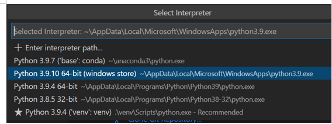
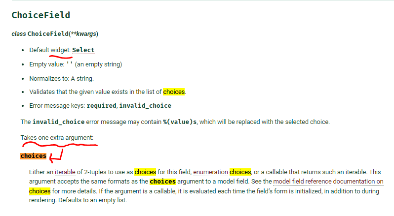
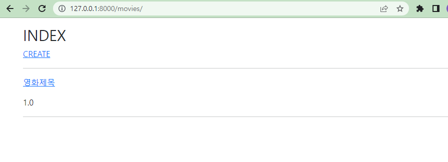
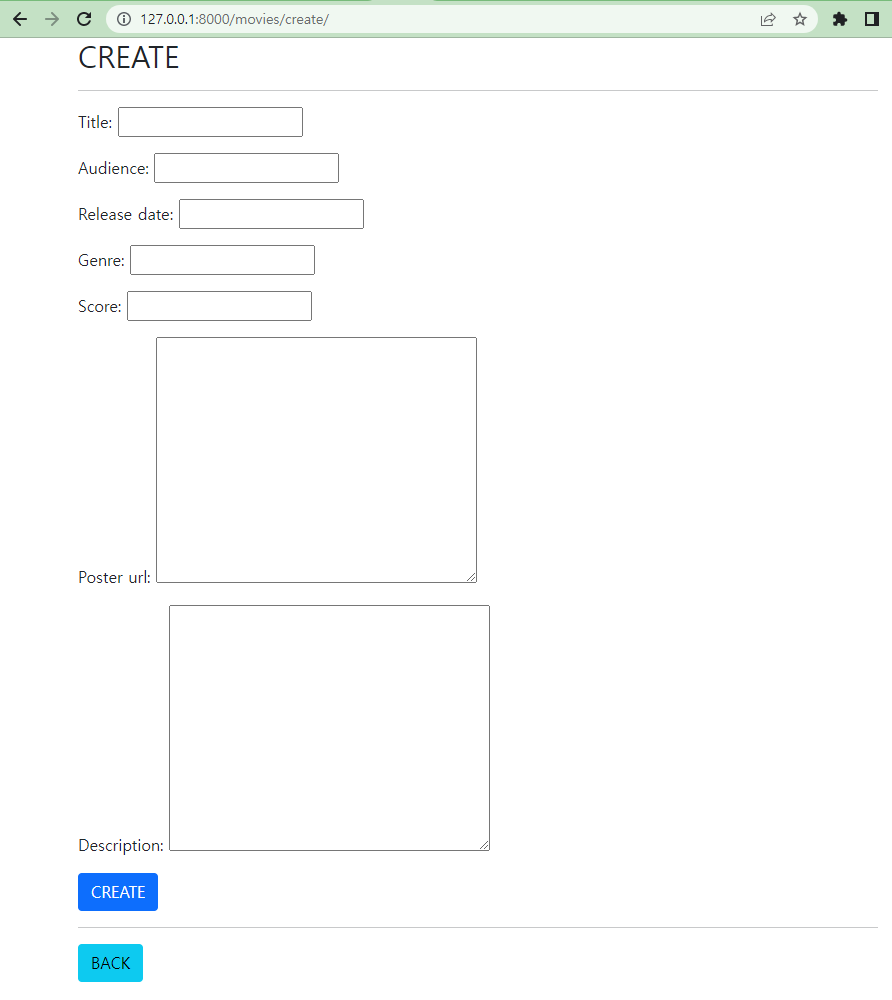
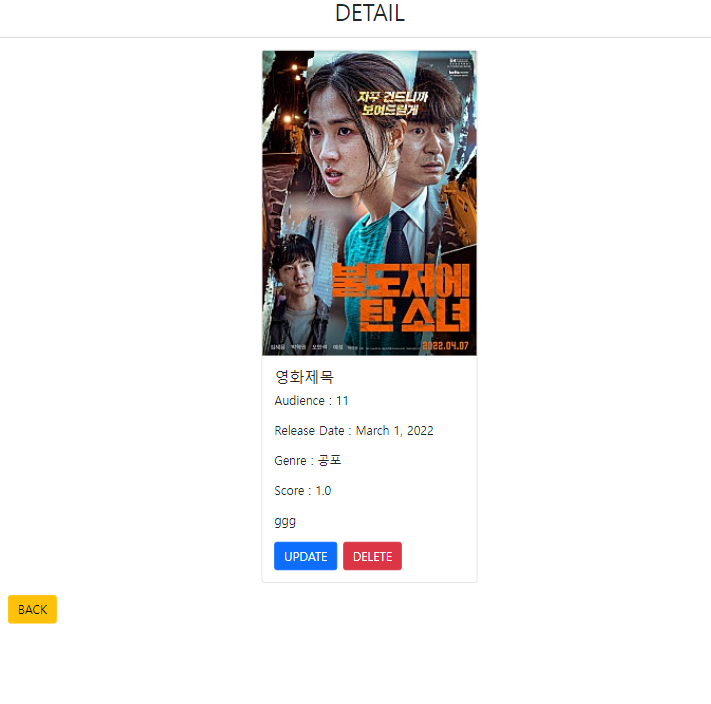
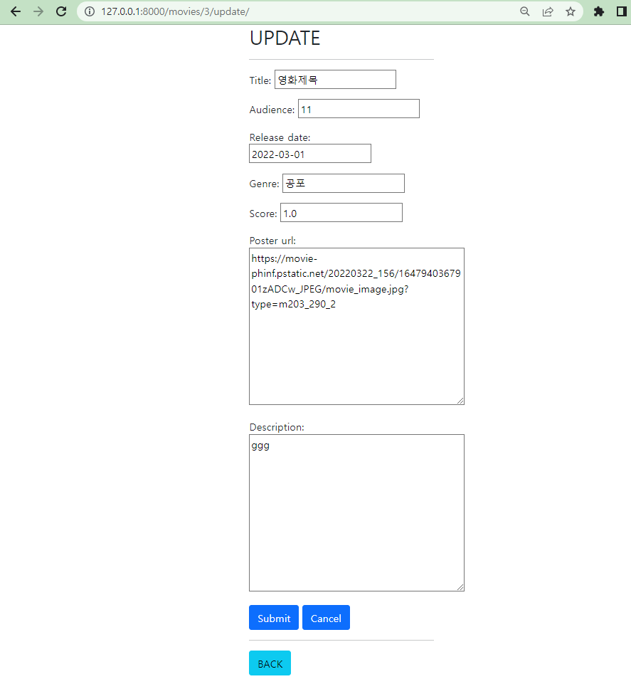
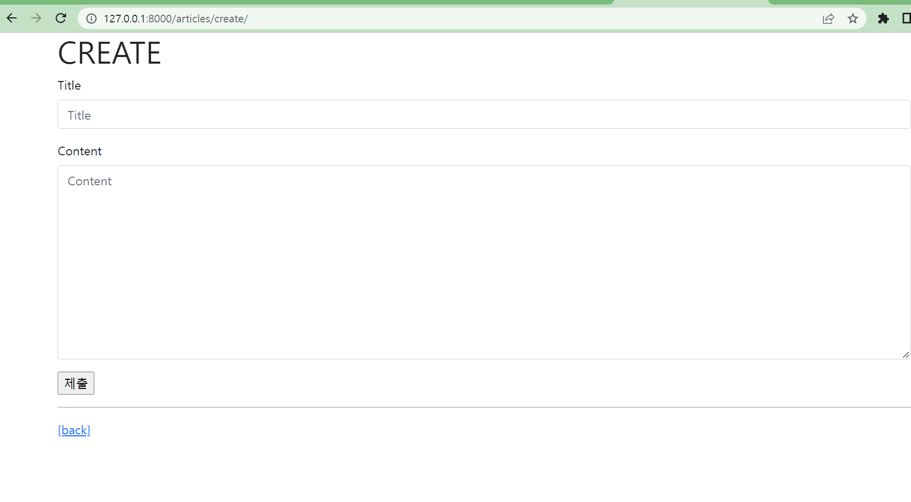

# 기초

## 1. 실행순서


+ **manage.py** 가 있는 곳이 BASE_DIR 이다.

```bash
# 1. 가상환경 활성화 in bash
python -m venv venv

source venv/Scripts/activate


```

+ 설치해야 하는 것들

```bash
$ pip install -r requirements.txt  # requirements.txt 에 패키지 정리되어있는 경우 진행
$ pip install django==3.2.12
$ pip install ipython
$ pip install django-extensions
```


```bash
th# 2. vs code에서 select interpreter

ctrl + shift + p -> python select interpreter 검색 후
별표 추천으로 뜨는 venv 를 선택
```



맨 아래 선택


```bash
# 3. 만약 requirements.txt 없다면, 장고 설치 in bash
pip install django==3.2.12

# 4. 프로젝트 생성
django-admin startproject projectname . # . 붙이면 상위폴더 없이 생성됨

# 5. django 서버 시작하기 (활성화)
python manage.py runserver

```


```bash
# 6. 앱 생성
python manage.py startapp appnames # appnames 는 복수형으로 작성

# 7. 앱 등록
# projectname/settings.py 에 들어가서
INSTALLED_APPS = [
# Local apps (우리가 만든 것)
'appnames',

#Third party apps (pip install 하는 것들)
''

# Djnago apps (기본 설치된 것들)
'기본설치된 것들',
]


```


```python
# 8. projectname(folder) urls 에 

## (1) application view 추가   / include 추가
from appnames import views
from django.urls import path, include

## (2) urlpatterns의 path에 articles(appname) & include 추가
path('articles/',include('articles.urls') ) # include의 기능은 articles/~ 라는 url 들어오면 뒷부분 ~ url 부분을 articles.urls 모듈로 보내서 처리함


# 9. articles 에 urls.py 생성 후
from django.urls import path
from . import views
# 처리해야할 목록
# articles/   : 모든 게시글 보여주기:index.html
# articles/new/ : 게시글 작성을 위한 양식 요청 new.html
# articles/create/ : 사용자가 작성한 내용을 DB에 저장
# articles/<int:pk>/ : pk에  해당하는 게시글 내용 보여주기 detail.html
app_name = 'articles'
urlpatterns = [
  path('',views.index,name='index'),
  path('new/',views.new,name='new'),
  path('create/',views.create,name='create'),
  path('<int:pk>/',views.detail,name='detail'),
]
# 여기서 path는 name으로 호출되는 경우 url을 내보내고, url을 받는 경우 views로 보내는 2가지 역할을 함
# app_name = articles로 해서 name_space를 만들어줌. 
# 그래서 여기의 name 들의 정확한 이름은 articles:index  / articles:new / articles:create 와 같음


```


```python
# 10. articles/views.py 작성

# 9에서 views.index 와 같이 사용한 함수들 만들어주기
from django.shortcuts import redirect, render
from .models import Article    #----------까먹지 말기

# Create your views here.
def index(request):
    #여기에서 DB의 게시글 데이터를 가져와야 합니다. 
    articles = Article.objects.all().order_by('-pk')
    context = {
        'articles' : articles
    }
    return render(request,'articles/index.html', context)

#사용자가 내용을 작성하기 위해 보여주는 양식
def new(request):
    return render(request,'articles/new.html')


#사용자가 작성한 내용을 저장하면 됩니다. 
def create(request):
    #사용자가 보낸 데이터를 받아서 DB에 저장
    # save()
    title = request.POST.get('title')
    content = request.POST.get('content')
    article = Article()
    article.title = title
    article.content = content
    article.save()
    # return render(request,'articles/index.html')
    return redirect('articles:index')


def detail(request,pk):
    #pk를 아니까.....DB에서 가져오기
    article = Article.objects.get(pk=pk)
    context ={
        'article' : article
    }
    return render(request,'articles/detail.html',context)
```


```html
# 11. html 파일 작성

## (1) BASE_DIR(manage.py가 있는 곳)에
template/base.html 생성 후 작성

  <title>CRUD App</title>
  <link href="https://cdn.jsdelivr.net/npm/bootstrap@5.1.3/dist/css/bootstrap.min.css" rel="stylesheet" integrity="sha384-1BmE4kWBq78iYhFldvKuhfTAU6auU8tT94WrHftjDbrCEXSU1oBoqyl2QvZ6jIW3" crossorigin="anonymous">
</head>
<body>
  <nav class="navbar navbar-expand-lg navbar-light bg-light">
   
  </nav>
  
  
  <script src="https://cdn.jsdelivr.net/npm/bootstrap@5.1.3/dist/js/bootstrap.bundle.min.js" integrity="sha384-ka7Sk0Gln4gmtz2MlQnikT1wXgYsOg+OMhuP+IlRH9sENBO0LRn5q+8nbTov4+1p" crossorigin="anonymous"></script>
</body>
</html>


## (2)
settings의 TEMPLATE=[ { 'DIRS':[BASE_DIR/'templates'] } ] 작성

## (3) 10에서 작성한 render의 2번째 성분에 template 요청한 부분들 html작성
articles/templates/articles/index.html


  # base.html을 읽게됨. 드러다 block 나오면 해당 html 문서의 해당 block 부분으로 이동

  <h1>Index 페이지 입니다.</h1>
  <h1>Articles</h1>
  <a href="  ">[새 글 쓰기]</a>    #url의 밖은 ""여야함.
  <hr>
  
    <p>글 번호 : {{ article.id }}</p>
    <p><a href="  ">글 제목 : {{ article.title }}</a></p>
     <p>글 내용 : {{ article.content }}</p> 
    <hr>
  




# 위 파일의 읽는 순서
# extends 'base.html' 하면 모든 app의 template 하위로 가서 base.html 찾게 되는데, 11.(2)에서 base.html이 저장되어 있는 곳도 찾아보도록 설정했음
# 그렇게 base.html 찾으면 base.html을 쭉~~ 읽게 됨.
# 그러다가 block 을 만나게되면, index.html에 해당 블록이 있는지 보고, 있다면, 그 블록 사이에 있는 것들을 읽게 됨. 그러다 index.html에서 block이 끝나면, 다시 base.html로 돌아와서 그 뒷부분을 읽게 됨.
# base.html에 block이 있지만 index.html에는 없는 경우, 그냥 넘어가게 됨.
```


+ 아래처럼 class 생성시 `from . import Article` 가능해짐 [models 참고](https://docs.djangoproject.com/en/4.0/topics/db/models/)

```python
# 12. models.py 작성
## Djangodb.models 모듈은 파이썬 object를 DB로 전송하기 위한 기능들 있는 모듈
## models.Model 은 ORM 역할을 할 수 있는 객체로 상위 CLASS/ 여러 method 저장되어있음
## 그래서 Article이 상속받아서 쓸 수 있다.

from turtle import title, update
from django.db import models

# Create your models here.
class Article(models.Model):     
    #필드 정의
    title = models.CharField(max_length=20)
    content = models.TextField()
    created_at = models.DateTimeField(auto_now_add=True)
    updated_at = models.DateTimeField(auto_now=True)

    

    def __str__(self) -> str:
        return self.title  # instance 이름 치면 해당 값 return 됨
```


```bash
# 13. migration

## (1) model.py 수정사항 migrations / migrate
$ python manage.py makemigrations  # 설계도 만들기 / Model.py에 쓴 것으로 SQL문 짜는 것이 makemigrations
$ python manage.py migrate         # 설계도를 DB에 반영


## (2) migration 된 것 확인
$ python manage.py showmigrations

## (3) migration 된 것 SQL문 확인
$ python manage.py sqlmigrate app_name 0001
```


+ 모델 class object(instance) 생성 가능한 코드

```python
# 1.
article = Article(title = 'title', content='content')
article.save()

# 2
article = Article()
article.title = 'title'
article.content='content'
article.save()

# 3.
Article.objects.create(title='title',content='content')

# 4
article = Article(1(int로된 id), 'title', 'content')
article.save()
```

+ model instance 가져오기

```python
# id=1 인 첫 instance 가져오기
# 1.
Article.objects.all()[0]
# 2.
Article.objects.all().first()
# 3.
Article.objects.all().get(id=1)
```


python shell

```bash
# 14. python object instance 생성과 이를 DB에 입력

## (0) python shell 실행위해 ipython, django extention 설치 및 등록
$ pip install ipython
$ pip install django-extensions

settings의
INSTALLED_APP = [
'django_extensions' ##------------------주의!!!! 여기 추가시 _ 언더바 이용
]#추가하기

## (1) python shell 실행
ipython, django extention설치 해 놓으면

`python manage.py shell_plus` 를 bash 에서 실행하면, models.py에 있는 class 들 모두 import 해서 Object를 생성할 수 있고, 이 Object를 DB에 입력할 수 있게 됨.

## (2) 생성명령어
article = Article(title='first_title',content='first_content') # Object instance 생성
article.save() # DB에 저장
article.delete() # DB에서 삭제?


## (3) 기타명령어
Article.object.all() # 해당 클래스 object instance 모두 보기
Article.object.all().order_by('-pk') # 역순으로 보기

Article.object.get(title='찾고자하는것') # object instance 1개만 있을 때 찾을 수 있음. pk로 이용권장
Article.object.get(pk='찾고자하는것')

Article.object.filter('get과같은방식') # 여러개 있어도 찾을 수 있음

```


+ 가능한 Django Model Field Type [문서](https://docs.djangoproject.com/en/4.0/ref/models/fields/)
  + CharField, TextField, IntegerField, FloatField, DateTimeField, DateField


```python
#사용자가 작성한 내용을 저장하면 됩니다. 
def create(request): # 해당 요청은 데이터를 DB에 저장하라는 것이지, 어떤 페이지를 보여달라는 것이 아님
    #사용자가 보낸 데이터를 받아서 DB에 저장
    # save()
    title = request.POST.get('title')
    content = request.POST.get('content')
    article = Article()
    article.title = title
    article.content = content
    article.save()
    # return render(request,'articles/index.html')  # 이걸로 return 하면 요청과 페이지가 안맞는 현상이 발생한다.(index페이지에 content 잘 안보이고, 주소창도 create로 되어있음)
    return redirect('articles:index')
    return redirect('articles:detail', article.pk) # 변수 넣는 법(variable routing)
# redirect : 브라우저가 새로운 요청을 만들도록 응답 / 여기서는 index page를 보여주기 위한 요청을 새로 만들어라. 그러면 create라는 url가 아닌 index라는 url을 새로 만들게 됨.
```


+ variable routing
  + url 주소를 변수처럼 이용하는 것
+ 구성요소
  + url path converters (이것들 없어도 작동함/그냥 알려주기 위한 것)
    + str, int,slug
    + `path('<int:pk>/',views.detail,name='detail'),`
      + `pk`가 변수명 선언한것
  +  `path('<int:pk>/',views.detail,name='detail'),` 입력 후, views에서 detail 함수에 pk 를 인자로 넣어줘야함 


+ 상세페이지보기
  + detail/?pageno=15 # detail 이란 url은 바뀌지 않음
  + variable routing   
    + articles/15 # 이건 url 자체가 변경됨
    + 모든 숫자에대해 새로 url 만들 수 없으므로, 해당 숫자를 variable로 보게 됨
    + `path('<int:pk>/',views.detail,name='detail'),`


+ variable routing 진행 순서

```django


  <h1>Index 페이지 입니다.</h1>
  <h1>Articles</h1>
  <a href="  ">[새 글 쓰기]</a>
  <hr>
  
    <p>글 번호 : {{ article.id }}</p>
    <p><a href="  ">글 제목 : {{ article.title }}</a></p>
     <p>글 내용 : {{ article.content }}</p> 
    <hr>
  

  
```

위에 a tag에 href 에 article.pk 넣어주면 이것이 app의 urls로 가고 거기서 `path('<int:pk>/',views.detail,name='detail'),` 로 가서  views로 감


+ 세부게시물 삭제하기 / 수정하기
+ delete.html 만들어야하는데, 여기에 어떤 게시글 삭제할 것인지 요청 같이 보내야 함
+ articles/pk/
+ articles/pk/delete   : 삭제
+ articles/pk/update : 수정


+ 삭제요청

+ 1. urls.py

  ```python
  app_name = 'articles'
  urlpatterns = [
    path('',views.index,name='index'),
    path('new/',views.new,name='new'),
    path('create/',views.create,name='create'),
    path('<int:pk>/',views.detail,name='detail'),
    path('<int:pk>/delete/',views.delete,name='delete'),  # 생성 1
  ]
  ```

+ 2. views.py

  ```python
  ```

  


+ GET & POST
  + form 이용해서 input의 정보 서버로 보낼 때, key-value pair로 보내지는데, input의 name 값이 key 값이다.

+ GET 은 서버에 정보 요청
+ POST 는 서버에 정보 전송


+ GET

  + 쿼리 형태로

  ```url
  http://127.0.0.1:8000/articles/new/?title=%EC%A0%9C%EB%AA%A9%EC%9E%85%EB%8B%88%EB%8B%A4%201111&content=%EB%82%B4%EC%9A%A9%EC%9E%85%EB%8B%88%EB%8B%A4.%201111
  ```

  주소창의 url 을 변경해서 하는 것은 모두 GET 요청임.(form method=GET, a tag의 href)

  

+  POST

  ```HTML
  
  ```

  + csrf token 도 넣어줘야 함


+ shell_plus

  ```python
  # 삭제
  article = Article.object.get(pk=1)
  article.delete()
  ```

  


+ DB API

  + get()

    같은 것


# 2. 웹사이트 만들기


## [1] admin [문서](https://docs.djangoproject.com/en/4.0/ref/contrib/admin/)

+ 유의 : url에서 /admin 했는데, OperationalError at /admin/ 뜨면 `$ python manage.py migrate` 해주면 됨


### (1) 계정생성

```bash
# 1. admin 계정 생성
$ python manage.py createsuperuser  # email 은 입력안해도 됨
```


### (2) admin 사이트에 app 가져오기

```python
# 1. appname(folder)의 admin.py 에 작성
# [1] 아래코드 입력시 admin 사이트에 해당 app 가져오고, DB와 상호작용 가능 
from .models import Article
admin.site.register(Article) # 입력

# [2] 원하는 variable이 admin에 뜨도록 하려면
from .models import Article

class ArticleAdmin(admin.ModelAdmin):
    list_display = ('pk','title','content','created_at','updated_at')

admin.site.register(Article, ArticleAdmin) # 수정해서 입력
```


## [2] main page

+ `python manage.py runserver`  입력시 로켓말고, 글 목록(게시판) 나오도록


### (1) appfolder(articles) 에서 할 일 

```python
# 1. urls.py 에서 할일
from django.urls import path
from . import views
# articles/ : 모든 게시글 다 보여주기
# articles/new/ : 게시글 작성 양식 요청
# articles/creat/ : 사용자가 작성한 내용 DB에 저장
app_name = 'articles'
urlpatterns = [
    path('', views.index, name='index'),
    path('new',views.new, name='new'),
    path('create',views.create, name='create')
]

```


## 2. 구성요소

### [1] projectname folder

```bash
projectname(folder)
  __init__.py  # Python 에게 이 디렉토리를 하나의 Python 패키지록 다루도록 지시
  asgi.py      # Asynchronous Server Gateway Interface로 
               # Django application이 비동기식 웹서버와 연결 및 소통하는 것을 도움
               # 배포할 때 이용
  settings.py  # 애플리케이션의 모든 설정을 포함 / 사용
  urls.py      # 사이트의 url과 적절한 views의 연결을 지정 / 사용
  wsgi.py      # Web Server Gateway Interface로
               # Django application이 웹서버와 연결 및 소통하는 것을 도움
               # 배포할 때 이용
manage.py      # Djnago 프로젝트와 다양한 방법으로 상호작용하는 커맨드라인 유틸리티
template(folder) # 템플릿
```

### [2] app folder

```bash
appnames(folder)
  migrations(folder)
  __init__.py
  admin.py    # 관리자용 페이지 설정
  apps.py     # 앱의 정보가 작성된 곳
  models.py   # 앱에서 사용하는 모델을 정의하는 곳
  tests.py    # 프로젝트의 테스트 코드를 작성하는 곳
  views.py    # view 함수들이 정의되는 곳
  template(folder) # 템플릿
```

### [3] template(folder)

+ template 는 직접생성해야
+ application과 project 바깥이 생성
+ project 바깥에 있는 template을 application의 template에 상속가능


## 3. 중요 로직

### [1] 코드작성순서

`urls.py` &rarr; `views.py` &rarr; `template`


```python
# 1. urls.py 예
from django.contrib import admin
from django.urls import path
from movies import views

urlpatterns = [
    path('admin/', admin.site.urls),
    path('movies/', views.movies),
    path('movies/recommendations/',views.recommendations),
]


# 2. views.py 예
from django.shortcuts import render
# Create your views here.

def index(request):
    return render(request, 'index.html')

def movies(request):
    pass

def recommendations(request):
    return render(request, 'recommendations.html')

# 3. template 예
# app folder의 template에
index.html, recommndations.html 생성 후 작성
```


# 웹페이지에 데이터 띄우기 위해 해야할 것들

+ 아래는 모두 같은 경로에 위치

## 1. appname folder 

+ models.py에 class 정의

  + ipython, django extention, django extention viewer 설치 해 놓으면

    `python manage.py shell_plus ` 를 bash 에서 실행하면, models.py에 있는 class 들 모두 import 해서 Object를 생성할 수 있고, 이 Object를 DB에 입력할 수 있게 됨.

+ urls.py

  + `from . import views` 넣기
  + `app_name = 'articles'` 추가
  + `urlpatterns `
    + `path('',views.index,name='index')  ` 1
    + `path('new/',views.new, name='new')` 추가 2

+ templates/articles

  + index.html

    + ``

    + ``  내용 작성 ``

      

  + new.html

    + ``
    + ``  내용 작성 ``


# 2. projectname folder

+ settings.py
  + `INSTALLED_APPS` 에 appname 추가
  + `TEMPLATES = [ 'DIRS' : [BASE_DIR/'templates']   ] ` 입력
+ urls.py
  + `from django.urls import path, include` 추가
  + `urlpatters = [ path('articles/'), include('articles.urls')]` 추가
  + 
  + 


# 3. templates

+ 상속을 위해서 만들기
+ base.html 생성
  + CDN 추가
  + `navbar` 등 원하면 작성
  +  `` `` 작성


# 명령어 관련

# 1. shell

`python manage.py shell_plus `


## 2. bash

`python manage.py runserver`


----

# django project 실행순서

## 1. 초기 작업

### [1] 가상환경 설치안되어있고, 패키지도 없는 경우

```bash
# 가상환경 생성 및 활성화
$ python -m venv venv
$ source venv/Scripts/activate    # venv 의 앞쪽 경로 잘 생각하기

# package 설치
$ pip install -r requirements.txt  # requirements.txt 에 패키지 정리되어있는 경우 진행

$ pip install django==3.2.12
$ pip install ipython                 # django-extensions 에서 shell plus 사용하는 건가?
$ pip install django-extensions       # settings.py <- 'django_extensions',
$ pip install django-bootstrap-v5     # settings.py <- 'bootstrap5',
```

+ [django-extention문서](https://django-extensions.readthedocs.io/en/latest/installation_instructions.html)
+ [bootstrap5문서](https://django-bootstrap-v5.readthedocs.io/en/latest/installation.html)


### [2] 가상환경o, 패키지o경우

```bash
$ source venv/Scripts/activate    # venv 의 앞쪽 경로 잘 생각하기
```


## 2. 진행순서

### [1] project & app 생성

```bash
$ django-admin startproject projectname . # . 붙이면, 현재 공간에 projectname, manage.py
										  # . 안붙이면, 현재공간에 projectname fold 생성되고, 내부에 위의 폴더와 파일 생성
$ python manage.py runserver              # project 잘 생성되었는지 확인
$ python manage.py startapp appnames      # settings.py <- 'appnames',
```


---


### [2] templates/base.html 생성

+ manage.py가 있는 BASE_DIR에 생성
+ ! -> enter 하면 기본 form 생성

```django

{# Load CSS and JavaScript #}

<!DOCTYPE html>
 ko 대신 en 가능 
<html lang="ko">
<head>
  <meta charset="UTF-8">
  <meta http-equiv="X-UA-Compatible" content="IE=edge">
  <meta name="viewport" content="width=device-width, initial-scale=1.0">
  <title>exercise</title>
   <link href="https://cdn.jsdelivr.net/npm/bootstrap@5.1.3/dist/css/bootstrap.min.css" rel="stylesheet" integrity="sha384-1BmE4kWBq78iYhFldvKuhfTAU6auU8tT94WrHftjDbrCEXSU1oBoqyl2QvZ6jIW3" crossorigin="anonymous"> 
  
</head>
    
<body>
  <div>
    
      
    
  </div>
   <script src="https://cdn.jsdelivr.net/npm/bootstrap@5.1.3/dist/js/bootstrap.bundle.min.js" integrity="sha384-ka7Sk0Gln4gmtz2MlQnikT1wXgYsOg+OMhuP+IlRH9sENBO0LRn5q+8nbTov4+1p" crossorigin="anonymous"></script> 
  
</body>
</html>
```

+ 참고

```django
# 아래는 django-bootstrap-v5  이용시 쓰는 코드  / # CDN으로 써도됨



```


---


### [3] projectname folder

#### (1)  urls.py

```python
from django.contrib import admin
from django.urls import path, include
#---------------게시판에 이미지 업로드를 위한 부분----------------------------
from django.conf import settings
from django.conf.urls.static import static
#-------------------------------------------------------------------------

urlpatterns = [
    path('admin/', admin.site.urls),
    path('movies/',include('movies.urls')),
    
] + static(settings.MEDIA_URL, document_root=settings.MEDIA_ROOT) # 이미지 업로드 위한 부분
```


#### (2) settings.py

```python
# 1.
INSTALLED_APPS = [
    'appnames',          # 추가
    'django_extensions', # 추가 sions 철자 주의
    
    'django.contrib.admin', ...

# 2.
TEMPLATES = [
    {
        'BACKEND': 'django.template.backends.django.DjangoTemplates',
        'DIRS': [BASE_DIR / 'templates',],  # 이 부분 추가

#---------- 이미지를 업로드 위한 부분-----------
# 맨 아래에 추가
MEDIA_ROOT = BASE_DIR / 'media'

MEDIA_URL = '/media/'
```


---


### [3] appfolder

#### (1) urls.py 생성

```python
from django.urls import path
from . import views

app_name = 'appnames'
# 아래는 원하는 작업들 적어주기
urlpatterns = [
    path('', views.index, name='index'),
    path('create/', views.create, name='create'),          # C(생성) # GET / POST 
    path('<int:pk>/', views.detail, name='detail'),        # R(읽기)
    path('<int:pk>/update/', views.update, name='update'), # U(수정) # GET / POST
    path('<int:pk>/delete/', views.delete, name='delete'), # D(삭제)

]
```


#### (2) views.py 임시 (model migration하기 위해)

```python
from django.shortcuts import render, redirect
# from .models import Movie
# from .forms import ModelForm

# Create your views here.
def index(request):
    pass

def create(request):
    pass

def detail(request,pk):
    pass

def update(request,pk):
    pass

def delete(request,pk):
    pass
```


#### (3) models.py [models.field참고](https://docs.djangoproject.com/en/4.0/ref/models/fields/)

+ 모델 생성

```python
# 1.데이터 유형
# varchar (20) -> CharField(max_length=20)
# integer      -> IntegerField()
# float        -> FloatField()
# date         -> DateTiemField() # auto_now_add=True : 현재시간추가 / auto_now=True : 현재시간으로 update
# text         -> TextField

# 2. 코드
from django.db import models
# Create your models here.
class Movie(models.Model):
    title = models.CharField(max_length=20)
    audience = models.IntegerField()
    release_date = models.DateTimeField()
    score = models.FloatField()
    description = models.TextField()
    
```

+ migration

```bash
$ python manage.py makemigrations  # 모델 설계도 생성 -> db.sqlite3 생성(안에 아무것도 없음)
$ python manage.py migrate         # 모델 설계도 반영 -> db.sqlite3 table에 스키마&data 생성됨
```

+ makemigrations 후에 

  + 열 추가시 나오는 문구

  > You are trying to add a non-nullable field 'test' to movie without a default; we can't do that (the database needs something to populate existing rows).
  > Please select a fix:
  >
  >  1) Provide a one-off default now (will be set on all existing rows with a null value for this column)
  >  2) Quit, and let me add a default in models.py
  > Select an option:

  + 1번은 새로 생긴 열의 defalut 값을 내가 설정, 2번은 컴퓨터가 설정


#### (4) admin.py [문서](https://docs.djangoproject.com/en/4.0/ref/contrib/admin/)

+ 위에서 정의한 Model Movie가 Admin site에서 데이터 생성,조회,수정,삭제 가능하도록
+ 유의 : url에서 /admin 했는데, OperationalError at /admin/ 뜨면 `$ python manage.py migrate` 해주면 됨

##### (a) 계정 생성

```bash
# 1. admin 계정 생성
$ python manage.py createsuperuser  # email 은 입력안해도 됨
```


##### (b) admin 사이트에 app 가져오기

```python
# 1. appname(folder)의 admin.py 에 작성
# [방법1] 아래코드 입력시 admin 사이트에 해당 app 가져오고, DB와 상호작용 가능 
from django.contrib import admin
from .models import Article  # Article 은 정의한 model class
admin.site.register(Article) # 입력

# [방법2] 원하는 variable이 admin에 뜨도록 하려면
from .models import Article

class ArticleAdmin(admin.ModelAdmin):
    list_display = ('pk','title','content','created_at','updated_at')

admin.site.register(Article, ArticleAdmin) # 수정해서 입력
```


#### (c) login

+ http://127.0.0.1:8000/admin/ 에서 로그인


#### (5) forms.py [widget문서](https://docs.djangoproject.com/en/4.0/ref/forms/widgets/) / [form field 문서](https://docs.djangoproject.com/en/4.0/ref/forms/fields/)

```python
from django import forms
from .models import Moive # models.py의 class


class ArticleForm(forms.ModelForm):
    # (원하는 모델 class) model form 에 대한 내용을 meta 안에 적는 것
    class Meta:
        model = Moive          # models.py의 class
        fields = '__all__'     # model 의 필드와 가장 적합한 것으로 만들어줌 /# 튜플,리스트도가능
        #exclude = ('title',)  # 제외할 것 선택
        # fields와 exclude 동시사용 불가
        
#--------------아래와 같이 쓰면, widget 사용 가능-----------------------------------------
# class ArticleForm(forms.ModelForm):

#     title = forms.CharField(
#         label ='제목',
#         widget = forms.TextInput(
#             attrs ={
#                 'class':'test form-control',
#                 'placeholder' : '제목을입력하세요',
#                 'maxlength' : 10,
#             }
#         ),
#         # error messages
#         error_messages={
#             'required' : "제목을 입력하세요!",  #'required' 는 에러종류
#         }
#     )

#     content = forms.CharField(
#         label='내용',
#         widget =forms.Textarea(
#             attrs={
#                 'class':'test2 form-control',
#                 'placeholder':"여기에 내용을 작성하세요",
#                 'cols' : 30,
#                 'rows': 10,
#             }
#         ),
#         error_messages={
#             'required':'내용을 입력하세요!',
#         }
#     )
    
#     class Meta:
#         model = Article # 이친구가 가지는 것과 똑같이 field 만들어라
#         fields = "__all__"
#----------------------------------------------------------------------
```


+ How to read widget & form document

  + This is form filed document (widget is same to this)

  

  +  see default widget & content & extra argument
    + you can learn how to use extra argument by hyperlinks in the body of choices


#### (6) views.py

```python
from django.shortcuts import render, redirect
from .models import Movie
from .forms import MovieForm
from django.views.decorators.http import require_http_methods, require_POST, require_safe

# Create your views here.
@require_http_methods(['GET'])
def index(request):
   moives = Movie.objects.all()
   context = {
       'movies' : moives,
   }
   return render(request, "movies/index.html",context) 

    
@require_http_methods(['GET','POST'])
def create(request):
    # POST
    if request.method =='POST':
        form = MovieForm(request.POST)
        if form.is_valid:
            movie = form.save()
            return redirect('movies:detail',movie.pk)


    # GET
    else:
        form = MovieForm()
    context = {
        'form': form
    }
    return render(request, 'movies/create.html',context
    # (위) is_valid False 경우 form 에 작성한 내용 그대로 다시 render (그러면 else(GET) 경우는 form 형식만 보내짐)


@require_http_methods(['GET'])
def detail(request,pk):
    movie = Movie.objects.get(pk=pk)
    context = {
        'movie' : movie,
    }
    return render(request, 'movies/detail.html', context)


@require_http_methods(['GET','POST'])
def update(request,pk):
    movie = Movie.objects.get(pk=pk)
    # 입력한 것 업데이트 요청
    if request.method=="POST":
        form = MovieForm(request.POST,instance=movie)
        if form.is_valid():
            movie = form.save()
            return redirect('movies:detail',movie.pk)

    # 수정 페이지 요청
    else:
        form = MovieForm(instance=movie)
    context = {
        'movie':movie,
        'form' : form,
    }
    return render(request, 'movies/update.html',context)

@require_POST
def delete(request,pk):
    movie = Movie.objects.get(pk=pk)
    movie.delete()
    return redirect('movies:index')
```


### [4] appfolder/templates (widget 없는 기본형)

#### (1) index.html

```django



<div class="mx-5 my-3">
<h2> INDEX </h2>
<a href=""> CREATE </a>
<hr>

<p> <a href="">  {{ movie.title }} </a> </p> 
<p> {{ movie.score }} </p>

<hr>

</div>


```



#### (2) create.html

```django



<div class="mx-auto" style="width:50rem;">
<h2> CREATE </h2>
<hr>

<form action="" method="POST">
  

    
    #-----------------------1~4methods are common from here to </form>---    
 1번 방법 as_p 
  {{ form.as_p }}
    
    
#----------------------------------------------------
 modelform에 작성된 title과 content 
 2번 방법 form.field
{{ form.title.errors }}
{{ form.title.label_tag }}
{{ form.title }}   
<hr>
{{ form.content.errors }}
{{ form.content.label_tag }}
{{ form.content }} 


    
#------------------------------------------------------------------
 3번 방법 
 

  
  에러발생시원하는 경고문구
  
      <div class='alert alert-danger' role="alert">
    {{ error }}
  

  </div>
  

  {{ field.errors }}
  {{ field.label_tag }}
  {{ field }}   

 

    
#------------------------------------------------------------------
 4번 방법 bootstrap은 아래 submit 부분 필요 없음  
<p>
  <input type="submit" value="CREATE" class="btn btn-primary">
</p>


  4번방법 bootstrap5 이용 
 
  
  
    <button type="submit" class="btn btn-primary">
      Submit
    </button>
  
 


</form>
<hr>
<a href="" class="btn btn-info"> BACK </a>
</div>

```




#### (3) detail.html

```django



<h2 class="text-center"> DETAIL </h2>
<hr>

<div class="card mx-auto" style="width: 18rem;">
  
  <div class="card-body">
<h5 class="card-title">{{ movie.title }}</h5>
    <p class="card-text"> Audience : {{ movie.audience }}</p>
    <p class="card-text"> Release Date : {{ movie.release_date }}</p>
    <p class="card-text"> Genre : {{ movie.genre }}</p>
    <p class="card-text"> Score : {{ movie.score }}</p>
    <p class="card-text"> {{ movie.description }}</p>
    <div class="d-flex justify-content-start">

        <a href="" class="btn btn-primary">UPDATE</a>

    <form action="" method="POST" class="mx-2">
      
      <input type="submit" value="DELETE" class="btn btn-danger">
    </form>
  </div>
  </div>
</div>

<div class="mx-3 my-3">
<a href="" class="btn btn-warning">BACK</a>
</div>



```




#### (4) UPDATE

```django



<div class="mx-auto" style="width: 18rem;">
<h2> UPDATE </h2>
<hr>
<form action="" method="POST">
  
  {{ form.as_p }}
  <input type="submit" value="Submit" class="btn btn-primary">
  <a href="" class="btn btn-primary">Cancel</a>
</form>
<hr>
<a href="" class="btn btn-info">BACK</a>
</div>

```




+ `<div class="mx-auto" style="width: 18rem;">` 로 가운데 정렬 가능
  + style="width" 부분이 있어야 함


-----


GET 은 서버로부터 데이터 전송받기

POST 는 서버로 데이터 보내기


----------------------------

# 0406

html에 extends 있으면, base html을 계속 읽다가, 블럭 만나면, 상속받은 html로 이동하는 것임

FORM 안에서 NAME이 서버에서 KEY값이 됨

return render(request, 'articles/new.html')

return redirect('articles:index')  # url 적어주면 됨(name space 활용해서 작성) (그냥 render처럼 url로 작성하면 안되나)


+ sqlite 실행 어떻게?


## forms

forms.py 생성 후 아래 코드 작성

```python
from django import forms

class ArticleForm(forms.Form):
    title = forms.CharField(max_length=10)
    content = forms.Textarea()
    
```


# 참고사항

+ 게시글 작성 부분

  

  과 같이 시원시원하게 작성하려면 다음 코드 이용

  ```django
  # create.html
  
  
  
  
  
    <h1>CREATE</h1>
    <form action="" method="POST">
      
      
      <input type="submit">
    </form>
    <hr>
    <a href="">[back]</a>
  
  ```

+ 수정도 마찬가지

  ```django
  # update.html
  
  
  
  
  
    <h1>UPDATE</h1>
    <form action="" method="POST">
      
      
      <input type="submit">
    </form>
    <hr>
    <a href="">[back]</a>
  
  ```

  
