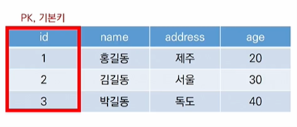

[toc]


#  DB

## 1. DB 장점


## 2. 관계형 데이터베이스(RDB)

### [1] RDB 정의

+ key - value들의 관계를 표로 정리한 DB
+ RDB : table을 RDB라고 칭함
+ relation : table 자체, table과 table의 관계


### [2] RDB 용어

+ 스키마

+ 테이블

+ 열 (컬럼,필드,어트리뷰트)

+ 행 (로우, 레코드, 튜플)

+ 키

  + 각 행(레코드)의 고유값

  + 반드시 설정해야하고, DB 관리 및 관계 설정 시 사용

    


# SQLite ([공식문서](https://www.sqlite.org/docs.html) / [편한문서](https://www.sqlitetutorial.net/) )

## 1. SQLite

### [1] 정의

+ 안드로이드 운영체제에서 기본적으로 탑재된 DB
+ 파일 형식으로 응용프로그램에 넣어서 사용하는 가벼운 DB (서버 형태가 아님)
+ SQL 이란
  + RDBMS (RDB 관리 시스템)의 데이터 관리를 위해 설계된 프로그래밍 언어
  + 기능
    + DB 스키마 생성/수정
    + 자료의 검색 / 관리
    + DB 객체 접근 조정 관리
  + 우리 수업에서는 장고의 ORM을 잘 이해하기 위한 보조느낌

###  [2] DATA TYPE

+ NULL
+ INTEGER
+ REAL
  + 8바이트 부동 소수점 숫자로 저장된 부동 소수점 값

+ TEXT
+ BLOB
  + 입력된 그대로 정확히 저장된 데이터 (별다른 타입없이 그대로 저장)


+ SQLite Type Affinity
  + 특정 컬럼에 저장하도록 권장하는 타입
  + INTEGER, TEXT, BLOB, REAL, NUMERIC


### [3] SQL 분류

**DDL** (Data Definition Language : 데이터 정의 언어)

: DB 구조(테이블,스키마)를 정의

+ CREATE	
  + 새로운 TABLE 만들고 등 DATA 조작 제외 모든 것

+ DROP

+ ALTER

  

**DML** (Manipulation : 조작)

: TABLE에 DATA 빼고 넣고 조작 등

+ INSERT
+ SELECT
+ UPDATE
+ DELETE


**DCL** (control:제어)

: DB 사용자의 권한 제어를 위해 사용

+ GRANT

+ REVOKE

+ COMMIT

+ ROLLBACK

  


## 2. SQLite DB/TABLE 생성

### [1] DB 설정 및 보기

+ DB 설정

```bash
# sqlite3 명령어 실행
# SQL/tutorial.sqlite3 를 DB로 사용
$ sqlite3 SQL/tutorial.sqlite3   # 항상 DB를 입력해서 들어야가 하는듯
```


+ DB보기 : SQLite EXPLORER

  + 실행법

    + ctrl + shift + p  -> SQLite : Open Database

    + 또는 마우스 우클릭 후, Open Databse

      

  + 주의사항

    + 띄어쓰기가 중요. 띄어쓰기를 하나의 단어로에 포함되게 하려면 ""로 단어 전체 감아주기 
      + "column name"

    

### [2] 테이블 생성 및 삭제

#### (1) 터미널

+ DB 생성

  ```bash
  $ sqlite3 tutorial.sqlite3
  sqlite> .database #DB 만드는 명령어
  
  # DB 생성
  $ sqlite3 dbfile.dbname
  sqlite> .database
  
  # TABLE로 변환
  sqlite> .tables
  ```

  + .은 sqlite 프로그램의 기능 실행

    

#### (2) 테이블 생성 및 조회(SQLite)

+ CSV to TABLE

  ```sqlite
  sqlite> .mode csv
  sqlite> .import hellodb.csv examples  -- hellodb.csv 파일을 examples table로 변환
  sqlite> .tables
  examples
  ```

+ 터미널 VIEW 변경

  ```sqlite
  sqlite> .headers on
  sqlite> .mode column
  splite> SELECT * FROM examples;
  ```

+ 테이블 생성 및 삭제

  + DB에 TABLE 생성

  ```sqlite
  sqlite> CREATE TABLE classmates (
     ...> id INTEGER PRIMARY KEY,   -- id column을 PK로 사용하겠다는 의미
     ...> name TEXT
     ...> );
     
  --- 이거 이용   
  sqlite> CREATE TABLE classmates (
      -- id column을 입력안하면, rowid 컬럼 자동으로 생김(SQLite가 관리해줌)
     ...> name TEXT
     ...> );
  ```
  
  
  
  + DB에 TABLE 생성 2 (**NOT NULL)**
  
  ```sqlite
  -- 꼭 필요한 값의 필드는 NOT NULL 설정해주기
  sqlite> CREATE TABLE classmates (
     ...> id INTEGER PRIMARY KEY,   -- id column을 PK로 사용하겠다는 의미
     ...> name TEXT NOT NULL
     ...> );
  ```
  
  
  
  
  
  + DB에서 TABLE 제거
  
  ```sqlite
  DROP TABLE classmates;
  ```


+ 테이블의 schema 조회

  ```sqlite
  sqlite > .schema table_name
  sqlite > .schema classmates
  ```

  

#### (3) ALTER TABLE

+ 기능

  + table 이름 변경

  + table에 새로운 column 추가

    ```sqlite
    ALTER TABLE table_name ADD COLUMN colname 데이터타입설정;
    
    
    --- 방법 1
    ALTER TABLE new_articles ADD COLUMN country TEXT;
    
    
    --- 방법 2
    ALTER TABLE new_articles ADD COLUMN country TEXT NOT NULL DEFAULT '기존데이터들의 디폴트값';
    ```

    

  + column 이름 수정

    ```sqlite
    ALTER TABLE table_name RENAME COLUMN current_name TO new_name;
    ALTER TABLE articles RENAME TO new_articels;
    ```

    

## 3. 데이터 조작 (SQLite3)

### [1] CRUD (SQLite3)


#### 요약

|      | 구문        | 예시                                                         |
| ---- | ----------- | ------------------------------------------------------------ |
| C    | INSERT INTO | **INSERT** **INTO** table_name (col1, col2, ...) **VALUES** (val1, val,2,...); |
| R    | SELECT FROM | **SELECT** * **FROM **table_name **WHERE** condition;        |
| U    | UPDATE SET  | **UPDATE** table_name **SET** col1 = val1, col2 = val2 **WHERE** condition; |
| D    | DELETE FROM | **DELETE** **FROM** table_name **WHERE** condition;          |


#### 예시

+ 아래에서는 `rowid`를 이용한다고 가정


+ INSERT

  ```sqlite
  INSERT INTO table_name (col1, col2) VALUES (val1,val2);
  
  -- 방법1
  INSERT INTO classmates (id, name) VALUES (1,"김땡딴");
  
  -- 방법2
  INSERT INTO classmateS VALUES (1,"김땡딴");
  
  ```


+ SELECT

  ```sqlite
  splite> SELECT * FROM classmates;
  
  sqlite> SELECT column-name as alias FROM table_name;
  sqlite> SELECT name as NameChange FROM classmates;
  ```

  

+ ```sqlite
  ORDER BY, DISTINCT, WHERE, LIMIT, GROUP BY  -- 와 함께 사용
  ```

  +  `LIMIT`

    ```sqlite
    sqlite> SELECT col1, col2, ... FROM table_name LIMIT 숫자;
    ```

    

  +  `WHERE`

     ```sqlite
     sqlite> SELECT * FROM classmates WHERE address='서울';
     ```

     일치여부 등호는 =으로 처리

     

  +  `SELECT DISTINCT`

     ```sqlite
     sqlite> SELECT DISTINCT col1 FROM classmates;
     ```

     ```sqlite
     sqlite> SELECT COUNT(DISTINCT col1) FROM classmates;  -- 이와 같이도 가능
     ```

     

  +  `OFFSET` (LIMIT 와 함께)

     + 주어진 요소나 지점까지의 위치변화량을 나타내는 정수형으로 `OFFSET`개 만큼 제외하고 시작한다고 생각하면 편함

     + 예 : 'abcdef' 에서 'c'는 'a'에서 2의 `OFFSET` 가짐

       ```sqlite
       sqlite> SELECT * FROM users_user LIMIT 10 OFFSET 3;
       ```

       ㅇ 4번~ 13 번까지 출력됨


+ DELETE

  ```sqlite
  sqlite> DELETE FROM table_name WHERE 조건;     -- 조건에 맞는 특정 행(레코드)삭제
  sqlite> DELETE FROM table_name WHERE rowid=3;
  ```

  + `rowid` 의 재사용?

    + SQLite는 삭제된 rowid를 재사용

    + `AUTOINCREMENT` 이용

      ```sqlite
      CREATE TABLE table_name (
      id INTEGER PRIMARY KEY AUTOINCREMENT,
      ...
      );    --과 같이 하면, id 재사용하지 않고 계속 증가
      ```

      


+ UPDATE

  ```sqlite
  -- col = val 명시된 것들만 값 바뀜 (바뀌지 않는 것 명시 안해도 코드 돌아감)
  sqlite> UPDATE table_name SET col1=val1, clo2=val32 ,.. WHERE contidion;
  
  sqlite> UPDATE classmates SET name='똥땅똥' WHERE id = 1;
  ```

  


### [2] Aggregate funtion

+ 집계함수
  + 각 집합에 대한 계산을 수행후, 단일값 반환 (여러행으로부터 하나의 결과값 반환)
+ **SELECT** 에서만 사용


#### 종류

+ COUNT, AVG, MAX, MIN, SUM


+ ```sqlite
  SELECT COUNT(col or *) FORM table_name;
  ```

+ ```sqlite
  -- col이 INTEGER 인 경우만 가능
  SELECT AVG(col) FROM talbe_name;
  SELECT MAX(col) FROM talbe_name;
  SELECT MIN(col) FROM talbe_name;
  SELECT SUM(col) FROM talbe_name;
  ```


#### 예시

+ ```sqlite
  -- 30 세 이상 평균 나이
  SELECT AVG(age) FROM users_user WHERE age>=30;
  
  -- 가장 balance (계좌잔액) 이 큰 사람과, 그 액수
  SELECT last_name, first_name, MAX(balance) FROM users_user;
  
  -- 30세 이상인 사람들의 계좌 평균금액
  SELECT AVG(balance) FROM users_user WHERE age >= 30;
  ```


### [3] LIKE

#### 종류

+ 와일드카드 문자 %, _
  + 특정한 패턴이 있는 문자열 혹은 파일을 찾거나, 긴 이름을 생략할 때 쓰임
  + % : 0개 이상의 문자 ( 해당위치에 문자열 존재 할수도 안할수도 )
  + _ : 1개의 문자   ( 반드시 1개의 문자 존재 )


#### 예시

+ ```sqlite
  SELECT * FROM table_name WHERE col LIKE '와일드카드패턴';
  
  SELECT * FROM users_user WHERE age LIKE '2_';   -- 20대인 사람
  SELECT * FROM users_user WHERE phone LIKE '02-%'; -- 지역번호 02인 사람
  SELECT * FROM users_user WHERE phone LIKE '%-1122-%'; -- 중간번호가 1122 인 사람
  ```

+ 

+ | 와일드카드 패턴 | 의미                            |
  | --------------- | ------------------------------- |
  | 2%              | 2로 시작하는 값                 |
  | %5              | 5로 끝나는 값                   |
  | %8%             | 8을 포함하는 값                 |
  | _9%             | 두번째가 9로 시작하는 값        |
  | 2 _ _ _         | 2 로 시작하고 4글자인 값        |
  | 3_%\_%          | 3으로 시작하고, 3글자 이상인 값 |


### [4] ORDER BY, GROUP BY

#### ORDER BY

+ ASC - 오름차순 DEFAULT

+ DESC - 내림차순

+ 예시

  + ```sqlite
    SELECT * FROM table_name ORDER BY col ASC;
    SELECT * FROM table_name ORDER BY col1, col2, DESC;
    
    SELECT * FROM users_user ORDER BY age ASC LIMIT 10; 
    ```


#### GROUP BY

+ 행 집합에서 요약 행 집합을 만듦

+ SELECT 문의 option절
+ **WHERE 절있는 경우 반드시 WHERE 뒤에 작성**

+ 예시 

  + ```sqlite
    SELECT col1, COUNT_SUM_MAX_MIN_AVG(col2) FROM table GROUP BY col1, col2;
    
    SELECT last_name, COUNT(*) FROM users_user GROUP BY last_name;
    SELECT last_name, COUNT(*) AS name_count FROM users_user GROUP BY last_name;
    ```

  + 


------


# ORM


# 4. ORM & SQL

## [1] 몰랐던 것

+ ORM with Python (0414 practice)

  ```python
  #비율 표시를 위해서 총개수, True개수, False 개수가 필요
  #역참조를 통해 각각 조회
  question = get_object_or_404(Question,pk=question_pk)
  total_count = question.comment_set.count()
  count_a = question.comment_set.filter(pick=0).count()
  count_b = question.comment_set.filter(pick=1).count()
  
  
  # annotate() 를 이용해서 조회
  
  #annoate : QuerySet 각 객체별 주석을 다는것과 같음...주석은 평균, 합계, 등이 될 수 있음
  # 아래는 주석을 달기 위한 기준선언, 우리는 객체별 총 댓글개수, TRUE 선택 개수, False 선택개수가 필요함
  # Count 클래스 참고 이외에도 AVG, MAX, MIN 등의 통계를 작성할 수 있음 Django_aggregation.md 문서 참조
  # https://docs.djangoproject.com/en/4.0/topics/db/aggregation/#cheat-sheet
  total_count = Count('comment')
  count_a = Count('comment', filter=Q(comment__pick=0))
  count_b = Count('comment', filter=Q(comment__pick=1))
  # 객체별로 주석을 달아서 결과를 반환받음
  result = Question.objects.annotate(
                          total_count=total_count,
                          count_a=count_a,
                          count_b=count_b
                      )
  # 결과 안에서 우리가 URI로 받은 question_pk와 같은 question 객체를 얻어옴 : 댓글개수 와 종류별 댓글 개수를 포함
  
  #get_object_or_404() 메서드는 첫 번째 인자로 (클래스|매니저|QuerySet) 을 받는다.
  
  # 53번 줄의 결과는 QuerySet 이므로 첫번째 인자로 들어갈 수 있다. 결과내 재검색.
  question = get_object_or_404(result, pk=question_pk)
  comments = question.comment_set.order_by('-pk') # 내림차순정렬
  
  #각 선택별 비율 계산
  a_per = round(question.count_a / question.total_count * 100, 2) if question.total_count else 0
  b_per = round(question.count_b / question.total_count * 100, 2) if question.total_count else 0
  ```

  -----
  
  

+ NOT NULL CONSTRAINT ERROR 뜨는 이유

  + 각 COLUMN의 제약 사항 때문 (무결성을 위해 제약 사항)

  + `NOT NULL`로 하면 해당 값이 `NULL` 인 경우 데이터 저장 안됨

    ```BASH
    sqlite> CREATE TABLE classmates (
        ..> id INTEGER PRIMARY KEY,
        ..> name TEXT NOT NULL,
        ..> age INT NOT NULL,
        ..> address TEXT NOT NULL
        ..> );
    ```

+ UNIQUE CONSTRAINT ERROR

  + 중복되는 값이 있는 것을 허용하지 않음
  + `UNIQUE` 이용 / 위의 `NOT NULL` 부분에 적으면 됨

+ roiwd


------

