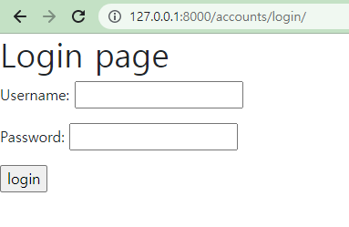

+ error 정리
  + 200번대
  + 400번대
  + 500번대

+ [Django 공식 github](https://github.com/django/django) 에서 package들 python으로 작성된 코드 볼 수 있음
  + 예를들어, ` from django.contrib.auth.models import User ` 를 보고 싶다면, 
  + github -> django -> contrib -> auth -> models.py -> class User 를 보면 됨


# Authentication system1

## 1. [HTTP](https://developer.mozilla.org/ko/docs/Web/HTTP/Overview)

+ 웹어플리케이션이란
  + 요청을 하면, 이에 응답하는 구성
  + 이와 같은 구성을 만들 수 있게 해주는 통신 약속(프로토콜)이 HTTP
+ HTTP
  + Hyper Text Transfer Protocol


### [1] HTTP 특징

#### (1) 비연결지향

+ 서버는 요청에 대한 응답을 보낸 후 연결을 끊음
  + 요청받은 거 응답하면, 서버는 할일 끝
  + 정보가 유지되어야 하는 상황(로그인, 장바구니 등등)에서 이것만으로는 할 수 없음


#### (2) 무상태

+ 연결을 끊는 순간 클라이언트와 서버 간의 통신이 끝나며, 상태 정보가 유지되지 않음

+ 클라이언트와 서버가 주고 받는 메시지들은 서로 완전히 독립적

  

## 2.쿠키 & 세션

+ 클라이언트와 서버의 지속적인 관계를 유지하기 위해 쿠키와 세션이 존재


### [1] 쿠키

#### (1) 개념

+ HTTP 쿠키는 서버가 사용자의 웹 브라우저에 전송하는 데이터 조각
+ 브라우저는 위의 쿠키들을 저장하고 있다가, 웹에 요청시 함께 전송
+ 클라이언트가 요청보내면 서버의 세션 공간으로가서, 클라이언트의 정보를 가져오는데, 이 때 요청을 보낸 클라이언트가 누구인지에 대한 정보를 담고 있음


#### (2) 활용

+ 두 요청이 동일한 브라우저(클라이언트)에게서 왔는지 아닌지를 판단


#### (3) 생성

+ 쿠키의 생성
  + 클라이언트가 누구인지 정보 없이, 요청을 보냄 (첫요청)
  
  + 서버가 응답에 해당 클라이언트 정보인 쿠키(session id)를 실어다가 응답 (서버 -> 클라이언트)
  
  + 이 후의 요청에서는 클라이언트가 자신의 정보(session id)를 담은 쿠키를 같이 서버로 보냄
  
    

#### (4) 삭제

##### (a) session cookies

+ 현재 session이 종료되면 삭제

+ 브라우저가 현재 session이 종료되는 시기를 정의

  

##### (b) persistent cookies

+ *Expires* 속성에 지정된 날짜 또는 *Max_Age* 속성에 지정된 기간 지나면 삭제 


### [2] 세션 (session)

#### (1) 개념

+ 사이트와 특정 브라우저 사이의 **상태(status)**를 유지시키는 것
+ 클라이언트가 서버에 접속하면, 서버가 특정 **session id** 를 발급하고, 클라이언트는 발급받은 **session id**를 쿠키에 저장

+ 클라이언트 별로, 임시로 정보를 저장하기 위해 사용하는 서버의 저장 공간(서버내부에서관리)

  + 각 클라이언트를 위한 서버 공간이 나누어져 있음
  + 해당 클라이언트의 세션 서버 공간에 가서, 그 정보 이용해서 응답

  

#### (2) MIDDLEWARE

+ 장고의 session은 미들웨어를 통해 구현됨
+ HTTP 요청과 응답 처리 중간에서 작동하는 시스템
  + django는 HTTP 요청이 들어오면, 미들웨어 거쳐서 해당 URL에 등록되어 있는 view함수로 연결
  + HTTP 응답 역시, 미들웨어를 거쳐서 내보냄

+ 데이터 관리, 애플리케이션 서비스, 인증 및 API관리 담당


## 3. accounts app

### [1] 쓰이는 패키지 및 method, 속성


#### (1) decorators

```python
# accounts/views.py
from django.views.decorators.http import require_http_methods, require_POST, require_safe
from django.contrib.auth.decorators import login_required
```


#### (2) login & logout

```python
# accounts/views.py
from django.shortcuts import render, redirect
from django.contrib.auth.forms import AuthenticationForm
from django.contrib.auth import login as auth_login
from django.contrib.auth import logout as auth_logout
```


#### (2) - 1 Authentication Form ( [github](https://github.com/django/django/blob/main/django/contrib/auth/forms.py) , [장고문서](https://docs.djangoproject.com/en/4.0/topics/auth/default/#module-django.contrib.auth.forms) )

+ `form = Authentication(request,request.POST)`

+ 사용자 로그인을 위한 form
+ 아이디와 비밀번호만 넣어주면 다음을 알아서 해줌
  + 데이터 베이스 검증과정과
  + session에서 처리해야 되는 과정들

+ `.get_user()`
  + 인스턴스 method로, 인스턴스가 유효하면, user를 제공


#### (2) -2 login 함수

+ `login(request, user, backend=None)`
  + HttpRequest 객체와 User 객체 필요
+ 로그인 기능
  + Django의 session framework를 이용해, session에 user id 저장( ==로그인 )


### [1] 로그인

#### (0) 필요한 import

```python
# accounts/views.py
from django.shortcuts import render, redirect
from django.contrib.auth import login as auth_login
from django.contrib.auth import logout as auth_logout
from django.views.decorators.http import require_http_methods, require_POST, require_safe
from django.contrib.auth.decorators import login_required
from django.contrib.auth.forms import AuthenticationForm, UserCreationForm, PasswordChangeForm #UserChangeForm
from .forms import CustomUserChangeForm
from django.contrib.auth import update_session_auth_hash
```


#### (2) 예시코드

+ urls.py

```python
# urls.py
from django.urls import path
from . import views
app_name = 'accounts'
urlpatterns = [
    path('login/',views.login,name='login'),
]
```

+ views.py

```python
# views.py
from django.shortcuts import render
from django.contrib.auth.forms import AuthenticationForm
# Create your views here.
def login(request):
    form = AuthenticationForm()
    context = {
        'form' : form,
    }
    return render(request,'accounts/login.html',context)
```

+ login.html

```django
# login.html


<h1> Login page</h1>
<form action="" method='POST'>

{{ form.as_p }}
<input type='submit' value='login'>
</form>

```

+ 구현된 웹페이지




### [2] 로그인 사용자 접근 제한


#### (1) `.is_authenticated`

+ User model의 속성(attribute) 중 하나
+ 모든 User 인스턴스에 대해 항상 True인 읽기 전용 속성
  + AnonymousUser는 항상 False
+ 사용자가 인증되었는지 알 수 있음

+ 코드

```django
# base.html

 1. 로그인 한 경우 
    

    <h3> Hello, {{ user }} </h3>

    <form action="" method='POST'>
      
      <input type='submit' value='Logout'>
    </form>

    <form action="" method='POST'>
      
      <input type='submit' value='update'>
    </form>

    <form action="" method='POST'>
      
    <input type='submit' value="회원탈퇴">
    </form>


 2. 로그인 안한 경우 
    
      <a href=""> Login </a>
      <a href=""> Signup </a>
    

 


```


#### (2) `@login_required`


+ next 사용시 바꿀 곳

login template 의 form 주소

articles의 delete


+ get and post 함깨 작동되는 view 함수의 작성순서는 
  + GET 부분 먼저 적고, 그 후 POST 부분 적기

```python
# 회원가입 페이지(get)와 회원가입 진행부분(post)
# 1. GET
def signup(request):
    if request.method=='POST':
        pass
    else:
        form = UserCreationForm()
    context = {
        'form':form,
    }
    return render(request,'accounts/signup.html',context)
# else 부터 작성 후 if로


# 2. POST
def signup(request):
    if request.method=='POST':
        form = UserCreationForm(request.POST)
        if form.is_valid():
            form.save()
            return redirect('articles:index')

    else:
        form = UserCreationForm()
    context = {
        'form':form,
    }
    return render(request,'accounts/signup.html',context)
```


+ FORM
  + AuthenticationForm
  + UserCreationForm
  + UserChangeForm
  + PasswordChangeForm


+ accounts가 기본경로인 경우
  + accounts/login/
    + `@login_required` 사용자가 로그인 되어 있지 않으면, **settings.LOGIN_URL** -> 'accounts/login/' 순으로 탐색해서, settings에 없으면, 'accounts/login/'로 이동
  + accounts/password/
    + 비밀번호 수정 form의 기본 url


+ redirect은 GET 요청
