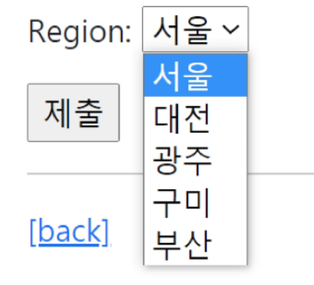

[toc]

# Custom

## [1] Custom 하는 법

+ 프로젝트 중간에 진행시 초기화 방법 : ([substituting a custom User model](https://docs.djangoproject.com/en/4.0/topics/auth/customizing/#substituting-a-custom-user-model) 여기서 따라해도됨) 

  

### (1) User custom은 필수(제일먼저항상)

+ accounts/models.py 에 등록

  ```python
  from django.db import models
  from django.contrib.auth.models import AbstractUser
  
  # Create your models here.
  class User(AbstractUser):
      pass
  ```

+ settings.py에 다음 추가

  + `AUTH_USER_MODEL = 'accounts.User'`
    + 앞으로 User 참조는 'accounts.User' 로 하겠다.
    + 원래는 auth_user 이용했었음(?)(아무튼 built-in User 이용했음)


### (2) 프로젝트 중간에 CustomUser 사용

+ 프로젝트 중간에 진행했기 때문에, DB 초기화한 후 MIGRATION 진행

  

+ 초기화 과정 ([substituting a custom User model](https://docs.djangoproject.com/en/4.0/topics/auth/customizing/#substituting-a-custom-user-model) 여기서 따라해도됨)

  + db.sqlite3 파일 삭제
  + migrations 에 숫자붙은 파일 모두 제거

  + 그 후 다시 migration, migrate 진행

  + db.sqlite3 생성됨

    + auth_user -> accounts_user로 대체됨

      


## [2] Custom 발생시 발생 문제 해결법

+ built-in User를 참조하는 부분들 고쳐줘야 함


### (1) admin site

+ admin/ 사이트의 경우

  + 사용자(들) 부분이 사라짐

  + [substituting a custom User model](https://docs.djangoproject.com/en/4.0/topics/auth/customizing/#substituting-a-custom-user-model) 보고 아래 입력

    ```python
    # accounts/admin.py
    from django.contrib import admin
    from django.contrib.auth.admin import UserAdmin
    from .models import User
    
    admin.site.register(User, UserAdmin)
    ```

    + 사용자(들) 생김


### (2) 회원가입

+ built-in User를 참조하는 것 교체
  + `UserCreationForm`, `UserChangeForm`

+ `get_user_model() -> object` 이용

  + Django에서는 User 직접참조 안함!

    + User 대체하면, 문제생김 (예: UserChangeForm, UserCreationForm의 built-in User 직접참조)
      + Meta에서 model = User 가 직접참조

  + 현재 장고 프로젝트에 **활성화된 User 객체**를 반환

    ```python
    # accounts/forms.py
    from django.contrib.auth.forms import UserChangeForm, UserCreationForm
    from django.contrib.auth import get_user_model
    
    
    class CustomUserChangeForm(UserChangeForm):
    
        # password = None
    
        class Meta:
            model = get_user_model() # User
            fields = ('email', 'first_name', 'last_name',)
    
    class CustomUserCreationForm(UserCreationForm):
    
        class Meta:
            model = get_user_model()
    ```


## [3] User : Article 의 1 : N 관계설정

### (1) Article model 수정 ( user 추가 )

+ Model에서 User 참조는 `get_user_model ()` 사용 x

  ```python
  # articles/models.py
  from django.db import models
  from django.conf import settings
  
  # Create your models here.
  class Article(models.Model):
      #참조하는 모델의 소문자 단수형
      user = models.ForeignKey(settings.AUTH_USER_MODEL, on_delete=models.CASCADE)
                               
      title = models.CharField(max_length=10)
      content = models.TextField()
      created_at = models.DateTimeField(auto_now_add=True)
      updated_at = models.DateTimeField(auto_now=True)
  
      def __str__(self):
          return self.title
      
  ```

  

### (2) 글생성 (article create) 부분을 바꾸기 위한 부분

+ articles/forms.py

  ```python
  from django import forms
  from .models import Article, Comment
  
  
  class ArticleForm(forms.ModelForm):
  
      class Meta:
          model = Article
          # fields = '__all__'
          exclude = ('user',)  # 이렇게 교체
  
  class CommentForm(forms.ModelForm):
  
      class Meta:
          model = Comment
          fields = ('content',)
  
  ```

+ articles/views.py

  ```python
  @login_required
  @require_http_methods(['GET', 'POST'])
  def create(request):
      if request.method == 'POST':
          form = ArticleForm(request.POST)
          if form.is_valid():
              # article = form.save()            # 삭제
              article = form.save(commit=False)  # 추가
              article.user = request.user        # 추가
              article.save()                     # 추가
              return redirect('articles:detail', article.pk)
      else:
          form = ArticleForm()
      context = {
          'form': form,
      }
      return render(request, 'articles/create.html', context)
  ```


### (3) 글삭제는 글작성자만

+ articles/views.py

  ```python
  @require_POST
  def delete(request, pk):
      if request.user.is_authticated:
          article = get_object_or_404(Article, pk=pk)
          # article.delete()                  # 삭제                  
          if request.user == article.user:    # 추가
              article.delete()                # 추가
      return redirect('articles:index')
  ```

  

### (4) 글수정은 작성자만

+ articles/views.py

  ```python
  @login_required
  @require_http_methods(['GET', 'POST'])
  def update(request, pk):
      article = get_object_or_404(Article, pk=pk)
      # if request.method == 'POST':                             # if 문 넣기  위해
      #     form = ArticleForm(request.POST, instance=article)   # 옆으로 4칸 밀기
      #     if form.is_valid():                                  #
      #         article = form.save()                            #
      #         return redirect('articles:detail', article.pk)   #
              
      # else:                                                    #
      #     form = ArticleForm(instance=article)                 #
      
      if request.user == article.user:                           # 추가
          if request.method == 'POST':
              form = ArticleForm(request.POST, instance=article)
              if form.is_valid():
                  article = form.save()
                  return redirect('articles:detail', article.pk)
  
          else:
              form = ArticleForm(instance=article)
      else:#작성자 아니면 main으로 redirect                         # 추가
          return redirect('articles:index')                      # 추가
      
      
      context = {
          'article': article,
          'form': form,
      }
      return render(request, 'articles/update.html', context)
  ```

  

### (5) 글작성자가 아니면 수정/삭제 버튼 못보게하기

+ articles/detail.html

  ```django
  
    <h1>DETAIL</h1>
    <h3>{{ article.pk }}번째 글</h3>
    <hr>
    <p>제목 : {{ article.title }}</p>
    <p>내용 : {{ article.content }}</p>
    <p>작성 시각 : {{ article.created_at }}</p>
    <p>수정 시각 : {{ article.updated_at }}</p>
    <hr>
      # 추가
    <a href="">수정</a>
    <form action="" method="POST">
      
      <input type="submit" value="삭제">
    </form>
     # 추가
  ```

  


## [4] User : Comments 의 1: N 관계 설정

### (1) Comment model 수정 (user 추가)

+ articles/models.py

  ```python
  class Comment(models.Model):
      user = models.ForeignKey(settings.AUTH_USER_MODEL, on_delete=models.CASCADE)#추가
      article = models.ForeignKey(Article, on_delete=models.CASCADE)  #이전에 추가
      
      content = models.CharField(max_length=200)
      created_at = models.DateTimeField(auto_now_add=True)
      updated_at = models.DateTimeField(auto_now=True)
  
      def __str__(self):
          return self.content
  ```

  

### (2) create 수정

+ articles/views.py

```python
@require_POST
def comment_create(request, pk):
    if request.user.is_authenticated:
        article = get_object_or_404(Article, pk=pk)
        comment_form = CommentForm(request.POST)
        if comment_form.is_valid():
            comment = comment_form.save(commit=False)
            comment.article = article
            comment.user = request.user                  # 추가
            comment.save()
        return redirect('articles:detail', article.pk)
    return redirect('accounts:login')
```


### (3) 비로그인 user 댓글 작성 숨기기

+ articles/detail.html

  ```django
    </ul>
    <hr>
       # 추가
    <form action="" method="POST">
      
      {{ comment_form }}
      <input type="submit">
    </form>
                                   # 추가
    <a href=""> [댓글을 작성하려면 로그인 하세요.]</a>  # 추가
                                                                   # 추가
  
  ```

  

### (4) 댓글 삭제 버튼 본인만 보이게

+ articles/detail.html

  ```django
  
    <h4>댓글 목록</h4>
    <ul>
      
        <li>
           {{ comment.user }} : {{ comment.content }}        # 수정
  
                        # 추가
            <form action="" method="POST">
              
              <input type="submit" value="삭제">
            </form>
                                                  # 추가
  
  
        </li>
      
    </ul>
  ```

  

### (5) 댓글 삭제는 작성자만 가능하게

+ articles/views.py

  ```python
  @require_POST
  def comment_delete(request, article_pk ,comment_pk):
      if request.user.is_authenticated:
          comment = get_object_or_404(Comment, pk=comment_pk)
          if request.user == comment.user:                   # 추가
              comment.delete()                               # 추가
          # comment.delete()                                 # 삭제
      return redirect('articles:detail', article_pk)
  ```

  


# 일반사항

## [1] User model 참조

### (1) User model을 직접 참조하지 않는다

+ `settings.AUTH_USER_MODEL -> str`
  + **models.py**에서 사용
+ `get_user_model() -> object`
  + **modles.py가 아닌** 모든 곳에서 사용


### (2) 위 처럼 이용하는 이유

+ 장고에서 app이 실행되는 순서
  + INSTALLED_APP에서 순차적으로 APP IMPORT
    + APP IMPORT 도중에 models를 import 하지 않음
  + 각 앱의 models를 import
+ 따라서 순서가 빠른 app 에서 뒷 순서의 models를 받지 못함
  + 예를들면, articles에서 models import 할 때, accounts의 User model import 불가!


## [2] settings.py

### (1) TEMPLATES

+ 아래의 코드 덕에,  request, user를 모든 templates에서 쓸 수 있음

  + `'django.template.context_processors.request',` : request

  +  ` 'django.contrib.auth.context_processors.auth',` : user

    ​       
    
    

### (2) Custom User 이용시

+ `AUTH_USER_MODEL = 'accounts.User'` 추가


## [3] article_id = pk

+ articles/views.py 의 `comment_create`함수에서

  + `comment.article = article` 대신 `comment.article_id = pk`로 바꾸기만 해도, article이 바뀜

    ```python
    @require_POST
    def comment_create(request, pk):
        if request.user.is_authenticated:
            article = get_object_or_404(Article, pk=pk)
            comment_form = CommentForm(request.POST)
            if comment_form.is_valid():
                comment = comment_form.save(commit=False)
                comment.article = article    # 해당부분, comment.article_id = pk
                comment.user = request.user
                comment.save()
            return redirect('articles:detail', article.pk)
        return redirect('accounts:login')
    ```

    

## [4] ModelForm.save(commit=False)

+ commit 은 DB에 저장하겠다는 것

  ```PYTHON
  @require_POST
  def comment_create(request, pk):
      if request.user.is_authenticated:
          article = get_object_or_404(Article, pk=pk)
          comment_form = CommentForm(request.POST)
          if comment_form.is_valid():
              comment = comment_form.save(commit=False)  # 할당 위해서 comment instance가 필요해서추가
              comment.article = article                  # 할당위해 추가
              comment.user = request.user                # 할당위해 추가
              comment.save()                             # 저장 : 기존    
          return redirect('articles:detail', article.pk)
      return redirect('accounts:login')
  ```

  


## [6] user

### (1) 요청의 user 가져오기

+ `request.user`

### (2) user password 암호화 알고리즘

+ https://docs.djangoproject.com/en/3.2/topics/auth/passwords/#password-management-in-django

  #### PBKDF2

  - 해쉬 컨테이너 알고리즘
  - 입력한 암호 기반으로 salt를 정해진 횟수만큼 hash 함수 수행

  

  #### SHA256

  - 특정 입력값에 대해 항상 같은 값을 리턴

  > **취약점**
  >
  > 1. 레인보우 어택 취약
  > 2. 무차별 대입공격 취약
  >
  > **보완점**
  >
  > 1. salting (레인보우 어택 방어)
  >    - 임의의 문자열을 추가하여 다이제스트 생성
  >    - 같은 패스워드라도 각각 다른 salt가 들어가 다이제스트가 다르게 만들어짐
  > 2. key stretching (무차별 대입공격 방어)
  >    - 해시 함수를 여러번 반복
  >    - 즉, 생성된 다이제스트를 입력값으로 다시 다이제스트를 생성. 이를 반복.


### (3) password 부분 함수

+ `from django.contrib.auth import update_session_auth_hash`


## [7] comment 기능 추가 관련

### (1) articles/urls.py

```python
# 아래와 같이 추가
path('<int:pk>/comment/', views.comment_create, name='comment_create'),
path('<int:article_pk>/comments/<int:comment_pk>/delete/', views.comment_delete, name='comment_delete'),

```


### (2) articles/models.py

```python
class Comment(models.Model):
    article = models.ForeignKey(Article, on_delete=models.CASCADE) # 알기

    content = models.CharField(max_length=150)
    created_at = models.DateTimeField(auto_now_add=True)
    updated_at = models.DateTimeField(auto_now = True)
```


### (3) articles/forms.py

```python
class CommentForm(forms.ModelForm):

    class Meta:
        model = Comment
        fields = '__all__'
```


### (4) articles/views.py

```python
# 1. article object 얻어오기
article = get_object_or_404(Article, pk=pk)


#2. detail
@require_safe
def detail(request, pk):
    article = get_object_or_404(Article, pk=pk)
    comment_form = CommentForm()
    # 조회한 article의 모든 댓글을 조회(역참조)
    comments = article.comment_set.all()
    context = {
        'article': article,
        'comment_form': comment_form,
        'comments': comments,
    }
    return render(request, 'articles/detail.html', context)
```


## [8] login 시

### (1) 보여주는 form

+ `AuthenticationForm`


### (2) user 얻기

+ form.get_user()


### (3) login as auth_login 함수

+ `auth_login(request, form.get_user())`


## [9] 1:N

+ [9]는 다음과 같이 가정
  + 1 : Question class or Article class
  + N : comment class


### (1) ForeignKey

+ `on_delete`속성은 `ForeignKey` 필드의 필수 인자

+ DB(1:N 관계) 에서는 외래 키는 UNIQUE한 성질 만족하면, ForeignKey 아닌것 사용할 수 있음
+ **ForeignKey** 는 참조 무결성을 위한 **제약사항**
  + 이상한 값을 참조하려고 하면, ERROR 발생시킴


### (2) 1:N model manager

+ 역참조함수
  + `(참조당하는)classobject.comment_set.all()`
  + `question.comment_set.all()`


### (3) Table & column

+ 1 : N 관계 = Q : a
  + Question 1개에 answer N개 달릴 수 있는 관계
+ table 은 app name + Nclass 이름 
  + appname_Nclass     : articles_comment
+ column 명은 Nclass의 field + id
  + NclassField_id  : answer_id


## [10] next

+ `@login_reqired` 만나면 기존 가려던 경로를 next에 저장
+ 다음과 같이 코드로 next로 갈 수 있게 해줌
  + `      return redirect(request.GET.get('next') or 'articles:index')`


## [11] `get_object_or_404`

+ class_object = get_obejct_or_404(Class= , pk=)
  + ` article = get_object_or_404(Article,pk=article_pk) `


## [12] bootstrap5


+ custom 예시코드

  ```python
  
  ```


## [13] widget

+ articles/forms.py 예시

  ```python
  class ArticleForm(forms.Form):
      title = forms.CharField(max_length=10)
      content = forms.CharField(widdget=forms.Textarea)
  ```


+ dropdown select

  ```python
  # forms.py
  
  class ArticleForm(forms.Form):
      REGION_A = 'Seoul'
      REGION_B = 'Daejeon'
      REGIONS_CHOICES = [
          (REGION_A, '서울')   # '서울'이 사용자에게 보임
          (REGION_B, '대전')
      ]
      
      # fields
      region = forms.ChoiceField(choices=REGIONS_CHOICES, widget=forms.Select())
  ```

  


## [14] Form 사용시 데이터 가져오기(ArticleForm의 request 인자확인필요)

+ views.py

  ```python
  form = ArticleForm(request.POST)
  if form.is_valid():
      title = form.cleaned_data.get('title')
      content = form.cleaned_data.get('content')
      article = Article.objects.create(title=title, content=content)
  ```

  


## [15] import 하는 것들

```python
# views.py
from django.shortcuts import render, redirect
from django.contrib.auth import login as auth_login
from django.contrib.auth import logout as auth_logout
from django.views.decorators.http import require_http_methods, require_POST, require_safe
from django.contrib.auth.decorators import login_required
from django.contrib.auth.forms import AuthenticationForm, UserCreationForm, PasswordChangeForm #UserChangeForm
from .forms import CustomUserChangeForm
from django.contrib.auth import update_session_auth_hash  # 비밀번호 바꿀 때 이용


# models.py
from django.db import models
from django.conf import settings
settings.AUTH_USER_MODEL로 user 표기

from django.contrib.auth.models import AbstractUser
class User(AbstractUser):
    pass


# forms.py
from django.contrib.auth.forms import UserChangeForm, UserCreationForm
from django.contrib.auth import get_user_model  # 이를 호출하면, 현재 project에서 사용하는 user class를 return해줌

class CustomUserChangeForm(UserChangeForm):
    class Meta:
        model  = get_user_model()
        fields = ('email','first_name','last_name')

class CustomUserCreationForm(UserCreationForm):
    
    class Meta:
        model  = get_user_model()
        fields = UserCreationForm.Meta.fields + ('email',)


```


## [16] 자주 까먹거나 헷갈리는 것

+ signup (user creation)

  ```python
  # 회원가입 : CREATE
  def signup(request):
      if request.method == 'POST':
          #요청에서 데이터 받아와서
          #모델만들어서 DB 저장...
          form = CustomUserCreationForm(request.POST)
          if form.is_valid():
              user = form.save()                  # 해당부분!!!!!
              auth_login(request,user)
              return redirect('articles:index')
      else:
          #회원가입 화면 보여주기
          form = CustomUserCreationForm()
      context = {
          'form' : form
      }
      return render(request,'accounts/signup.html',context)
  ```

  

+ index

  ```python
  def index(request):
      articles = Article.objects.order_by('-pk')
  ```

  


# 04/18 시험관련

+  DB1, DB2 과제 잘 보기

+ 시험비율

  + SQL 40% ~ 50%

    + 쉬운게 나옴

      + KEYWORD

    + 실행과정

    + 동작방식

    + 실제 결과

    + 자잘한 문법

      + 예 : \__(a)__ 에 들어가는 것은?

        ```sql
        SELECT ~
        __(a)__
        WHERE ~
        ```

        

      

  + DB

    + 순수 DB아닌
      + ORM도 포함 (DJANGO MODEL 교재)

+ 봐야할 것

+ MODEL 나온 ORM :  DJANGO02(0308) 의 DJANGO MODEL

+ DB의 SQL (DB01(0314))

+ MODEL RELATION 관련(DB 모델관련 DB01(0314), DB02(0413) )


+ 안나오는 것
  + 순수 DJANGO 내용 
    + user.is_authenticated 같은 것


+ 정리

  ```python
  [7회차 DB 과목평가 공지]
  
  4월 18일 진행되는 7회차 과목평가 DB 관련하여 안내드립니다.
  
  일시: 4월 18일
  과목: DB
  시험범위: 교재 기준으로 django_02 (단, admin 제외), db01, db02
  시험유형: 객관식, 단답형 및 서술형
  잘 준비하셔서 모두 좋은 결과 있기를 바라겠습니다.
  
  평가 관련해서 문의사항 있을 시 쓰레드를 통해 질문 남겨주세요
  ```

  