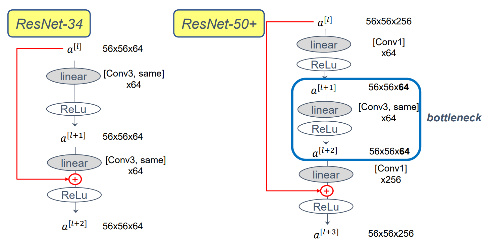
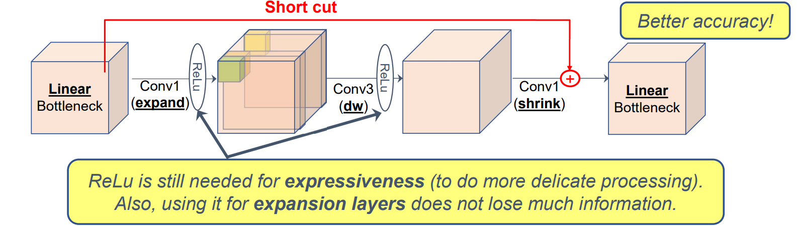

[toc]

# 1. CNN for 2D Object Classification

## [1] CNN Summary

### (1) CNN 과 Fully connected layer

+ **Fully connected layer**에서는 input * weight = output 에서 모든 input 이용해서 output 1개 만듦
  + weight 파라미터 개수(input dim * output dim)가 매우 많음
+ **CNN 경우** **고정된 filter(weight)를 이용**해서 전체 input에 적용해서 전체 output 생성
  + parameter sharing
    + less memory
  + sparsity of connections
    + less computation
  + regularization 
    + less overfitting (파라미터 개수 적어서 가능)

### (2) 구성요소

+ input , output : nxn, mxm

#### (a) conv layer

+ weight : fxf (filter == kernel)
+ stride
+ padding 
  + 효과
    + convolution 후 차원 유지
    + edge 정보 보존
  + 종류
    + valid conv : no padding
    + same conv : padding to maintain output size

+ 결과 차원

  + $$
    [\frac{n+2p-f}{s}+1]*[\frac{n+2p-f}{s}+1]
    $$

#### (b) pooling layer

+ filter fxf
  + Max or Average
  + 학습 x
+ stride s

### (3) 발전과정

+ Accuracy 높이기 위해 Layer를 깊게 쌓기
+ Architecture 설계를 사람이 이해할 수 있도록 하기
+ computational overhead에 대한 고민
  + bottleneck ( 1x1 conv )

## [2] AlexNet[NIPS'12]

### (1) Architecture

+ 7개의 learnable layer

[출처](https://anhreynolds.com/blogs/alexnet.html)

### (2) 특징

+ LeNet과 비슷하지만, 1000배 많은 파라미터 가짐
  + 파라미터 개수 ~60M
+ LeNet은 sigmoid, Alexnet은 **Relu**
+ Complext architecture
  + 필터사이즈 : 3x3, 5x5, 11x11로 다양
  + 스트라이드 : 1, 2, 4로 다양

## [3] VGG-16[ICLR'15]

+ 좀 더 규칙적인 layer 만듦
  + Simple & uniform architecture

### (1) 규칙

+ Conv Layer : 3x3, s =1
+ pooling layer : max pooling, 2x2, s = 2
+ Doubling channels

### (2) Architecture

[출처](https://sophieeunajang.wordpress.com/2020/12/02/vggnet/)

### (3) 특징

+ 파라미터 개수가 너무 많음
  + 16 layers
  + 138M param

## [4] Inception [CVPR'15]

### (1) 기존 문제점

+ Layer 개수 늘어나면서 계산량 증가
+ CNN 구조가 복잡
  + Lalyer type(conv, pooling) , filter size, stride 등 다 정해야 함

### (2) 1x1 Conv

+ channel 관점에서 Fully connected layer

+ channel 개수만 변경 가능

  + **channel 개수 줄여서 conv의 계산량 줄일 수 있음**
    + Bottleneck layer

+ conv와 같은 연산 개수 있어도, memory reordering 없어서, 1x1 conv가 더 빠름

  

### (3) Architecture

[출처](https://techblog-history-younghunjo1.tistory.com/132)

[출처](https://www.researchgate.net/figure/Structure-of-inception-CNN-used-for-feature-extraction-and-combination-of-embranchment_fig2_332522654)

### (4) GoogLeNet

+ Inception 여러개 쌓아서 새로운 모델

### (5) 구현

+ 여전히 사람의 직관에 의존한 architecture 설계
  + 1x1 conv 해도 잘 되는 거 보면, **여전히 많은 계산 줄일 수 있는 것 아닐까?**

## [5] [ResNet[CVPR'16]](https://openaccess.thecvf.com/content_cvpr_2016/papers/He_Deep_Residual_Learning_CVPR_2016_paper.pdf)

### (1) Motivation

+ 여전히 더 깊게 쌓자!
+ 어떻게 layer를 늘리면서 training error를 계속 감소시킬 수 있을까
+ **residual connection**
  + 최악의  경우에도 training이 계속되도록 만들어 줌
+ **bottleneck** 이용해서 계산량 줄이기
  + 1x1 conv (채널축소)-> ReLu -> conv3 -> ReLu -> 1x1 conv (채널개수복구) -> ReLu

 

### (2) Architecture

+ residual connection (김형신교수님 수업자료)

  

# 2. Lightweight CNN for 2D Object Classification

## [1] Review

### CNN, AlexNet[2012], VGG[2015], Inception[2015], ResNet[2016]

+ CNN
  + Conv Layer, Pooling Layer, **sparsity of connections**(MLP와차이), **parameter sharing**(MLP와차이)

+ AlexNet[2012]
  + Pioneering work but complex architecture
+ VGG[2015]
  + A deeper NN with unified architecture but heavy computation
  + AlexNet의 이해하기 어려움을 극복하기 위해, 규칙을 추가
    + 왜 그 규칙이 좋은지는 모름
+ Inception[2015]
  + A deeper NN with Inception module(all-in-one : 1x1, 3x3, 5x5, pooling layer 다 넣자)
  + **Bottleneck Layer**로 Layer가 깊어져도, 효율적으로 계산할 수 있도록 함
+ ResNet[2016]
  + A super deep NN with **skip connection** to train deep NN robustly
  + training이 잘 안되는 경우 skip connection이 성능 저하를 막음

## [2] [MobileNet [arxiv'17]](https://arxiv.org/pdf/1704.04861.pdf)

### (1) Motivation

+ a standard conv layer는 MLP보단 효율적이지만, 여전히 channel이 많아지면, computation이 heavy함

#### (a) Standard Convolution

+ 1개 output 위해서는 무조건 input의 channel 개수만큼 곱해줘야함
  + 계산량이 많음
  + 파라미터 개수가 input & output channel 개수에 크게 영향 받음
+ Height, width, channel 개수 바꿀 수 있음
  + fiilter 개수 == output channel개수
+ 계산량 계산
  + 곱셈 개수 = $$ (D_F \times D_F \times C\_{in}) \times (D\_{out} \times D_{out}  ) \times C\_{out}$$

#### (b) Depthwise Convolution

+ 1개 channel마다 1개의 filter를 이용
+ Height, width 바꿀 수 있지만, channel 개수 바꿀 수 없음
  + 1x1 conv로 channel 개수 조절

#### (c) Depthwise Separable Conv

+ 과정

  1. Depthwise Conv로 height, width 조절

  2. 1x1 Conv로 channel 개수 조절

     

+ 파라미터 개수 비교

+ 계산량 비교

### (2) Architecture

#### (a) 기본 구조

+ 28-layer
+ [논문참고](https://arxiv.org/pdf/1704.04861.pdf)
  + Table1, Table4

#### (b) Make it Even Lighter (논문 3.4)

+ channel 줄이기 (Table 6)
  + input channel, output channel 에 alpha (0<alpha<1)곱해서 줄이기
+ width, height 줄이기 (논문의 Table7, 식 (7) )
  + input width/height, output width/height에 rho(0<rho<1) 곱해서 줄이기
  + input dimension을 줄임

## [3] [MobileNet v2[CVPR'18]](https://arxiv.org/pdf/1801.04381.pdf)

+ MobileNet에 Residual block을 추가함

### (1) IDEAS

+ Inverted residual block 

  + **Short cut between bottleneck layers**

+ **Depthwise Conv** between expansion layers

+ **Linear bottleneck**

  + 너무 많은 정보를 잃을까봐 마지막에는 Relu안쓰고 Linear

    

+ (김형신교수님 강의자료)

  + 

    

## [4] [MnasNet [CVPR'19]](https://arxiv.org/pdf/1807.11626.pdf)

+ lightweight CNN by NAS(Neural Architecture Search)

### (1) 개념

#### (a) Objective function

+ accuracy & (mobile에서의) latency 모두 고려

  + 기존 NAS는 Accuracy만 고려했음

+ 

  

#### (b) NAS

+ **강화학습** 기반 방법

+ Search Space를 제시하고, 그 중 좋은 것을 찾게 함
  + NxN Conv, Channel 개수 등
  + Search Space Size vs. Layer Diversity
    + Search Space size를 잘 줄여야 함
    + 각 Layer들 간의 구조를 다양하게 해야 함

  

#### (c) Search Space size vs. Layer Diversity

+ Block으로 쪼개어서, Block 별로 NAS 진행
  + Block 내부의 layer들은 모두 같음
+ Options
  + Conv : conv, dw conv, inverted bottleneck conv
  + skip option : pooling, residual or no skip
  + kernel size : 3x3, 5x5
  + \# of layers, output size...
+ 

### (2) Architecture

+ 
+ Diversity 주는 것 의미있게 결과 나옴

### (3) 성능

+ Figure 1,2, 5

## [5] [EfficientNet [ICML'19]](https://arxiv.org/pdf/1905.11946.pdf)

### (1) Motivation

+ We want to take care of how to scale a model efficiently
+ 기계마다 감당 가능한 모델의 complexity가 다름
  + 어떤 식으로 scaling 하는 것이 좋을 것인가

#### (a) Objective

+ **FLOPS를 이용**
  + Latency 대신 이용

+ **Search Space**: MnasNet과 같음

### (2) Architecture ( Scaling )

+ Figure 2

  

  ppt35

#### (a) Compound scaling

+ Channel, Layer, Resolution 모두 한 번에 늘리고 줄임

### (3) 성능

+ Figure5, table 3

## [6] MnasNet & EfficientNet summary

+ **Neural architecture search**

  + considering both accuracy and computational cost (Latency or FLOPs)

+ **Hierarchical search space**

  + Block-wise search to balance layer diversity and computational cost

+ **Compound Scaling**

  + Scale width(filter개수==channel개수), depth(Layer개수), resolution(image 해상도) all together

  + Width scaling : MobileNet, ShuffleNet

  + Depth scaling : ResNet

    

+ **Core ideas of MobileNets still survive**

  + Inverted bottleneck, depthwise separable conv, linear bottleneck 여전히 이용 됨

  + 즉 NAS 했지만 여전히 제한적임
    + 기존에 직관적으로 만들었던, MobileNet 구조를 Search space로 이용해서 NAS 진행한 것

# 3.Two-stage 2D Object Detectors

## [1] Review

### MobileNets[2017], MobileNets[2018], MnasNet[2019], EfficientNet[2019], Transfer Learning

 

+ MobileNets[2017]
  + A lightweight DNN using **depthwise separable conv**(depthwise conv + 1x1 conv) , width multiplier and resolution multiplier
  + 즉 **1x1 conv로 channel 개수 조절**
  + **depthwise conv로 계산량 감소**
+ MobileNets[2018]
  + **inverted residual block** (skip connection bw bottlenecks : 왜냐하면 이 곳에 필요한 정보 다 있으므로), **depthwise conv** for expansion layer and **linear bottleneck**
+ MnasNet[2019]
  + Neural Architecture Search with a **multi-target** objective function and **block-wise** search space
  + 5x5 conv도 선택됨
  + MobileNets에서 이용했던 구조가 선택됨
+ EfficientNet[2019]
  + NAS-based baseline and **compound** scaling
  + tf에 구현되어 있음
+ Transfer Learning
  + Change the lat layer, initialize, and train for your application

## [2] Transfer Learning

+ Object detection에서 필수적인 이야기

### (1) Motivation

+ DNN APP을 만들고 싶지만, Training을 위한 Big data가 없음
+ well-trained DNN 존재
  + same input type and works for a similar task
+ 기존의 well-trained DNN을 내 TASK에 맞게 Transfer 할 수 있음 with small dataset

### (2) How?

+ 방법 1
  + 마지막 결과 layer 부분의 weight만 training하고 앞의 layer들은 training하지 않음
+ 방법 2
  + 데이터가 좀 더 많다면, 뒤에서부터, 다른 layer들도 training 시킴

### (3) 왜 가능한가?

+ deeplearning 가정
  + 초반 레이어들은 저차원적인 일을 할 것이라고 가정함. 그래서 앞부분은 edges, coners등 모든 이미지들의 공통적인 요소들에 관한 task를 함.
  + 그래서 layer 깊을수록, 더 고차원적인 일을 한다고 가정하고 있음.
  + 아무튼 그래서 transfer learning 통해서 뒷부분(고차원부분)만 바꿔주면, 다른 일을 할 수 있다.

# 공부할 것

+ [FLOPS](https://ko.wikipedia.org/wiki/%ED%94%8C%EB%A1%AD%EC%8A%A4)

  + **플롭스**(**FLOPS**, **FL**oating point **O**perations **P**er **S**econd)는 [컴퓨터](https://ko.wikipedia.org/wiki/컴퓨터)의 성능을 수치로 나타낼 때 주로 사용되는 [단위](https://ko.wikipedia.org/wiki/단위)이다.

    **초당 [부동소수점](https://ko.wikipedia.org/wiki/부동소수점) 연산**이라는 의미로 컴퓨터가 1초동안 수행할 수 있는 부동소수점 연산의 횟수를 기준으로 삼는다. 

+ [NAS](https://en.wikipedia.org/wiki/Neural_architecture_search)
