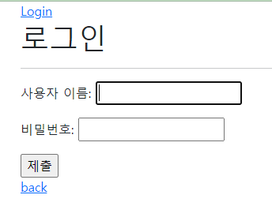
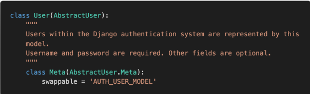

[toc]

+ error 정리
  + 200번대
  + 400번대
  + 500번대
  + NoreverseMatch
    + templates에서 url 잘못된 경우
+ [Django 공식 github](https://github.com/django/django) 에서 package들 python으로 작성된 코드 볼 수 있음
  + 예를들어, ` from django.contrib.auth.models import User ` 를 보고 싶다면, 
  + github -> django -> contrib -> auth -> models.py -> class User 를 보면 됨


# Authentication system1

## 1. [HTTP](https://developer.mozilla.org/ko/docs/Web/HTTP/Overview)

+ 웹어플리케이션이란
  + 클라이언트가 요청을 하면, 이에 서버가 응답하는 구성
  + 이와 같은 구성을 만들 수 있게 해주는 통신 약속(프로토콜)이 HTTP
+ HTTP
  + Hyper Text Transfer Protocol


### [1] HTTP 특징

+ 비연결지향과 무상태를 극복하고, 지속적인 관계를 유지하기 위해, 쿠키와 세션 이용


#### (1) 비연결지향

+ 서버는 요청에 대한 **응답을 보낸 후 연결을 끊음**
  + 요청받은 거 응답하면, 서버는 할일 끝
  + 정보가 유지되어야 하는 상황(로그인, 장바구니 등등)에서 이것만으로는 할 수 없음


#### (2) 무상태

+ 연결을 끊는 순간 클라이언트와 서버 간의 통신이 끝나며, 상태 정보가 유지되지 않음

+ 클라이언트와 서버가 주고 받는 메시지들은 서로 완전히 독립적

  

## 2.쿠키 & 세션

+ 클라이언트와 서버의 **지속적인 관계를 유지하기 위해** 쿠키와 세션이 존재

  + 쿠키와 세션 예 : 로그인 상태 유지, 장바구니 목록 유지
  + 웹소켓 예 : 채팅창, 주식창
    + 내가 대화 입력하면, 대화 상대방은 서버에 요청한 적 없지만, 서버로부터 응답을 받음
    + 위 과정을 위해, 웹소켓(web socket) 이용 (웹소켓은 서버와 채팅방을 연결)
      + 내가 요청하지 않아도, 웹소켓을 통해서, 응답 받을 수 있음


+ 과정

  + 클라이언트가 서버에 요청

  + 서버는 클라이언트의 요청이 최초 요청이라면, 세션(클라이언트 정보 저장)을 만들어서, 클라이언트의 id를 하나 붙임

  + id를 쿠키라는 파일에 담아서 클라이언트에게 전송

  + 클라이언트는 쿠키를 보관하고 있으면서, 쿠키를 만들어준 서버로 요청을 보낼 때, 쿠키를 같이 보냄

  + 서버는 쿠키를 보고, 이전에 요청이 왔던 클라이언트라는 것을 알 수 있음

    

---

### [1] 쿠키

#### (1) 개념

+ HTTP 쿠키는 서버가 사용자의 웹 브라우저에 전송하는 데이터 조각
+ 브라우저는 위의 쿠키들을 저장하고 있다가, 웹에 요청시 함께 전송
+ 클라이언트가 요청보내면 서버의 세션 공간으로가서, 클라이언트의 정보를 가져오는데, 이 때 요청을 보낸 클라이언트가 누구인지에 대한 정보를 담고 있음


#### (2) 활용

+ 두 요청이 동일한 브라우저(클라이언트)에게서 왔는지 아닌지를 판단


#### (3) 생성

+ 쿠키의 생성
  + 클라이언트가 누구인지 정보 없이, 요청을 보냄 (첫요청)
  
  + 서버가 응답에 해당 클라이언트 정보인 쿠키(session id)를 실어다가 응답 (서버 -> 클라이언트)
  
  + 이 후의 요청에서는 클라이언트가 자신의 정보(session id)를 담은 쿠키를 같이 서버로 보냄
  
    

#### (4) 삭제

##### (a) session cookies

+ 현재 session이 종료되면 삭제

+ 브라우저가 현재 session이 종료되는 시기를 정의

  

##### (b) persistent cookies

+ *Expires* 속성에 지정된 날짜 또는 *Max_Age* 속성에 지정된 기간 지나면 삭제 


---


### [2] 세션 (session)

#### (1) 개념

+ 사이트와 특정 브라우저 사이의 **상태(status)**를 유지시키는 것

+ 클라이언트가 서버에 접속하면, 서버가 특정 **session id** 를 발급하고, 클라이언트는 발급받은 **session id**를 쿠키에 저장

  + 로그인 성공시 서버에는 session_key, session_value가 저장되고, 쿠키에는 session_key를 sessionid라는 이름으로 담아서 보냄

+ 클라이언트 별로, 임시로 정보를 저장하기 위해 사용하는 서버의 저장 공간(서버내부에서관리)

  + 각 클라이언트를 위한 서버 공간이 나누어져 있음
  + 해당 클라이언트의 세션 서버 공간에 가서, 그 정보(로그인유무 등 현재 상태) 이용해서 응답

  

#### (2) MIDDLEWARE

+ 장고의 session은 미들웨어를 통해 구현됨
+ HTTP 요청과 응답 처리 중간에서 작동하는 시스템
  + django는 HTTP 요청이 들어오면, 미들웨어 거쳐서 해당 URL에 등록되어 있는 view함수로 연결
  + HTTP 응답 역시, 미들웨어를 거쳐서 내보냄

+ 데이터 관리, 애플리케이션 서비스, 인증 및 API관리 담당


## 3. accounts app - (base & login & logout)


### [0] base.html

```django
# base.html

 1. 로그인 한 경우 
    

    <h3> Hello, {{ user }} </h3>

    <form action="" method='POST'>
      
      <input type='submit' value='Logout'>
    </form>
    
	# form으로 하나 a tag로 하나 GET 요청은 똑같음
    <form action="" method='GET'>
      <input type='submit' value='update'>
    </form>
    
    <a href=""> update </a>

    <form action="" method='POST'>
      
    <input type='submit' value="회원탈퇴">
    </form>


 2. 로그인 안한 경우 
    
      <a href=""> Login </a>
      <a href=""> Signup </a>
    

 


```


### [1] 로그인

#### (1) decorators ( login & logout )

```python
# accounts/views.py
from django.views.decorators.http import require_http_methods, require_POST, require_safe
from django.contrib.auth.decorators import login_required
```


#### (2) form & functions ( login & logout )

```python
# accounts/views.py
from django.shortcuts import render, redirect
from django.contrib.auth.forms import AuthenticationForm
from django.contrib.auth import login as auth_login
from django.contrib.auth import logout as auth_logout
```


#### (2) - 1 Authentication Form ( [github](https://github.com/django/django/blob/main/django/contrib/auth/forms.py) , [장고문서](https://docs.djangoproject.com/en/4.0/topics/auth/default/#module-django.contrib.auth.forms) )

+ `form = Authentication(request,request.POST)`

+ 사용자 로그인을 위한 form

+ 아이디와 비밀번호만 넣어주면 다음을 알아서 해줌
  + 데이터 베이스 검증과정과
  + session에서 처리해야 되는 과정들
  + ID & PW를 DB의 것과 일치하는지 확인 

+ `.get_user()`

  + 인스턴스 method로, 인스턴스가 유효하면, user를 제공
  + 코드

  ```python
  form= AuthenticationForm(request, request.POST)
          if form.is_valid():
              auth_login(request, form.get_user())
  ```

  


#### (2) -2 login 함수

+ `login(request, user, backend=None)`
  + HttpRequest 객체와 User 객체 필요
+ 로그인 기능
  + Django의 session framework를 이용해, session에 user id 저장( ==로그인 )


#### (3) 로그인 사용자의 접근 제한

##### (a) .is_authenticated

+ `.is_authenticated`

  + User model의 속성(attribute) 중 하나

  + 사용자가 인증되었는지 알 수 있음

    

+ 로그인 되어있다면,  (request 없어도 됨)

  + request.user가 auth.User Instance
  + `.is_authenticated` 가 True

+ 로그인 안되어있다면

  + request.user 가 AnonymousUser instance
  + `.is_authenticated` 가 False

  

+ 코드

```django
# base.html

 1. 로그인 한 경우 
    

    <h3> Hello, {{ user }} </h3>

    <form action="" method='POST'>
      
      <input type='submit' value='Logout'>
    </form>
    
	# form으로 하나 a tag로 하나 GET 요청은 똑같음
    <form action="" method='GET'>
      <input type='submit' value='update'>
    </form>
    
    <a href=""> update </a>

    <form action="" method='POST'>
      
    <input type='submit' value="회원탈퇴">
    </form>


 2. 로그인 안한 경우 
    
      <a href=""> Login </a>
      <a href=""> Signup </a>
    

 


```


##### (b) @login_required

+ decorator 이용

+ accounts/login/

  + `@login_required` 사용시, 사용자가 로그인 되어 있지 않으면, 
  + **settings.py 에 LOGIN_URL** 부분에 기본 URL 설정 안되어 있으면
  + 'accounts/login/' 로 이동
  + 즉 settings.py에서 LOGIN_URL 설정하지 않으면 accounts/login/ 으로 이동

+ `GET` 요청을 허용하는 곳에서만 사용해야

+ next

  + 사용자가 원래 하려고 했던 (`@login_required` 에 차단당함) url 정보 담고 있음
  + accounts/login/?next=/accounts/create (next는 쿼리스트링 부분)
  + 코드

  ```python
  # views.py login 부분
  if request.method =="POST":
      form= AuthenticationForm(request, request.POST)
      if form.is_valid():
          auth_login(request, form.get_user())
          return redirect(request.GET.get('next') or 'articles:index')   # 이렇게 표현하면, request.GET.get('next') 있으면 왼쪽으로, 없으면 오른쪽으로 감
      
  ```

  ```django
  # login.html 부분
  <form action="" method="POST">  # action에 주소 빼줘야 next 부분 포함해서 요청
  <form action="" method="POST">으로 하면, next 정보가 없는 새로운 'accounts:login'으로 요청을 보내게 됨 
  ```

  


#### (4) 로그인 code

+ urls.py

```python
# urls.py
from django.urls import path
from . import views
app_name = 'accounts'
urlpatterns = [
    path('login/',views.login,name='login'),
]
```

+ views.py

```python
@require_http_methods(['POST','GET'])
def login(request):
    data = request.GET.get('next')   # '/articles/create/' 로 login 후에 redirect가 되어야 함

    # 이미 로그인 된 사람의 접근 차단
    if request.user.is_authenticated:
        return redirect('articles:index')

    if request.method =="POST":
        form= AuthenticationForm(request, request.POST)
        if form.is_valid():
            auth_login(request, form.get_user())
            return redirect(request.GET.get('next') or 'articles:index')   # 이렇게 표현하면, request.GET.get('next') 있으면 왼쪽으로, 없으면 오른쪽으로 감

    else:
        form = AuthenticationForm()
                
    context = {
        'form':form,
    }
    
    return render(request, 'accounts/login.html',context)
```

+ login.html

```django



  <h1>로그인</h1>
  <hr>
    
  <form action="" method="POST">
    
    {{ form.as_p }}
    <input type="submit">
  </form>
  <a href="">back</a>

```

+ image




---


### [2] 로그아웃

+ session에서 사용자정보를 없애거나
+ session을 없애면 됨


#### (1) logout 함수

+ `logout(request)`
  + 현재 요청에 대한 session data를 DB에서 완전히 삭제
  + 클라이언트의 쿠키에서도 sessionid를 삭제


#### (2) logout 코드

+ views.py

```python
@require_POST
def logout(request):
    if request.user.is_authenticated:
        auth_logout(request)

    return redirect('articles:index')
```

+ base.html

```django
 1. 로그인 한 경우  


    <h3> Hello, {{ user }} </h3>

    <form action="" method='POST'>
      
      <input type='submit' value='Logout'>
    </form>
```


---


### [3] decorator 조합에 의한 문제

+ `@login_required` 의 진행 과정

  + 로그인 하지 않고, 로그인 필요한 부분 접근 (예 : delete)
  + login page 보여줌
  + 로그인 페이지 응답 (next='articles/1/delete/')
  + 사용자가 로그인 요청 (POST)
  + views.py의 login 함수를 보면, 로그인 성공 경우 , next 경로로 redirect ( `GET` 요청 )를 보내게 됨
  + 그런데, delete는 POST만 허용하겠다고 선언한 상황
  + 405 error 발생 (method is not allowed)

+ `@login_required` 보다는 `.is_authenticated` 이용

  + 예시코드

  ```python
  # 회원탈퇴
  # @login_required
  @require_POST  # @login_required 와 같이 쓸 수 없음
  def delete(request):
      # 현재 로그인한 유저만
      if request.user.is_authenticated:   # 이렇게 이용
          # 반드시 회원 탈퇴 후 로그아웃 호출
          request.user.delete()
          auth_logout(request)  # 이것하면, user 정보가 request에서 빠지므로, 위아래 순서 바뀌면 회원탈퇴 안됨
      
      return redirect('articles:index')
  ```


+ `@login_required` 는 반드시 `GET` 요청을 받을 수 있는 곳에서 사용


## 4. accounts app - ( 회원가입/탈퇴/수정)

### [1] import & urls.py

#### (1) decorators

```python
# views.py
from django.views.decorators.http import require_http_methods, require_POST, require_safe
from django.contrib.auth.decorators import login_required
```


#### (2) forms & functions

```python
# views.py
from django.contrib.auth.forms import AuthenticationForm, UserCreationForm, PasswordChangeForm #UserChangeForm(CustomUserChangeForm 만드는데 사용)
from .forms import CustomUserChangeForm
from django.contrib.auth import update_session_auth_hash  # 비밀번호 변경에 사용
```


#### (3) urls.py

```python
from django.urls import path
from . import views

app_name = 'accounts'
urlpatterns = [
    path('login/',views.login, name='login'),
    path('logout/',views.logout,name='logout'),
    path('signup/',views.signup,name='signup'),
    path('delete/',views.delete,name='delete'),
    path('update/',views.update,name='update'),
    path('password/',views.change_password,name='change_password'),
]
```


---

### [2] 회원가입

+ views.py

```python
# 회원가입 페이지(get)와 회원가입 진행부분(post)
@require_http_methods(['GET', 'POST'])
def signup(request):

    if request.user.is_authenticated:
        return redirect('articles:index')

    if request.method=='POST':
        form = UserCreationForm(request.POST)
        if form.is_valid():
            user = form.save()
            auth_login(request,user)
            return redirect('articles:index')

    else:
        form = UserCreationForm()
    context = {
        'form':form,
    }
    return render(request,'accounts/signup.html',context)
```


+ signup.html

```django


  <h1>회원가입</h1>
  <hr>

  <form action="" method="POST">
    
    {{ form.as_p }}
    <input type="submit">
  </form>

  <a href="">back</a>

```


---


### [3] 회원탈퇴

+ views.py

```python
# 회원탈퇴
@require_POST  # @login_required 와 같이 쓸 수 없음
def delete(request):
    # 현재 로그인한 유저만
    if request.user.is_authenticated:  # user가 model이므로, delete() 바로 가능
        # 반드시 회원 탈퇴 후 로그아웃 호출
        request.user.delete()
        auth_logout(request)  # 이것하면, user 정보가 request에서 빠지므로, 위아래 순서 바뀌면 회원탈퇴 안됨
    
    return redirect('articles:index')
```


---

### [4] 회원정보변경

#### (1) `from django.contrib.auth import get_user_model` [공식문서](https://docs.djangoproject.com/en/4.0/topics/auth/customizing/)

+ built in form을 사용하므로, model을 가져오려면, `get_user_model()` 이용


#### (2) 코드

+ forms.py

```python
from django.contrib.auth.forms import UserChangeForm
from django.contrib.auth import get_user_model  # 이를 호출하면, 현재 project에서 사용하는 user class를 return해줌

# 그대로 상속 받아서 field 만 지정할 것
class CustomUserChangeForm(UserChangeForm):

    # password=None   # 회원정보 수정에서 비밀번호 링크 없애기 /UserChangForm 구조 확인해보고 이렇게 하면 됨

    class Meta:
        model = get_user_model()  # user
        fields = ('email', 'first_name', 'last_name')  # 원하는 요소만 뜨도록 설정
```

+ views.py

```python
def update(request):
    if request.method=='POST':
        form = CustomUserChangeForm(request.POST, instance=request.user)
        if form.is_valid():
            form.save()
            return redirect('articles:index')

    else:
        form=CustomUserChangeForm(instance=request.user)
    context = {
        'form':form,
    }    
    return render(request, 'accounts/update.html',context)
```

+ update.html

```django



  <h1>회원정보수정</h1>
  <hr>
  
  <form action="" method="POST">
    
    {{ form.as_p }}
    <input type="submit">
  </form>
  <a href="">back</a>

```

+ base.html

```django
<form action="" method='GET'>
  <input type='submit' value='update'>
</form>
```


---

### [5] 비밀번호 변경

+ password를 함수명으로 쓰면, 문제가 생길 수 있을 것 같아서 change_password 이용

+ views.py

```python
@login_required
@require_http_methods(['GET','POST'])
def change_password(request):
    if request.method == 'POST':
        form = PasswordChangeForm(request.user,request.POST)
        if form.is_valid():
            user = form.save()  # 비밀번호 변경
            update_session_auth_hash(request, user) # 여기 user는 비번 바꾼 user
            return redirect('articles:index')

    else:
        form = PasswordChangeForm(request.user) 

    context = {
        'form':form,
    }
    return render(request, 'accounts/change_password.html', context)
```


+ change_password.html

```django



  <h1>비밀번호변경</h1>
  <hr>
  
  <form action="" method="POST">
    
    {{ form.as_p }}
    <input type="submit">
  </form>
  <a href="">back</a>

```


---


## 5. 코드 작성 순서

+ get and post 함깨 작동되는 view 함수의 작성순서는 
  + GET 부분 먼저 적고, 그 후 POST 부분 적기

```python
# 회원가입 페이지(get)와 회원가입 진행부분(post)
# 1. GET
def signup(request):
    if request.method=='POST':
        pass
    else:
        form = UserCreationForm()
    context = {
        'form':form,
    }
    return render(request,'accounts/signup.html',context)
# else 부터 작성 후 if로


# 2. POST
def signup(request):
    if request.method=='POST':
        form = UserCreationForm(request.POST)
        if form.is_valid():
            form.save()
            return redirect('articles:index')

    else:
        form = UserCreationForm()
    context = {
        'form':form,
    }
    return render(request,'accounts/signup.html',context)
```


## 6. 틀리는 부분

+ views login

  + AuthenticationForm 인자 (request, request.POST)

  + auth_login 인자 (request, form.get_user())

    


+ next 관련

  + login.html

  ```django
  <form actions="" method='POST'>   # actions 없다면, 현재 켜져있는 page의 url로 이동하게 됨
  
  {{ form.as_p }}
    <input type='submit' value='login'>
  </form>
  ```

  + views login

    `return redirect(request.GET.get('next') or 'articles:index')`


+ views logout

  + auth_logout(request)

+ views signup

  + form = UserCreationForm(request.POST)
  + user = form.save()
                auth_login(request,user)

+ views update

  + form = CustomUserChangeForm(request.POST, instance=request.user)

+ forms.py for update

  + from django.contrib.auth.forms import UserChangeForm

    from django.contrib.auth import get_user_model

    

+ views delete

  +   if request.user.is_authenticated:

    ​    request.user.delete()

    ​    auth_logout(request)

+ views change_password

  + if request.method == 'POST':
            form = PasswordChangeForm(request.user,request.POST)
  + if form.is_valid():
                user = form.save()  # 비밀번호 변경
                update_session_auth_hash(request, user) # 여기 user는 비번 바꾼 user


+ 


## 7. 그 외 필기사항


+ 0412 hw 1번 / **User** 모델 참고

  + Django에서 기본적으로 사용하는 **User** 모델은 AbstractUser 모델을 상속받아 정의된다

  + 

  + 아래의 models.py를 참고하여 User 모델에서 사용할 수 있는 칼럼 중 BooleanField 로 정의 된 컬럼을 모두 작성하시오.

  +  https://github.com/django/django/blob/master/django/contrib/auth/models.py

    

    


+ next 사용시 바꿀 곳

login template 의 form 주소

articles의 delete


+ FORM
  + AuthenticationForm
  + UserCreationForm
  + UserChangeForm
  + PasswordChangeForm


+ accounts가 기본경로인 경우
  + accounts/login/
    + `@login_required` 사용시, 사용자가 로그인 되어 있지 않으면, **settings.LOGIN_URL** -> 'accounts/login/' 순으로 탐색해서, settings에 없으면, 'accounts/login/'로 이동
    + 즉 settings.py에서 LOGIN_URL 설정하지 않으면 accounts/login/ 으로 이동
  + accounts/password/
    + 비밀번호 수정 form의 기본 url


+ redirect은 GET 요청
