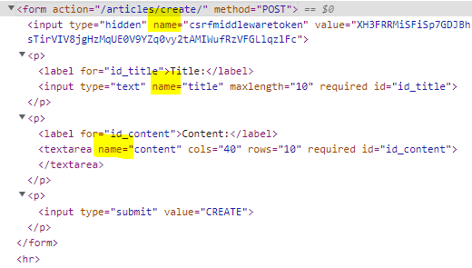

POST는 DB 조작

GET은 DB 조작 x


# Form


+ Form 선언
  + models.py 와 유사


+ Form Fields
  + input의 유효성 검사를 처리
+ Widgets
  + 웹페이지에서 input element의 단순 raw한 렌더링 처리


+ Form fileds 와 widget을 이용해서 여러 filed 이용가능
+ [widgets 공식문서](https://docs.djangoproject.com/en/4.0/ref/forms/widgets/)
+ [장고 권장 작성 style](https://docs.djangoproject.com/en/dev/internals/contributing/writing-code/coding-style/)


# Model form

1. 모델 필드 속성에 맞는 html element를 만들어 주고(model의 fields를 보고 tag, type 등 알아서 만들어줌)
2. 이를 통해 받은 데이터를 view 함수에서 유효성 검사를 할 수 있도록 함

--------

+ model form 

  + 실제 DB에 저장이 이루어지는 데이터를 받으려면 Model form 사용
  + db와 비슷한 구조

+ ModelForm class

  + Meta class
    + model, fields, exclude 

  ---------------

+ form 은 db와 관련이 없음

  + 데이터를 처리해야하지만, db에 저장하지는 않을 때 이용
  + 예를 들어 로그인 할 때는 form 이용

--------------------


## [1] form

### (1) create

```python
# 요청으로부터 데이터 받아서 
# Model 객체에 담아서
# DB API 활용해서 DB에 저장

# 1. form 이용
def create(request):
    form = ArticleForm(request, POST)

    # 유효성 검사
    if form.is_valid():  # 받은 데이터가 유효한 경우
        article = form.save()  # DB에 DATA 저장됨 & return 으로 save 된 객체 나옴
        return redirect('articles:detail', article.pk)
    else: # 유효하지 않은 input을 받은 경우
        return redirect('articles:new')
    
    
# 2. 아래는 form 을 안쓰는 경우의 코드    
def create(request):

    title = request.POST.get('title')
    content = request.POST.get('content')

    article = Article(title=title, content=content)

    article.save()

    return redirect('articles:index')
 
```


## [3] method

### (1) save()

```python
article = Article.objects.get(pk=1)
form = # 이 경우 수정
form.save()  
```


### (2) is_valid()

```python
form.is_valid() # 불리언 반환 및, form 변환?
forms.errors     # 에러메세지 확인 가능
```


## Bootstrap 활용

## (1) 방법1

+ widget의 attrs에 'class'를 key로 가지도록해서 'class': 'form-control'

## (2) 방법2 [문서](https://django-bootstrap-v5.readthedocs.io/en/latest/quickstart.html)

+ django-bootstrap5

+ [시작방법](https://django-bootstrap-v5.readthedocs.io/en/latest/installation.html)

  ```bash
  $ pip install django-bootstrap-v5
  ```


+ quick start

```html
{# Load the tag library #}
 # base.html의 맨 위에 적기

{# Load CSS and JavaScript #} 기존 cdn 대신 넣기
  # head에 넣고
  # body에 넣기
```


+ [위젯사용관련부분](https://django-bootstrap-v5.readthedocs.io/en/latest/widgets.html)

# error 해결

+ NoReverseMatch
  + 내가 요청한 주소(해당템플릿)의 url만 보면됨!


# 그외

render에서 주소쓰는법하고

redirect에서 주소쓰는법

```python
            return redirect('articles:detail', article.pk)


    return render(request, 'articles/update.html', context)
```


ko-kr : settings.py


+ BASE_DIR 은 manage.py 있는 곳
+ html 파일을 항상 모든 app의 templates 로 들어가서 찾기 때문에, settings.py에 여기도 찾아보라고 BASE_DIR/'templates' 해줘야 함


# 숙제

1. ModelForm을 사용할 때 Meta 클래스 내부에 model과 fields 변수는 반드시 작성해야 한다. 

+ **T**

+ Form 할때는 없어도 되지만, ModelForm은 모델과 연결시켜주는 것이라서, **Meta class** 작성해줘야 함

  + **model 이랑 field를 선언을 해주어야** 함.(include, exclude 포함)

  

2. ModelForm을 사용할 때는 렌더링 되는 input element 속성은 Django에서 제공 해주는 대로만 사용해야 한다. 

+ F
+ widget 속성을 이용해서, 변경할 수 있음


3. 화면에 나타나는 각 element 위치는 html에서 form.as_p()를 사용하지 않아도 직접 위치시킬 수 있다.

+ **T**
  + for를 사용 / form 요소의 속성들(field)로 각각의 요소들에 접근할 수 있음


# 참고사항

+ 에러 여러개 다르게 표시
  + https://docs.djangoproject.com/en/4.0/topics/forms/modelforms/#considerations-regarding-model-s-error-messages


# 질문

+ create 3번 방법에 `field` 그냥 있는거 의미

  ```django
  
  
  
  
  <form action="" method="POST">
    
  
   3번 방법 
  
    
    에러발생시원하는 경고문구
    
        <div class='alert alert-danger' role="alert">
      {{ error }}
    
    </div>
    
  
    {{ field.errors }}
    {{ field.label_tag }}
  <------------------------------------------------------------------------------    
    {{ field }}   <-----------------------해당부분
  <-------------------------------------------------------------------------------
      
  
      
  <p>
    <input type="submit" value="CREATE">
  </p>
  </form>
  
  
  
  ```

  + `field`(해당요소의 input)의 내용을 그대로 출력


+ Form 과 modelform은 같은역할

  + Form 

    + 입력받을 수 있는 창을 보여주는 것 / 입력을 서버에서 받음 

    + 모델과 상관없음 

      + 그래서 직접 모델을 생성해 준 후, 저장해야 함

      + ```python
        # 직접 모델
        title = request.POST.get('title')
        article = Article(title=title)  를 한 후,
        article.save() 를 해야 함
        ```

        

        

  + modelform

    + form + 우리가 만들 모델과 매핑(사용자의 입력)
    + 이미 모델과 매핑되어 있어서, 바로 DB에 저장가능

    

  + 코드 비교

    ```python
    # forms.py
    from django import forms
    from .models import Article
    
    # Form은 아래 처럼 직접 필드 설정해 줘야 함
    class ArticleForm(forms.Form):
        title = forms.CharField(max_length=10)
        content = forms.CharField()
    
    # ModelForm은 Meta에서 model을 Article로 설정했으므로, model과 연결되어 있고, 
    # 필드도 '__all__' 하면 model의 필드와 가장 적합한 필드로 만들어 줌
    class ArticleForm(forms.ModelForm):
    
        class Meta:
            model = Article
            fields = '__all__'  # **model 의 필드와 가장 적합한 필드로 만들어줌******
    ```

    


+ Form 작동 방법

  + ```python
    def create(request):
        if request.method == 'POST':
            form = ArticleForm(request.POST)
            if form.is_valid:
                article = form.save()  # form에 모델도 있포함(모델폼이라서 가능)
                return redirect('articles:detail',article.pk)
        
        else:
            form = ArticleForm()
        
        context = {
            'form' : form,
        }
    
        return render(request, 'articles/create.html', context)
    ```

  + `form`에 이런 내용 담은 것이라고 알려주면, views.py의 `return render(request, 'articles/create.html', context)`를  한 후,   template(`'articles/create.html'`)으로 가서,  필요한 내용 `context`에서 빼옴 (현재 `context`에 `form` 넣어서 `return` 한 상태)


+ ModelForm 코드예시

  + `form = ArticleForm(request.POST, instance=article)` 이라고 해야, form 만들 때, `ariticle` instance의 내용 가져와서 수정해 줌

  ```python
  # views.py 의 update 함수
  def update(request,pk):
      article = Article.objects.get(pk)
      if request.method == 'POST':
          form = ArticleForm(request.POST, instance=article)
          if form.is_valid():
              article = form.save()
              return redirect('articles:detail',article.pk)
      else:
          form = ArticleForm(instance=article)
  
      context = {
          'article':article,
          'form' : form,
      }
      return render(request, 'articles/update.html',context)
  ```

  


+ form class 에 test, test2 는 어떤 class
  + test, test2 는 별의미 없음
    + 자바스크립트에서 같은 클래스 모두에 한번에 접근해서, 데이터 수정할 때 이용
    + class="test test2" 와 같이 test, test2가 정의되어 있지 않아도, 오류발생하지 않음


---


+ 아래에서  `'articles:detail', 'articles/create.html', `차이 / redirect의 과정을 잘 모르겠음

  + return : 응답을 만들어 내야하는 부분
  + return 없이 호출하면 ValueError 뜸

     + 아래쪽에 세부사항 적혀있음

       


+ else에서   form = ArticleForm() 하면 form에 뭐있는 건지

  + 입력값 제외한 해당 페이지의 모든 정보를 담고 있음
  + forms.py에 이런 이런 내용 담으라고 정의된 것이고, views에서 template ` 'articles/create.html'`을 보고, `context(form)`에서 필요한 것을 가져오게 됨

+ ```python
  
  def create(request):
      if request.method == 'POST':
          form = ArticleForm(request.POST)
          if form.is_valid():
              article = form.save()
              return redirect('articles:detail', article.pk)
      else:
          form = ArticleForm()
      context = {
          'form': form,
      }
      return render(request, 'articles/create.html', context)
  ```


---


+ 아래에서 `request.POST` 의미

  + `request.POST` 정의
    + POST 요청에 대한 정보를 가진 객체라고 생각
  + 설명
    + 요청방식에 따라 request(요청 객체)의 모양이 조금씩 다름 
      + 그래서 `.POST`로 되어있으면, POST로 요청이 왔다고 간주하고 요청을 처리함
      + POST는 request의 BODY 에서 데이터를 가져옴
    + GET의 경우 request는
      + HEADER 부분에 
        + URL 
        + 요청파라미터(key&value)(개발자모드의 form 안에 들어있는 모든 name있는 것들이 요청파라미터임 / 사용자의 입력값 이외에도 csrf 토큰 등 name 있는 것 존재)로 구성이 됨
      + GET은 request의 HEADER 에서 데이터를 가져옴
    + POST의 경우 request에 
      + HEADER 뿐아니라 BODY 부분이 생기고, BODY 부분에 content type, ... , 요청 파라미터 등이 존재
      + POST 요청은 request의 BODY에서 데이터를 가져옴
      + 아래는 요청 파라미터의 예(name 있는 것들이 요청파라미터임)
      + 

  

+ ```PYTHON
  def update(request, pk):
      article = Article.objects.get(pk=pk)
      if request.method == 'POST':
          form = ArticleForm(request.POST, instance=article)
          if form.is_valid():
              article = form.save()
              return redirect('articles:detail', article.pk)
      else:
          form = ArticleForm(instance=article)
      context = {
          'article': article,
          'form': form,
      }
      return render(request, 'articles/update.html', context)
  
  ```


---


+ 주소 맨 앞의 `/` 는 ROOT를 의미


+ `path` 함수의 기능
  1. 들어온 요청에 따라, 실행할 함수 지정 
     + `path('create/',views.create,name="create"),` 에서, `'create/'` 들어오면 , `views.create`를 실행해라
  2.  장고 내부에서 사용할 URL 선언
     + `name`으로 호출될 경우, 해당 `name`을 부를 때, 사용할 URL을 `path` 맨 앞의 URL로 가지고 있음
       + 그래서 `ridirect` 가 `return` 될 때, `path`의 `name`이 호출되어도, 해당 URL을 다시 요청받게 됨
         + 즉, `name`으로 불렸을 때, 이런 URL 요청보내야지 라는 것 같음
       + `pk` 등 path의 맨 앞의 URL에 채워넣어야할 변수가 있다면, 이도 `redirect`에서 받아서 채워넣어서 URL을 선언하게 됨 (`redirect`에서 `context`로 넘겨줘야 함)
         + 예 : `path('<int:pk>/',views.detail,name='detail'),`
+ `path` 함수의 return 값은 `URLResolver` 응답


+ `ridirect`
  + `redirect('articles:detail', article.pk)` 는
    + 너 여기 주소로 다시 요청해라고 하는 것이고, 
    + 장고 서버 내에서는 `path('<int:pk>/',views.detail,name='detail'),` 의 name이 호출되면, 장고 내부에서 해당 name에 대해 사용할 URL을 선언하는데, 이를 `path` 앞의 주소로 이용함
    + 그리고 `pk` 같은 변수는 받아온 데이터에서 알아서 채워 넣음  
  + `redirect('articles:index')` 처럼 name을 쓰는 이유
    + `redirect('/articles/')`로(URL 주소입력) 해도되지만, 이렇게 하면, `path('', views.index, name='index')` 에서 앞의 `''`부분이 `'test'`로 바뀌었을 때, `views.index` 실행되게 하려면, `redirect('/articles/')` 를 모두  `redirect('/articles/test')`로 바꿔줘야 함
    +  


+ HTTP 응답관련

  + views.py의 `from django.shortcuts`  은 HTTP응답을 쉽게 해줌

  + HTTP Response의 종류는 3가지
    + HTML ( return render ) 
      + 화면 보여주려면 HTML 응답해야 함
    + JSON(문자열 Data)
    + ridirect
  + 사실 views.py에서 `return render(request, 'articles/index.html') ` 에서 `'articles/index.html'`는 HTML 파일이 아니라, 템플릿임
    + 이 템플릿 이용해서 HTML 응답 만드는 것

+ 


+ update 질문

  + `form.is_valid()` 가 False 경우와, 처음에 else인 경우, context에 담기는 것
  + `form = ArticleForm(instance=article)` 이게 어떻게 생긴 것?
    + `article`은 `pk`가지고 있지만, `form`은 가지고 있지 않음
  + detail.html에서 `<a href=""> UPDATE </a>` 와 같이 있는데, a tag는 GET method 인가요?

  ```python
  def update(request,pk):
      article = Article.objects.get(pk)
      if request.method == 'POST':
          form = ArticleForm(request.POST, instance=article)
          if form.is_valid():
              article = form.save()
              return redirect('articles:detail',article.pk)
      else: # 수정 양식만 요청하는 경우 (edit) : edit 
          form = ArticleForm(instance=article)
  
      context = {
          'article':article,
          'form' : form,
      }
      return render(request, 'articles/update.html',context)
  
  ```

  

+ 모델 작성후 마이그레이션하면, 서버에서 사용가능
  + 모델은 서버에서 사용할 데이터