[toc]

## 목차

+ [1.코딩애플](#1.-코딩애플)
  + [기초0강](#[1]-기초-0강)
  + [기초1강 - 설치 및 세팅](#[2]-기초-1강-:-설치-및-세팅)
    + [(3) 궁금증 해소](#(3)-궁금증-해소)
  + [기초 2강 - JSX](#[3]-기초-2강-:-JSX)
  + [기초 3강 - state](#[4]-기초-3강-:-state)
  + [기초 4-5강 - 이벤트리스너 & state 변경](#[5]-기초-4-5강-:-이벤트리스너-&-state-변경)


+ [2.인프런-처음만난리액트](#2.인프런-처음만난리액트)
  + [Sec3 - JSX](#sec3---jsx)


+ [참고](#[99]-참고)


# 1. 코딩애플


## [1] 기초 0강

+ React 쓰는 이유 및 특징

  + 앱 만들기, 발행하기 쉽고, UX적으로 뛰어남

  + 2020 이후로, class 없어져서 만만해짐

  + JS 기초지식 필요

    + 기초지식 없으면 어려움

      

+ 강의 목적

  + 혼자서도 잘하는 사람 양성하는 커리큘럼
  + 있어보이는 실전 프로젝트 제작
    + 쇼핑몰 & 블로그


### (1) Web-app의 장점

+ 모바일앱으로 발행이 쉬움
+ 앱처럼 뛰어난 UX
+ 그냥 웹사이트보다 비즈니스적 강점


### (2) 필요사전지식

+ var, let, const, if else, for, function return, array object, addEventListener, HTML/CSS


## [2] 기초 1강 : 설치 및 세팅

+ 에러나는 경우 참고 [링크](https://codingapple.com/unit/react1-install-create-react-app-npx/?id=2305)

### (1) 설치과정

+ Node.js 최신버전 설치
+ visual studio code(에디터) 설치
+ open folder
+ 에디터의 터미널열어서 npx create-react-app 프로젝트명 입력
+ 방금 생성된 프로젝트명 폴더를 에디터로 오픈 해서 src > App.js에서 코드짜면 되고
+ **미리보기** 띄우려면 터미널 열어서 `npm start` 하면 됨


### (2) 블로그 생성 프로젝트

+ `npx create-react-app blog`

  + `npx` : 라이브러리 설치 도와주는 명령어(nodejs 설치 되어 있어야 이용가능)
  + `create-react-app` : react setting 다 된 boilerplate 만들기 쉽게 도와주는 라이브러리
  + `blog` : blog라는 이름의 react project

  


### (3) 궁금증 해소

+ Node.js 설치 이유
  + 설치 이유는 [create react app](https://create-react-app.dev/) 이라는 라이브러리 사용하기 위해서
  + 또한 Nodejs 설치하면 npm 이라는 툴 이용 가능

+ 생성된 react app

  + App.js

    + App.js는 메인페이지에 들어갈 HTML 짜는 곳

    + 실제 메인 페이지는 public > index.html 임

    + src > index.js가 App.js 의 내용을 public > index.html에 반영되도록 해줌 

      + ```js
        // index.js
        // id가 root인 div 태그에다가, App.js의 모든 내용 넣어주세요
        const root = ReactDOM.createRoot(document.getElementById('root'));
        root.render(
          <React.StrictMode>
            <App />
          </React.StrictMode>
        );
        ```

        

  + node_modules
    + 설치한 라이브러리 모두 모은 폴더
      + creat react app 실행 위해서는 수많은 라이브러리 필요
  + public
    + static 파일 보관함
    + public 폴더에 넣으면 빌드, 배포할 때 압축되지 않고, 그대로 있음
  + src
    + 소스코드 보관함
    + APP.js 에 작성
  + package.json
    + 내가 설치한 라이브러리의 이름과 버전을 다 모아둠
      + npm으로 설치할 때마다, 자동으로 update 됨
  + 


## [3] 기초 2강 : JSX

### (1) App.js 작성

+ 함수 return 부분에 그냥 HTML 작성하면 됨 (HTML 처럼 보이지만 사실 JSX임)

  + ```JS
    function App() {
      return (
          여기에 그냥 다 작성하면 됨
        <div className="App">
          
        </div>
      );
    }
    ```


### (2) 작성법(JSX)

+ class 넣을려면 JSX는 `class` 못쓰고, **`className` 써야함**

  + style은 App.css에 넣어주면 됨

+ **데이터 바인딩**

  + `{}` 쓰고, 변수 넣으면 됨

    + src, id, href, className 등의 속성에도 가능

  + 아래는 데이터 바인딩 (이미지 넣기, 함수값 넣기, 변수 넣기) 3가지 예

    + ```js
      import logo from './logo.svg';   // logo.svg를 넣고 싶다.
      import './App.css';
      
      function App() {
      
        let posts = '강남 고기 맛집';  // 서버에서 가져온 데이터라고 칩니다.
        
        // 비교 1: 전통적 js 데이터 바인딩
        //document.getElementById().innerHTML = ''? 와 같이 했어야 함
      
        function 함수(){
          return 100
        }
        
        return (
          <div className="App">
            <div className="black-nav">
              <div> 개발 Blog </div>
            </div>
            </img>  // 이미지 바인딩해서 넣기
            <h4> 블로그 글 </h4>      
            <h4> { posts } </h4>     // 변수 바인딩해서 넣기
            <h4> { 함수() } </h4>    // 함수값 바인딩해서 넣기
          </div>
        );
      }
      
      export default App;
      
      
      ```

    + 

+ style 속성 집어 넣을 때

  + 아래 처럼은 불가

    ```html
    <div style="font-size : 16px"> </div>
    ```

    + js에서 쓸 수 있는 민감한 기호들이 많아서, 위처럼은 불가

  + 무조건 `{}` 안에 object 형식으로 넣어주면 됨

    + ```html
      # 방법 1
      <div style={ {color : 'blue', fontSize : '30px'} } > </div>
      
      # 방법 2
      let posts = {color : 'blue', fontSize : '30px'}  ( return 위쪽에 적기)
      <div style={ posts } > </div>
      ```

    + 


## [4] 기초 3강 : state

+ 코드 [링크](https://codingapple.com/unit/react-3-state-usestate-hook/?id=2305)

+ **자주 바뀌고, 중요한 데이터는 state에 저장**

  

### (1) 데이터 저장

#### (a) 저장 방법

+ 변수에 저장

+ state 만들어서 저장

  + ES6 destructuring 문법 이용

    + ```js
      let [글제목,글제목변경] = useState('남자 코트 추천'); // 이렇게 코딩하면 이 자리에는 array가 남음 [a=남자코트추천,b=state정정해주는함수] 꼴
      ```

#### (b) state 사용법

+ state 는 변수 대신 쓰는 데이터 저장 공간

+ `useState()`를 이용해 만들어야 함

  + `useState() 는 [a,b]` 꼴로 저장됨

  + 문자, 숫자, array, object 모두 저장 가능

  + ```js
    import { useState } from 'react';
    
    import './App.css';
    
    function App() {
      // ES6 destructuring 문법
      // array안의 [10,100] 두 개의 데이터를, 두 개의 변수에 답고 싶으면 아래 처럼 하면 됨.
      // 원래 useState('남자 코트 추천') 은 ['남자 코트 추천', 함수] 임
      let [글제목,글제목변경] = useState('남자 코트 추천');  // 이렇게 코딩하면 이 자리에는 array가 남음 [a=남자코트추천,b=state정정해주는함수] 꼴
      
      return (
        <div className="App">
          <div className="black-nav">
            <div> 개발 Blog </div>
          </div>
    
          <div className="list">
            <h3> { 글제목 } </h3>
            <p> 2월 17일 발행</p>
            <hr/>
          </div>
    
        </div>
      );
    }
    
    export default App;
    ```

  + ```js
    let [글제목2, 글제목변경2] = useState(['남자 코트 추천','최고']) 이렇게 한다면
    <h3> { 글제목2 } </h3> => 남자 코트 추천최고  로 나옴
    <h3> { 글제목2[0] } </h3> => 남자 코트 추천
    <h3> { 글제목2[1] } </h3> => 최고
    ```

+ 


#### (c) state 쓰는 이유

+ 웹이 App처럼 동작하게 만들고 싶어서
  + App처럼 동작하게 하려면, 자주 변경되는 모든 데이터를 state로 저장해야함
+ **state를 담고 있는 데이터가 바뀌면, HTML이 자동으로 재렌더링 됨**
  + 제목 정렬이나 제목 수정 등의 데이터 조작시 새로고침 없이 재렌더링 됨
  + 그냥 변수에 넣은 데이터가 바뀌면, 새로고침 해야 재렌더링 됨
  + 


## [5] 기초 4-5강 : 이벤트리스너 & state 변경

+ [강의코드링크](https://codingapple.com/course/react-basic/)

### (1) 좋아요 버튼

+ 이벤트리스너

  + `onClick` : js, html 문법과 같음, 함수를 넣어야 함

    + ```html
      let [글제목, 글제목변경] = useState(['아동복 추천','아동 신발 추천','아동 용품 추천']);
      <h3> { 글제목[1] } <span onClick={ 실행할 함수 }>👍</span> 0 </h3>
      <h3> { 글제목[1] } <span onClick={ ()=>{실행할 내용} }>👍</span> 0 </h3>
      ```


### (2) state 변경(데이터변경)

+ 데이터 변경 과정

  + state 만들 때 **생성되는 함수** 이용해서, state 데이터 변경해야 함

    + 그래야 재 렌더링이 자동으로 됨!
    + 또한 **state 자체를 완전 대체하는 함수**임
      + 부분부분 변경같은 거 안됨 ( `글제목변경[0] = '새로운 제목'` 이런거 안됨) 

  + ```js
    let [따봉, 따봉변경] = useState(0);
    <h3> { 글제목[1] } <span onClick={ ()=>{ 따봉변경(따봉+1) } } >👍</span> { 따봉 } </h3>
    ```

  + deepcopy : `[...array]`

    + ```js
      // 버튼 누르면 아동복 추천 -> 여자 코트 추천 으로 바뀜!
      let [글제목, 글제목변경] = useState(['아동복 추천','아동 신발 추천','아동 용품 추천']);
      function 제목변경2(){
        // let newArray = 글제목에 있던 0번째 데이터를 여자코트 추천으로 바꿈
        let newArray = [...글제목];
        newArray[0] ='여자 코트 추천'
        글제목변경( newArray );
        }
      <button onClick={ 제목변경2 }>버튼3</button>
      ```


+ 데이터 정렬

  + 마찬가지 순서로 진행하면 됨.

  ```js
  let [글제목, 글제목변경] = useState(['아동복 추천','아동 신발 추천','아동 용품 추천']);
  function 제목정렬(){
      // let newArray = 글제목에 있던 0번째 데이터를 여자코트 추천으로 바꿈
      let newArray = [...글제목];
      newArray.sort()
      글제목변경( newArray );
    }
  ```

  


+ 내 요약
  + **데이터 변경하는 법**
    + 기존 state를 deepcopy `[...array]`
    + deepcopy 본의 데이터를 변경
    + state 생성 시 만든 변경함수로 deepcopy한 데이터로 대체


+ 강의자요약
  1. useState만들 때 함께 만들어놨던 따봉변경() 글제목변경() 이런 함수를 쓰시면 됩니다. 
  2.  근데 array 자료라면 그냥 대충 등호 이런걸로 변경하면 안되고 사본을 만들어서 그걸 변경하셔야합니다. 
  3. 사본 만드는 법은 let newArray = [...기존state이름] 이렇게 만드신 다음 newArray를 수정해서 글제목변경(newArray) 이렇게 하셔야 제대로 state 변경이 가능합니다.


# 2.인프런-처음만난리액트

## Sec1


## Sec2

### [1] HTML, CSS, React (실습)

+ 직접 수기로 CSS, React 환경 세팅


### [2] create-react-app (실습)

+ 라이브러리 활용해서, react 환경에서 작성 
+ react로 웹앱을 개발하기 위한 모든 설정이 되어있는 상태로 react를 생성해줌


#### (1) 개발환경

+ Node.js : v14.0.0 이상
+ nmp v6.14.0 이상
+ VS Code


#### (2) 명령어

+ `npx create-react-app my-app`
  + react app 개발환경 세팅
  + npx : execute npm package binaries
+ `npm start`
  + 앱 실행


## Sec3 - JSX 

### [1] JSX의 정의와 역할

+ 정의

  + JSX = A syntax extension to JavaScript

  + JS + XML/HTML 임

    + JS의 문법을 확장

      

+ JSX 예제 코드

  + ```JSX
    const element = <h1>Hello, world! </h1>;
    ```

    + `const element` 는 JS, `<h1> </h1>`은 HTML


+ JSX 역할

  + 내부적으로 XML / HTML 코드를 JS로 변환하는 과정을 거침

    + 즉 JSX로 작성해도,  JS 결과물이 나옴

  + `React.createElement`

    + XML / HTML을 JS로 변환하는 역할

  + JSX 예제 코드 1

    + ```JSX
      class Hello extends React.Component {
          render() {
              return <div> Hello {this.props.toWhat} </div>;
          }
      }
      
      ReactDom.render(
      	<Hello toWaht="World"/>,
          document.getElementById('root')
      );
      ```

    

  + JSX를 사용하지 않은 예제 코드 1
  
    + ```JS
      class Hello extends React.Component {
          render() {
              return React.createElement('div', null, `Hello ${this.props.toWhat}`);
          }
      }
      
      ReactDom.render(
           React.createElement(Hello, { toWhat: 'World' }, null),
          document.getElementById('root')
      );
      ```
  
  
  
  
  + JSX를 쓰지 않으면 `React.createElement` 를 사용하게 되고, 그 결과로 JS 객체가 나옴
  
    
  
  + 예제코드 2
  
    + ```JSX
      // JSX 사용
      const element = (
      <h1 className="greeting">
          Hello, world!
      </h1>
      )
      
      //-----------------------------------------------------------------
      // JSX 사용 X
      const element = React.createElement(
      'h1',
      { className: 'greeting'},
          'Hello, world!'
      )
      
      // React.createElement()의 결과로 아래와 같은 JS객체 생성
      const element = {
          type : 'h1', 
          props : {
              className : 'greeting',
              children : 'Hello, world!'
          }
      }
      ```
  
    
  
  + `React.createElement()` 구조
  
    + ```js
      React.createElement(
      	type,          // 다른 react component나 html tag들
      	[props],       // 속성들이 들어감
      	[...children]  // 현재 element가 포함하고 있는 자식 element
      )
      ```
  
      


### [2] JSX의 장점 및 사용법

#### (1) 장점

+ 코드가 간결해짐

  + ```jsx
    // JSX 사용
    <div>Hello, {name}</div>
    
    // JSX 사용X
    React.createElement('div',null, `Hello, ${name}`);
    ```

+ 가독성 향상

  + 버그를 쉽게 발견할 수 있어서, 유지보수 용이해짐

+ Injection Attacks 방어 가능

  + XXS (cross site scripting attack) 방어


#### (2) 사용법

+ JS + XML / HTML

+ `{}` 사용하면 js 들어간다고 생각

  

**작성법 1** - 기본

+ ```JSX
  // 기본 형태
  ... XML / HTML
  { JS CODE }
  ... XML / HTML
  
  // 예시 1 : js 변수 호출
  const element = <h1>안녕, {name} </h1>;
  
  // 예시 2 : js 함수 호출
  const element = (
  	<h1>
      	Hello, {formatUser(user)}
      </h1>	
  );
  
  // 예시 3 : 유저이면 유저 이름 넣어서 인사
  function getGreeting(user) {
      if (user) {
          return <h1> Hello, {formatName(user)}!</h1>
      }
      return <h1>Hello, Stranger.</h1>
  }
  ```


**작성법 2** - 태그의 속성(attribute)에 값을 넣는 방법

```JSX
// 1. 큰 따옴표 사이에 문자열 넣기
const element = <div tabIndex="0"></div>
      
// 2. 중괄호 사이에 js 코드 넣기
const element = </img>
```


**작성법 3** - children 정의

```jsx
const element = ( 
    <div>
    	<h1>안녕하세요</h1>                     이렇게 작성하면 children 됨
        <h2>열심히 리액트 공부해 봅시다!</h2>
    </div>
);
```


### [3] JSX 코드 작성해보기 (실습)

#### (1) JSX 버전

**파일구조**

+ my-app
  + src
    + Chapter_03
      + Book.jsx
      + Library.jsx
  + index.js


**index.js**에 jsx 가져오기

+ `export default` 넣기!

+ Book.jsx

  + ```jsx
    import React from "react";
    function Book(props){
      return (
        <div>
          <h1>{ `이 책의 이름은 ${props.name} 입니다.` }</h1>
          <h2>{ `이 책은 총 ${props.numOfPage} 페이지로 이루어져 있습니다.` } </h2>
        </div>
      )
    }
    export default Book;
    ```

+ Library.jsx

  + ```jsx
    import React from "react"
    import Book from "./Book"
    
    function Library(props){
      return (
        <div>
          <Book name="처음 만난 파이썬" numOfPage={300} />
          <Book name="처음 만난 AWS" numOfPage={400} />
          <Book name="처음 만난 리액트" numOfPage={500} />
        </div>
      )
    }
    export default Library;
    ```

+ index.js

  + ```js
    
    import Library from "./Chapter_03/Library";  // 추가
    
    
    const root = ReactDOM.createRoot(document.getElementById('root'));
    root.render(
      <React.StrictMode>
        <Library />  // <App />에서  교체
      </React.StrictMode>
    );
    ```

  + 


#### (2) TSX 버전

+ `""` 가 아닌 `''` 써야 함

**파일구조**

+ my-app
  + src
    + Chapter_03
      + Book.tsx
      + Library.tsx
  + index.tsx


**index.tsx**에 tsx가져오기

+ `export default` 넣기!

+ Book.tsx

  + ```jsx
    import React from 'react';
    
    interface bookProps{
      name : string;
      numOfPage : number;
    }
    
    
    function Book(props : bookProps){
      return (
        <div>
          <h1>{ `이 책의 이름은 ${props.name} 입니다.` }</h1>
          <h2>{ `이 책은 총 ${props.numOfPage} 페이지로 이루어져 있습니다.` } </h2>
          
        </div>
      )
    }
    
    export default Book;
    ```

+ Library.tsx

  + ```jsx
    import React from 'react'
    import Book from './Book'
    
    interface libraryProps{
    }
    
    
    function Library(props : libraryProps){
      return (
    
        <div>
          <Book name="처음 만난 파이썬" numOfPage={300} />
          <Book name="처음 만난 AWS" numOfPage={400} />
          <Book name="처음 만난 리액트" numOfPage={500} />
        </div>
      )
    }
    
    export default Library;
    ```

+ index.tsx

  + ```js
    import Library from './Chapter_03/Library';  // 추가
    
    
    const root = ReactDOM.createRoot(document.getElementById('root'));
    root.render(
      <React.StrictMode>
        <Library />  // <App />에서  교체
      </React.StrictMode>
    );
    
    
    // chapter 03
    // import Library from './Chapter_03/Library';
    // const root = ReactDOM.createRoot(
    //   document.getElementById('root') as HTMLElement
    // );
    // root.render(
    //   <React.StrictMode>
    //     <Clock />
    //   </React.StrictMode>
    // );
    ```

  + 


## Sec4

### [1] Rendering Elements

#### (1) React element의 개념과 역할

+ Elemnent는 react app을 구성하는 가장 작은 블록들
  + 기존에는 element라고 하면 DOM element였음

+ React 초창기에 화면에 나타나는 js 객체를 나타내는 용어 필요했음
  + Descriptor라는 용어를 썼지만, 최종적으로 DOM에서 ELEMENT로 나타나서, ELEMENT로 용어 통일
  + React Element는 DOM element의 가상표현임

+ React Elements는 화면에서 보이는 것 기술

  + ```jsx
    // element 부분은 react의 createElement 이용해서  
    const element = <h1>Hello, world</h1>;
    ```

+ React Elements는 js 객체 형태로 존재

  + 한 번 생성되면 바꿀 수 없음

+ `createElement` : type, props, children 외우기

  + ```react
    React.createElement(
    	type,
    	[props],        // element 성질
    	[...children])  // 해당 element의 자식
    ```

  + 동작과정

    + 


### [2] Element의 특징 및 렌더링하기

#### (2)-1 React element 특징

+ 불변성 (immutable)
  + Elements 생성 후에는 children이나 attributes를 바꿀 수 없음
    + 그럼 화면 갱신은 어떻게?
    + 새로운 element를 만들어서, 바꿔치기하기
  + component : 붕어빵 틀, element : 만들어진 붕어빵


#### (2)-2 React element가 rendering 되는 과정

+ Root Dom Node

  + ```html
    <div id="root"> </div>
    ```

  + 이 곳에 모든 react element 넣음

+ `ReactDom.render`

  + react element : react의 virtual dom에 존재

  + dom element : 실제 브라우저의 dom에 존재

  + 따라서 **react가 rendering 되는 과정**은 react virtual dom에서 실제 브라우저의 dom으로 이동하는 과정

  + ```jsx
    const element = <h1>안녕, 리액트!</h1>
    ReactDom.render(element, document.getElementById('root'));
    ```

  + 


### [3] 시계 만들기 (실습)

#### (1) TSX 버전

+ src/chapter_04/Clock.tsx

  + ```tsx
    import React from 'react'
    
    //인터페이스 설정으로 props 대응
    interface clockProps{
    }
    
    function Clock(props : clockProps){
      return (
        <div>
          <h1>안녕, 리액트!</h1>
          <h2> 현재 시간 : {new Date().toLocaleTimeString()} </h2>
        </div>
      );
    }
    
    export default Clock;
    ```

+ src/index.tsx

  + ```tsx
    // 공통
    import React from 'react';
    import ReactDOM from 'react-dom/client';
    import './index.css';
    import App from './App';
    import reportWebVitals from './reportWebVitals';
    
    
    //chapter 04
    import Clock from './chapter_04/Clock';
    const root = ReactDOM.createRoot(
      document.getElementById('root') as HTMLElement
    );
    setInterval( () =>{
      root.render(
        <React.StrictMode>
          <Clock />
        </React.StrictMode>,
      );
    }, 1000) ;
    ```

  + 


## Sec5

### [1] Components and Porps (매우중요)

#### (1) Components

+ React는 componnent Based
  + 레고 블록 조립하듯, 컴포넌트를 모아서 개발
  + 작은 컴포넌트 모아서 -> 큰 컴포넌트 모아서 -> 전체 페이지
+ react component의 입/출력
  + 입력 -> React component : (함수느낌) -> 출력
  + 입력 = props
  + 출력 = React element
+ Component와 element는 OOP의 class와 instance 와 비슷


#### (2) Props

+ **컴포넌트에 전달할 다양한 정보를 담고 있는 자바스크립트 객체**

+ react component(붕어빵틀) 의 속 재료(팥, 슈크림, 고구마)를 의미
  + 팥! 붕어빵(element)
  + 슈크림! 붕어빵
  + 고구마! 붕어빵
+ 예
  + 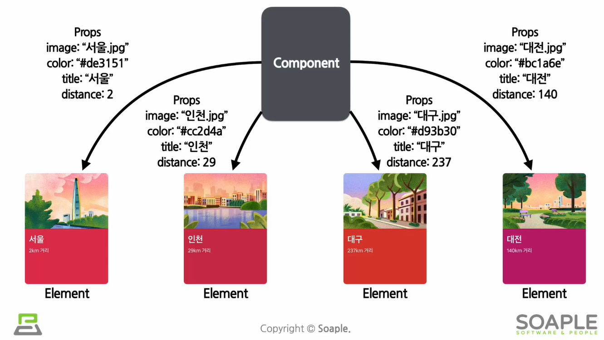


### [2] Props 특징 및 사용법

#### (1) Props 특징

+ 값을 읽기만하고, 변경은 불가능함
  + 붕어빵 다 구워졌는데, 배를 가르고 재료 바꿀 수 없음
+ 모든 리액트 컴포넌트는 Props를 직접 바꿀 수 없고, 같은 Porps에 대해서는 항상 같은 결과를 보여줄 것!
  + 모든 리액트 컴포넌트는 그들의 Props에 관해서는 Pure 함수 같은 역할을 해야함


#### (2) JS 함수 속성(pure)

+ ```JS
  // 함수가 pure == 입력값을 변경하지 않으며, 같은 입력값에 대해서는 항상 같은 출력값 생성
  function sum(a,b) {
      return a+b;
  }
  
  // 함수가 inpure : 입력값인 account를 변경했음..
  function withdraw(account, amount) {
      account.total -= amount
  }
  ```


#### (3) Props 사용법

##### (a) jsx 사용시

+ 코드 예

  + ```jsx
    // 예 1 : profile 컴포넌트의 Props로 name, introduction, viewCount 전달 됨
    function App(props) {
        return (
        	<Profile
                name="소플"
                introduction="안녕하세요, 소플입니다."
                viewCount={1500}
             />
        );
    }
    
    => profile 컴포넌트의 Props로 name, introduction, viewCount 전달 됨
    // 아래와 같은 js object가 됨
    {
        name: "소플",
        introduction: "안녕하세요, 소플입니다.",
        viewCount: 1500
    }
    
    
    // 예 2
    function App(props) {
        return (
        	<Layout
                width={2560}
                height={1440}
                header={<Header title="소플의 블로그입니다." />}
                footer={<Footer/>}
             />
        );
    }
    ```

  + 문자열 외의 모든 것은 중괄호로 감싸야 함

  + component

    + Profile, Layout, Header, Footer

  + Porps

    + name, introduction, viewCount, width, height, header, footer


##### (b) jsx 안쓰는 경우

+ 코드 예

  + ```js
    React.createElement(
    	Profilem,
    	{
        	name: "소플",
        	introduction: "안녕하세요, 소플입니다.",
        	viewCount: 1500
    	},
        null
    );
    ```

  + 


### [3] Component 만들기

#### (1) Class component

+ 리액트 초기에 사용됨, 불편해서, Function comonent를 발전시키며 쓰게 됨

+ function component에 비해 , 몇가지 추가기능 있음

+ 모든 class component는 `React.Component(리액트 컴포넌트)`를 상속 받아서 사용

+ class component 예

  + ```jsx
    class Welcome extends React.Component {
        render() {
            return <h1>안녕, {this.props.name}</h1>
        }
    }
    ```

  + 


#### (2) Function Component

+ 개선해가며 사용했고, 그 결과 훅을 사용하게 됨

+ 리액트의 component는 함수로 생각함

+ function component 예

  + ```jsx
    function Welcome(props) {
        return <h1> 안녕, {props.name} </h1>
    }
    ```

+ 간단한 코드가 장점


#### (3) component naming 규칙

+ Component는 대문자로 시작해야 함
  + 소문자로 시작하면, Dom tag으로 인식
    + div나 span 같은 것은 내장 component임을 뜻하고, div, span라는 문자열 형태로 `React.createElement`에 전달됨

+ 예제

  + ```jsx
    // HTML div 태그로 인식
    const element = <div />;
    
    // Welcome이라는 리액트 Component로 인식
    const element = <Welcome name="인제"/>;
    ```


#### (4) Component 렌더링

+ 컴포넌트는 붕어빵 틀 역할이므로, 컴포넌트가 직접 렌더링 되지는 않고, 컴포넌트로 생성된 element가 렌더링 됨

+ 예제

  + ```jsx
    // 1. 코드 차이
    // Dom tag를 사용한 element
    const element = <div />;
    
    // 사용자가 정의한 Component를 사용한 element
    const element = <Welcome name='인제'/>;
    
    
    // 2. 렌더링 과정
    function Welcome(props){
        return <h1> 안녕, {props.name} </h1>
    }
    const element = <Welcome name='인제'></Welcome>;
    ReactDOM.render(
    	element,
    	document.getElementById('root')  // 실제 DOM에 RENDERING 됨!
    );
    ```


### [4] Component 합성과 추출

#### (1) 합성

+ react에서는 컴포넌트 안에 또 다른 컴포넌트 사용 가능

  + ```jsx
    function App(props){
        return (
        	<div>
                <Welcome name="이름1"></Welcome>  // 이 부분이 합성부분
                <Welcome name="이름2"></Welcome>  // 이 부분이 합성부분
                <Welcome name="이름3"></Welcome>  // 이 부분이 합성부분
        	</div>
        )
    }
    ```

  + 


#### (2) 추출

+ 재사용성이 상승 -> 개발속도 상승 효과를 가져옴

+ 구조

  + Comment Component > UserInfo Component > Avatar Component
  + 기능 단위 & **재사용 가능** 한 단위로 추출하는 것이 좋다

+ 코드 예시

  + ```jsx
    function Comment(props){
        return (
            <div className='comment'>
              <div className='user-info'>
              	
                <div classname='user-info-name'>
                	{props.author.name}  
                </div>
                
              </div>
            
            </div>
        
        );
    }
    
    //-----------------------추출 부분
    
    // 1. avatar 추출
    function Avatar(props){
        return (
               
        );
    }
    
    // avatar 추출 적용
    function Comment(props){
        return (
            <div className='comment'>
                <div className='user-info'>
                    <Avatar user={props.author}/>   // 추출부분 사용
                	<div classname='user-info-name'>
                		{props.author.name}  
                	</div>
                </div>
            </div>
        );
    }
                        
                        
    // 2. UserInfo 추출하기
    function UserInfo(props){
        return (
        	<div classname='user-info'>
            	<Avatar user={props.user} />
                <div classname='user-info-name'>
                	{props.user.name}  
                </div>            
            </div>
        );
    }
    
    // UserInfo 반영
    function Comment(props){
        return (
            <div className='comment'>
                <UserInfo user='user-info'/> // 추출부분 사용
            </div>
        );
    }
    ```

  + 

  


### [5] 실습

+ css 스타일 작성

  + ```tsx
    // comment.tsx
    import React from 'react';
    
    const styles = {
    	wrapper: {
    		margin: 8,
    		padding: 8,
    		display: "flex",
    		flexDirection: "row",
    		border: "1px solid grey",
    		borderRadius: 16,
    	},
    	imageContainer: {},
    	image: {
    		width: 50,
    		height: 50,
    		borderRadius: 25,
    	},
    	contentContainer: {
    		marginLeft: 8,
    		display: "flex",
    		flexDirection: "column",
    		justifyContent: "center",
    	},
    	nameText: {
    		color: "black",
    		fontSize: 16,
    		fontWeight: "bold",
    	},
    	commentText: {
    		color: "black",
    		fontSize: 16,
    	},
    };
    ```

  + 

+ 컴포넌트 코드 변경

  + 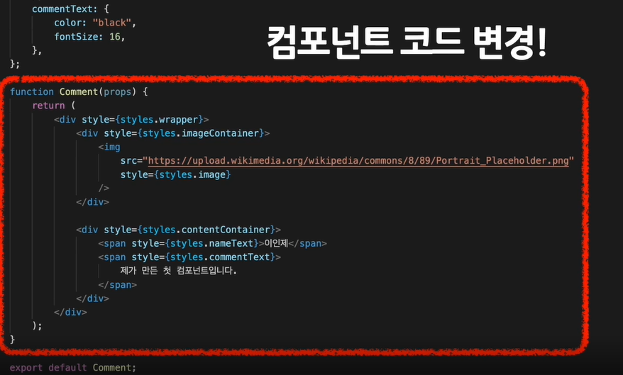


+ component 코드 변경 2 : 동적 이름 사용

  + ```tsx
    interface commentProps{
      name: string,
      comment : string
    }
    function Comment(props : commentProps) {
    	return (
    		<div style={styles.wrapper}>
    			<div style={styles.imageContainer}>
    				
    			</div>
    			<div style={styles.contentContainer}>
    				<span style={styles.nameText}>{props.name}</span>  // 동적이름사용
    				<span style={styles.commentText}>{props.comment}</span>
    			</div>
    		</div>
    	);
    }
    
    export default Comment;
    ```

  + 


+ comment 데이터를 별도의 객체로 분리하기

  + ```tsx
    // CommentList.tsx
    import React from 'react'
    import Comment from './Comment';
    interface commentListProps{
    }
    
    const comments = [
    	{
    		name: "오지현",
    		comment: "안녕하세요, 오지현입니다.",
    	},
    	{
    		name: "이민형",
    		comment: "I'm a child",
    	},
    	{
    		name: "이장원",
    		comment: "캔 위 메이컵 인 더 모닝",
    	},
    	{
    		name: "익스",
    		comment: "잘 부탁드립니다",
    	},
    ];
    
    function CommentList(props:commentListProps){
    	return (
    		<div>
    			{comments.map((comment) => {
    				return (
    					<Comment name={comment.name} comment={comment.comment} />
    				);
    			})}
    		</div>
    	);
    }
    export default CommentList;
    ```

  + 


## Sec 6 - State & Lifecycle

### [1] State & Lifecycle 정의

#### (1) State (매우중요)

+ React Component의 상태(변경가능한 데이터)를 나타냄

  + state는 개발자가 직접 정의

+ 주의사항

  + 렌더링이나 데이터 흐름에 사용되는 값만 state에 포함시켜야 함
  + 그렇지 않은 값은 컴포넌트에 저장

+ **state는 JS 객체**

+ state는 직접 수정 해선 안된다

  + ```js
    // 잘못됨
    this.state = {
        name: 'Inje'
    };
    
    // 옳음
    this.setState({
        name: 'Inje'
    });
    ```

  + 


#### (2) Lifecyle

##### (a) 리액트 컴포넌트의 생성과 사망 주기

+ 시간에 흐름에 따라 생성 / 업데이트 / 사라짐

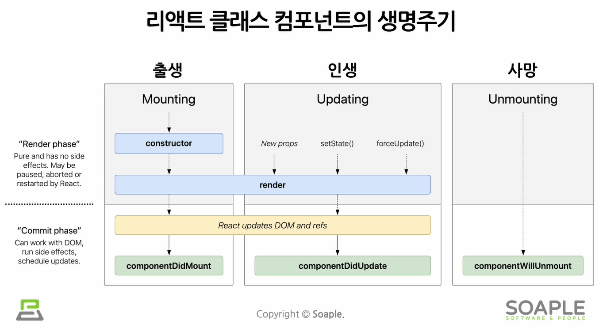


##### (b) 생명주기 함수 3가지

```tsx
// 그냥
componentDidMount(){
    console.log("componentDidMount() called");
}
componentDidUpdate(){
    console.log("componentDidUpdate() called");
}
componentWillUnmount(){
    console.log("componentWillUnmount() called");
}

// 컴포넌트 구분
componentDidMount(){
    console.log(`${this.props.id} componentDidMount() called`);
}

```


### [2] State 사용하기 (실습)

#### (1)

+ state update 하려면 `setState()` 함수 사용해야함
+ 


#### (2) React Devlopers Tools 사용

+ 구글에서 확장프로그램 설치하면,  개발자툴에서 react 탭 생김
  + Components 탭에서 컴포넌트 볼 수 있음
  + Profier 탭에서 start profiling 이용해서 컴포넌트 생성 시간 확인 가능


#### (3) Lifecycle method 사용해보기


## Sec 7 - Hooks

+ 16.8 version에서 생김


### [1] Hook 이란

#### (1) 컴포넌트

+ 컴포넌트

  + 함수 컴포넌트

    + state 사용 불가

    + Lifecycle에 따른 기능 구현 불가

    + **Hook** 으로 클래스 컴포넌트의 기능 사용 가능

      + 이름 앞에 **use** 를 붙여야 함
      + 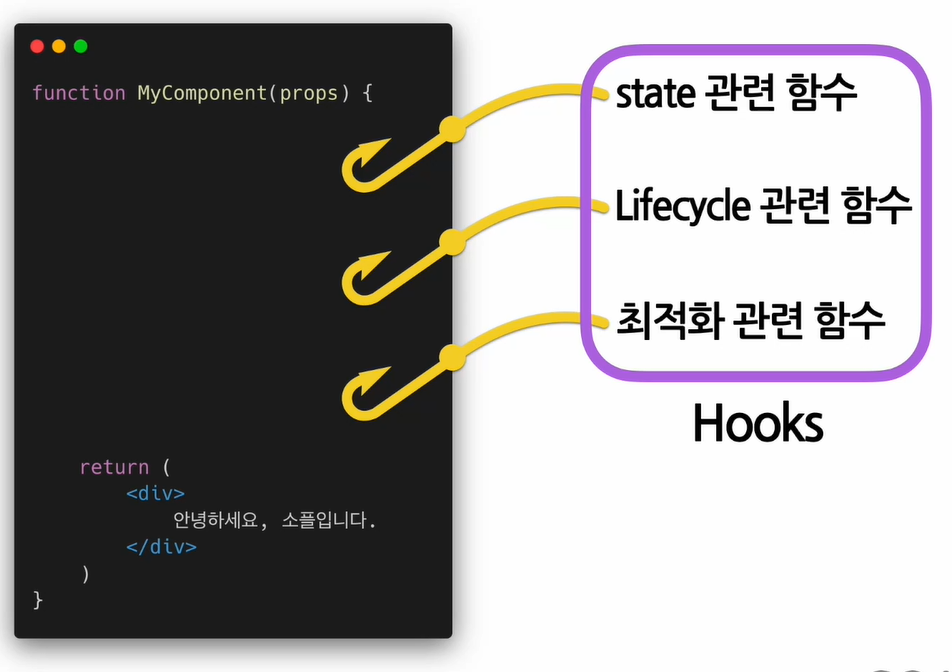

      

  + 클래스 컴포넌트

    + 생성자에서 state를 정의
    + `setState()` 함수를 통해 state 업데이트
    + Lifecycle methods 제공


#### (2) Hook 활용법

+ **use**를 앞에 붙여야 함

+ 예

  + ```tsx
    const [변수명, set함수명] = useState(초기값);
    
    // 예2
    import React, { useState } from 'react';
    
    function Counter(props){
        const [count, setCount] = useState(0);
        
        return (
            <div>
            	<p> 총 {count} 번 클릭하였음</p>
            	<button onClick={ ()=> setCount( count+1 ) }> 클릭 </button>
            </div>
        );
    }
    ```


#### (3) Hook 종류

##### (a) useState()

+ `useState(초기값)`
  + 변수 각각에 대해 set 함수가 있음

##### (b) useEffect() - 꼭 기억

+ `useEffect()`

  + side effect(=효과, 영향)를 수행하기 위한 hook

    + 서버에서 데이터 받아오거나, 수동으로 DOM을 변경
    + SIDE EFFECT는 다른 컴포넌트에 영향을 미칠 수 있으며, 렌더링 중에는 작업이 완료될 수 없는 것들
    + **Lifecycle** 함수 3가지의 기능을 사용할 수 있음

  + `useEffect(이펙트 함수, 의존성 배열)`

    + 배열이 하나라도 변경되면, 이펙트 함수 실행됨

    + `useEffect(이펙트함수, []);`

      + **mount**, **unmount** 시에 단 한 번씩만 실행되게 하려면

    + `useEffect(이펙트함수)`

      + 컴포넌트가 **update** 될 때마다 함수 호출

        

+ 사용법 정리

  + 

  


### [2] useMemo, useCallback, useRef

#### (1) useMemo

+ Memoized value를 리턴하는 Hook
  + Momoized value는 Momoization 된 값
+ Memoization
  + 비용이 많이 드는 함수의 호출 결과를 저장해 두었다가, 재사용

+ 사용법

  + ```ts
    const memoizedValue = useMemo(
      () => {
        // 연산량이 높은 작업을 수행하여 결과를 반환
        return computeExpensiveValue(의존성 변수1, 의존성 변수2);
      },
      [의존성 변수1, 의존성 변수2]
    );
    ```

+ 주의사항

  + 렌더링 도중에 `useMemo` 함수가 실행되므로, 렌더링 도중에 사용하면 안되는 것들은 사용하면 안됨
  + 렌더링 도중에 사용

+ 잘못 된 사용

  + ```ts
    // 1. 의존성 배열 넣지 않으면,  매 렌더링 마다 함수 실행 됨 => momoization의 의미가 없어짐
    const memoizedValue = useMemo(
      	() => computeExpensiveValue(a,b)
       );
    
    // 2. 의존성 배열이 빈 배열이라면, 컴포넌트 마운트 시에만 create 함수가 호출 됨 => 마운트 이후에는 값이 변경안됨 => 마운트 시점에만 값을 1번 계산해야하는 경우에 이렇게 사용은 가능
    const memoizedValue = useMemo(
      	() => {
            return computeExpensiveValue(a,b);
        }, 
          []
       );
    ```

  + 


#### (2) useCallback

+ Memoized function을 리턴하는 Hook
  + 의존성 배열 값이 바뀐경우에만 함수 새로 정의해서 return
    + `useMemo()` Hook과 유사

+ 사용법

  + ```ts
    const memoizeddCallback = useCallback(
      () => {
        doSomething(의존성 변수1, 의존성 변수2);   // 의존성 변수는 함수임
      },
      [의존성 변수1, 의존성 변수2]
    );
    ```

+ 동일 역할 코드

  + ```ts
    useCallback(함수, 의존성 배열);
    
    useMemo( ()=> 함수, 의존성 배열)
    ```

  + 

#### (3) useRef

+ **레퍼런스 객체**를 반환 함

  + 레퍼런스를 사용하기 위한 Hook
  + **레퍼런스**란 특정 컴포넌트에 접근할 수 있는 객체
    + 레퍼런스란 변경가능한 current라는 속성을 가지는 하나의 상자

+ `refObject.current` 에서

  + `current`는 현재 참조하고 있는 element

+ 사용법

  + ```ts
    // current 값이 초기값인 ref obj를 반환
    const refContainer = useRef(초기값);
    ```

  + 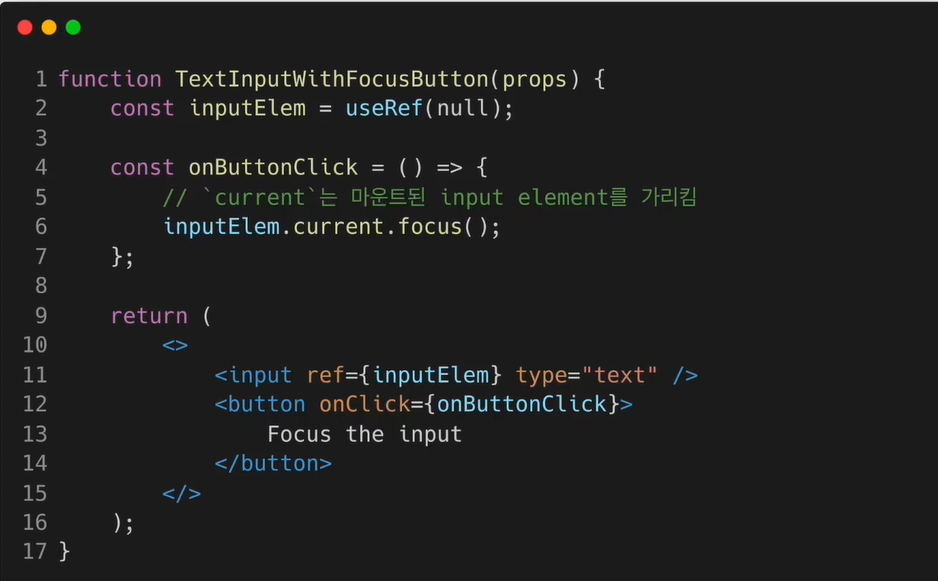

  

  + ```tsx
    <div ref={myRef} />
    ```

+ 주의사항

  + `useRef()` Hook은 내부의 데이터가 변경되었을 때, 별도로 알리지 않음


### [3] Hook의 규칙

#### (1) 규칙

1. Hook은 무조건 **최상위 레벨**에서만 호출해야 함

   + Hook 은 컴포넌트가 렌더링 될 때마다 매번 같은 순서로 호출되어야 함

   + 잘못된 사용 법

     + ```tsx
       function MyComponent(props) {
         const [name, setName] = useState('jihoh);
         if (name !== '') {
           useEffect(() => {
             ...
           });
         }
       }
       ```

       + 조건문의 결과에 따라 호출 순서가 달라지므로 잘못 된 사용임

2. **리액트 함수 컴포넌트에서만** Hook을 호출해야 함


#### (2) 패키지 소개

+ eslint-plugin-react-hooks
  + react에서 hook의 규칙을 따르도록 도와줌


#### (3) Custom Hook 만들기

+ 사용 목적
  + 여러 컴포넌트에서 반복적으로 사용되는 로직을 Hook으로 만들어서 **재사용**하기 위해서 이용
+ 주의 사항(추출)
  + **use**로 시작해야 함
  + 여러개의 컴포넌트에서 하나의 Custom Hook을 사용할 때, 컴포넌트 내부에 있는 모든 state와 effects는 전부 분리되어 있음
    + 이유
      + 각 Custom Hook 호출에 대해서, 분리된 state를 얻게 되기 때문
      + 각 Custom Hook의 호출 또한 완전히 독립적
+ custom hook 이란
  + 이름이 **use**로 시작하고, 내부에서 다른 Hook을 호출하는 하나의  JS 함수

+ 예제
  + 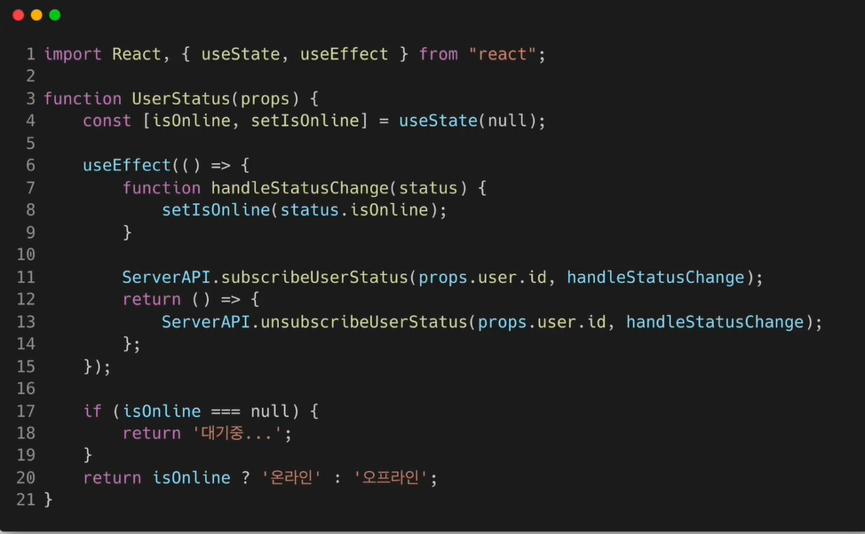


#### (4) custom hook 추출하기

+ 사용 예
  + 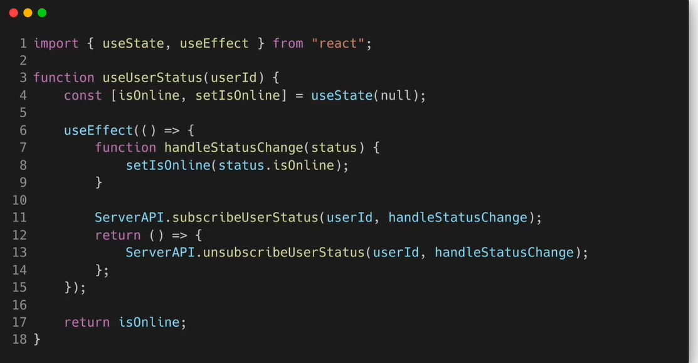


##### (5) custom hook 추출하기

+ 코드
  + 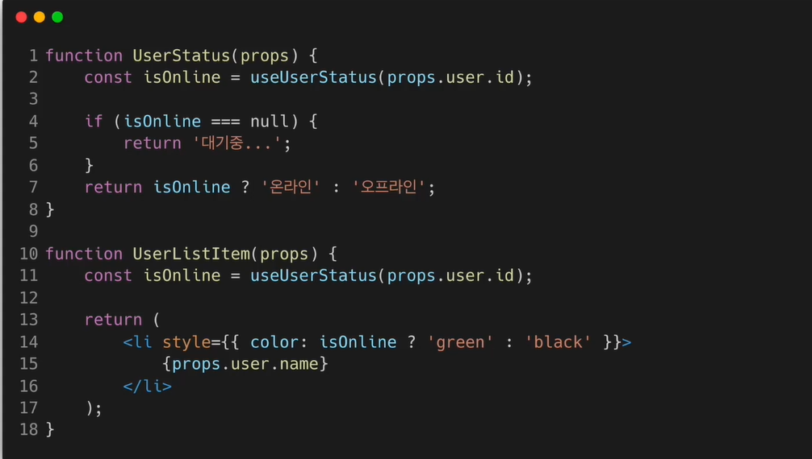


#### (6) Hook에서 데이터 공유

+ 코드
  + 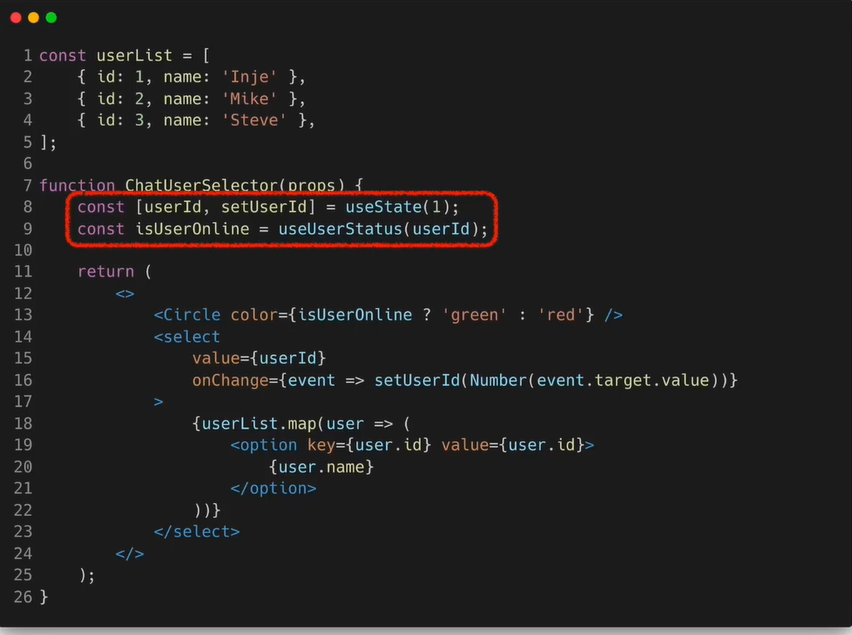


## Sec 8 - Handling Events

### [1] Event의 정의 및 Event 다루기

#### (1) 버튼 클릭 이벤트

+ Dom과 React의 Event 비교

  + ```tsx
    // 차이점 : onclick과 activagte 다름
    
    // Dom의 Event
    <button onclick="activate()"> Activate</button>
    
    // React의 Event
    <button onClick={activate}> Activate </button>
    ```

+ 


#### (2) Event handler(Listener)

+ 이벤트 발생 시, 이벤트 처리하는 역할

+ 코드

  + 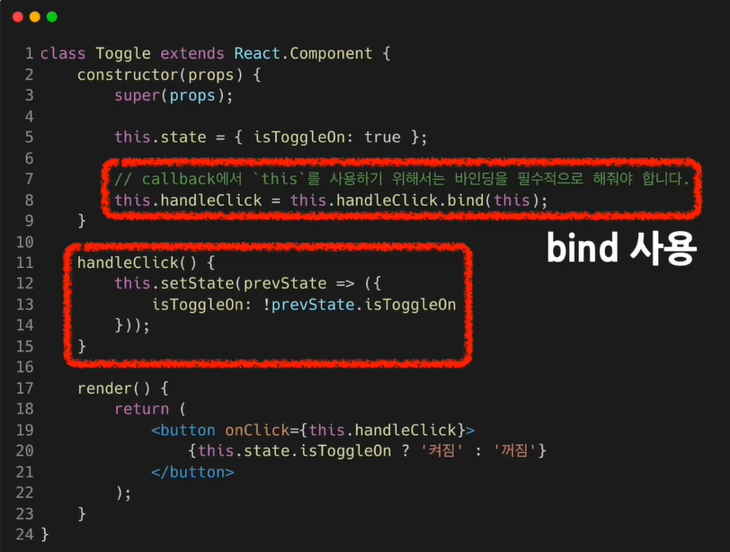

  + bind 사용 예

    ```tsx
    // bind 사용해야 하는 예
    class Toggle extends React.Component {
      constructor(props) {
    	super(props);
        this.state = { isToggleOn: true };
        
        // callback에서 'this'를 사용하기 위해선 바인딩 필수
        this.handleClick = this.handleClick.bind(this);
      }
      
      handleClick() {
        this.setState(prevState => ({
          isToggleOn: !prevState.isToggleOn
        }));
      }
      
      render() {
        return (
          <button onClick={this.handleClick}>
            {this.state.isToggleOn ? '켜짐' : '꺼짐'}
          </button>
        );
      }
    }
    ```

+ 예시

  + ```tsx
    function Toggle(props) {
      const [isToggleOn, setIsToggleOn] = useState(true);
      
      // 방법 1. 함수 안에 함수로 정의
      function handleClick() {
        setIsToggleOn((isToggleOn) => !isToggleOn);
      }
      
      // 방법 2. arrow function을 사용하여 정의
      const handleClick = () => {
        setIsToggleOn((isToggleOn) => !isToggleOn);
      }
      
      return (
        // 함수 컴포넌트는 이벤트를 넣어줄 때 this를 사용하지 않고 곧바로 정의한 이벤트 핸들러를 전달하면 됨
        <button onClick={handleClick}>
          {isToggleOn ? "켜짐" : "꺼짐"}
        </button>
      );
    ```

  + 

#### (3) event handler에 전달할 데이터(=매개변수 = argument)

+ class component의 argument 전달

  + ```tsx
    // 1. arrow function 사용
    // 명시적으로 react의 event 객체를 두 번째 매개변수로 전달
    <button onClick={(event) => this.deleteItem(id, event)}>삭제하기</button>
    
    // 2. bind 사용
    // 리액트가 알아서 event를 id 이후의 매개변수로 전달
    <button onClick={this.deleteItem.bind(this, id)}>삭제하기</button>
    ```

+ function component의 argument 저달

  + ```tsx
    function MyButton(props) {
      const handleDelete = (id, event) => {
        console.log(id, event.target);
      };
      
      return (
        <button onClick={(event) => handleDelete(1, event)}>
          삭제하기
        </button>
      );
    ```


### [2] 클릭 이벤트 처리하기 (실습)

#### (1)


#### (2)


#### (3) 함수 컴포넌트로 바꿔보기


## Sec 8 - Contidional rendering

### [1] Conditional Rendering의 정의

+ 어떠한 조건(if)에 따라서 렌더링이 달라지는 것

  + 예

    + True이면 버튼 보여주고 / False면 버튼 가리기

    + ```tsx
      function Greeting(props){
          const isLoggedIn = props.isLoggedIn;
          
          if (isLoggedIn){
              return <UserGreeting />;
          }
          return <GuestGreeting />;
          
      }
      ```

    + 


### [2] Turth / Falsy

+ T
  + ture, {}, [], 42 , "0", "false"

+ F
  + 0, -0 , 0n, '' , "",``, null, undefined, NaN


### [3] Element Variable

+ 리액트 엘리먼트를 변수처럼 다루는 것

+ 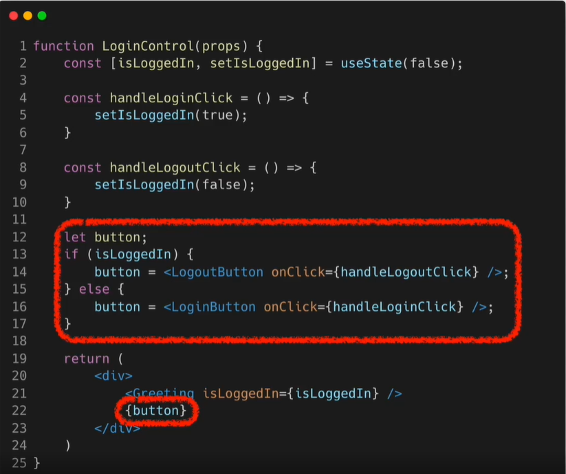


### [4] inline conditions (꼭기억)

+ 조거문을 코드 안에 집어 넣어서 쓰는 것


+ `inline if`
  + `&&` 를 이용
  + 단축평가
    + 첫 결과가 True => 다음 expression도  확인
    + 첫 결과가 False => 뒤의 expression은 확인 x
  + return 값
    + 첫 결과가 False => False에 해당하는 값 return 됨
  + 예시
    + 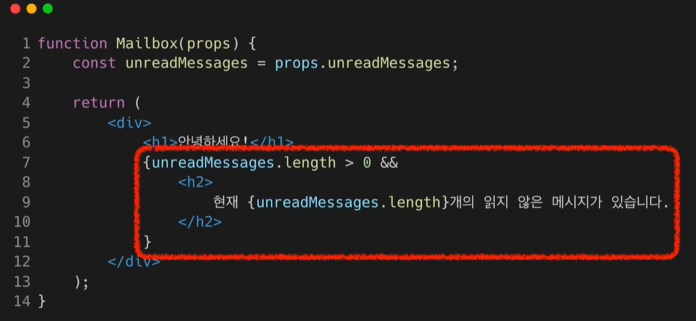


+ `inline if-else`

  + 조건문의 값에 따라서 다른 결과를 보여줄 때

  + 삼항 연산자 `?` 를 이용

    + `condition ? true : false`

  + 코드 예시

    + 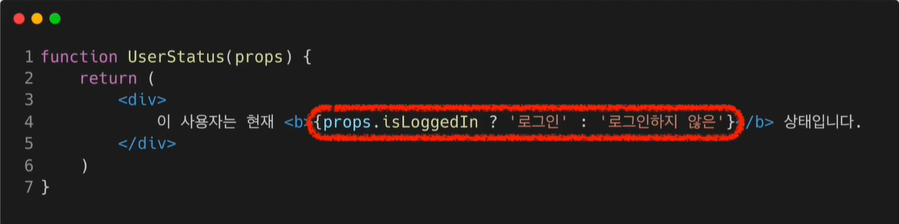

    + 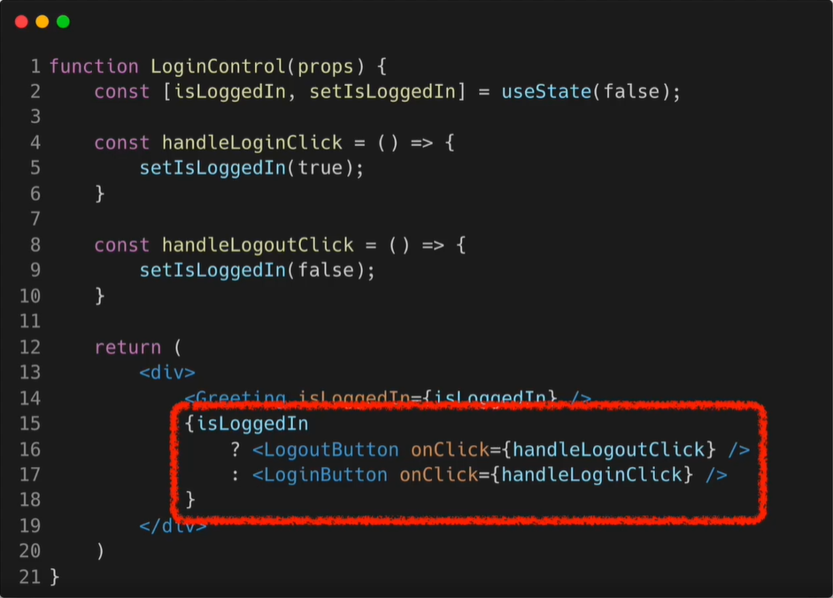


### [5] Component 렌더링 하지 않으려면

+ `null`을 return하면 됨
  + 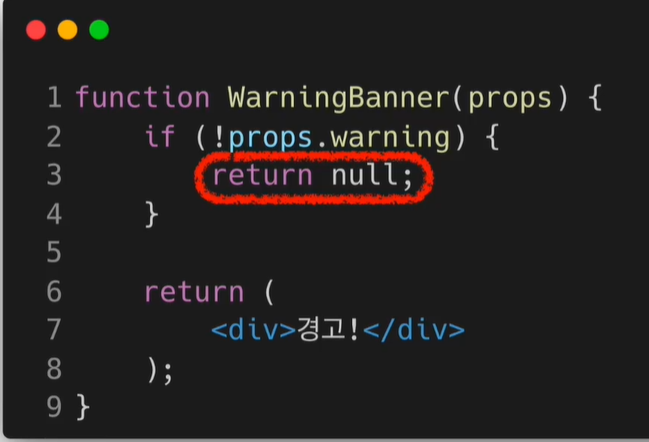
    + True일 때는 경고! 하지만, False일 때는 아무것도 안함
    + 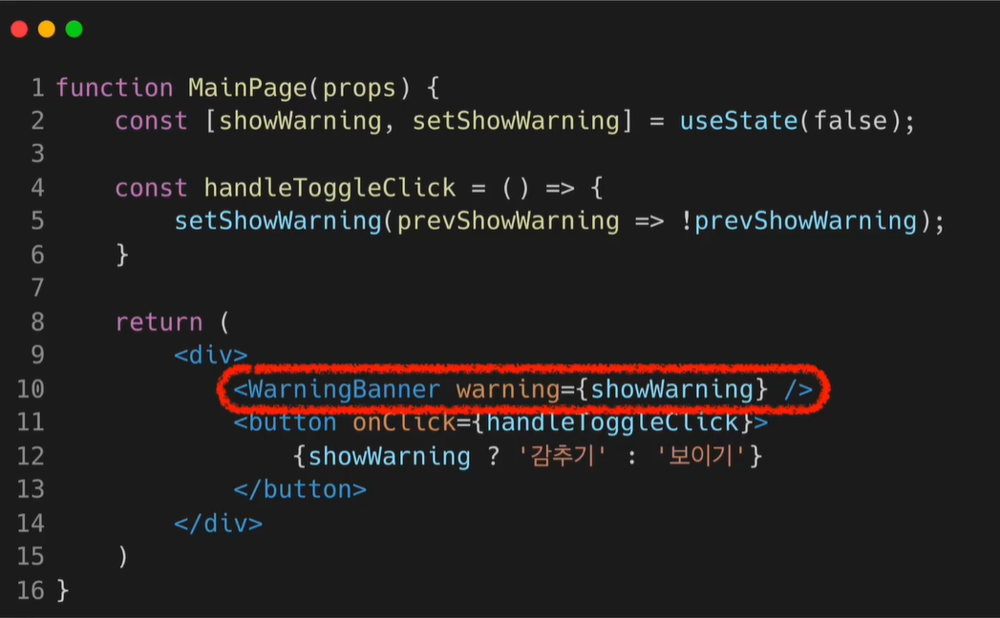


## Sec 10 - List와 Key


### [1] List와 Keys

#### (1) List

+ 배열

  + ```tsx
    const numbers = [1,2,3,4,5]
    ```


#### (2) keys

+ 각자 고유하다 == 아이템들을 구분하기 위한 고유한 문자열


### [2] 여러개의 Component 렌더링 하기

#### (1) `map()` 함수

+ 배열의 각 변수에 어떤 처리를 한 뒤 배열을 return

+ map 함수 안의 elements는 꼭 key가 필요함

+ 코드

  + ```tsx
    const doubled = numbers.map( (number)=> number*2 )
    ```

  + ```tsx
    const numbers = [1,2,3,4,5];
    const listItems = numbers.map(  (number)=> <li>{number}</li>);
    
    ReactDom.render(
    	<ul>{listItems}</ul>
        document.getElementById('root'));
    
    >>> 실제 렌더링 결과
    ReactDom.render(
    	<il>{1}</il>
        <il>{2}</il>
        <il>{3}</il>
        <il>{4}</il>
        <il>{5}</il>
        document.getElementById('root'));
    ```

  + 


### [3] List의 key

+ 값과 id 사용

  + 값

    + 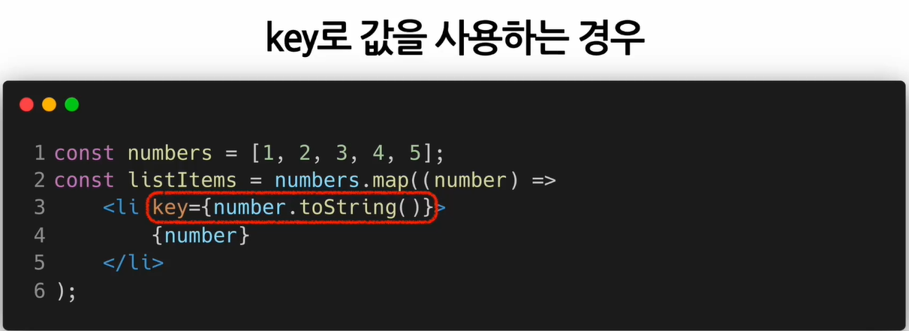

  + id

    + 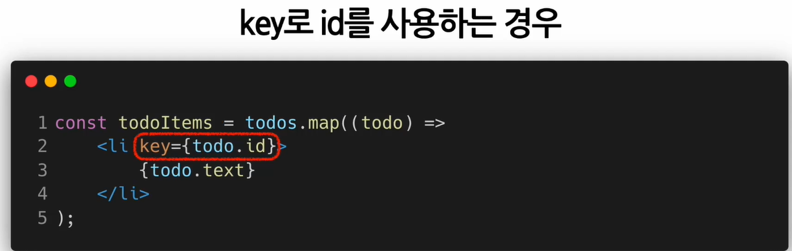

  + index

    + 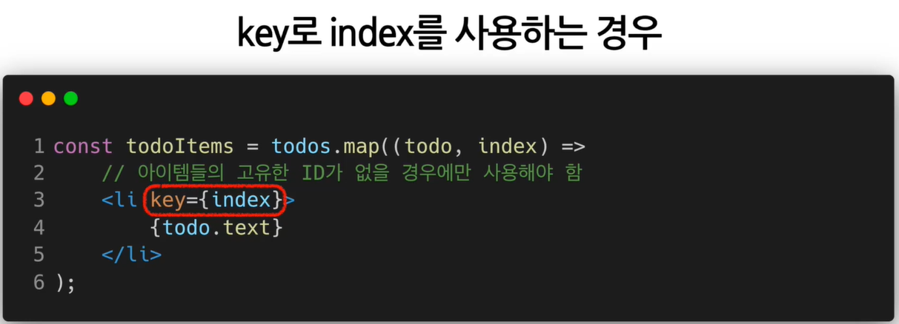

    + 정의하지 않으면 key로 index를 사용함
    + 성능 저하 일어나므로, id 있으면, id 쓰기


+ chap 12

  + `{ [ key : string ] : string}`

+ chap 13

  + `useState<string>('c')`  처럼 type 지정 해주기

+ chap 14

  + `export` : 다른 page에서 함수나 객체를 사용하고 싶을 때 이용

    + export default : 페이지 전체를 객체로함
    + export 개별 : 개별로 객체 취급

  + ```tsx
    export type ThemeType = {
        theme : string;
        toggleTheme : () => void;   // 요게 정형화 되어 있음
        // state를 변경하는 함수나, event 함수를 실행시킬 때는 return 값없으므로 void로 해주면 됨.
    }
    
    // 다른 곳에서 아래가 가능해짐
    import { themeContext, ThemeType } from './파일명'
    ```

  + ```tsx
    import { state, ReactElement } from 'react'
    function MainContetn() : ReactElement { // ReactElement 기억
        const {theme, toggletheme} : ThemeType = useContext(ThemeContex);
    }
    ```

  + 


## Sec 11 - Forms

### [1] Form과 Controlled component

#### (1) Form 이란

+ 사용자로부터 입력을 받기 위해 사용
  + 체크박스,  select 등 사용자가 선택하는 모든 것

##### (a) react from & html form

+ react form은 component 내부에서 state를 통해 데이터 관리 

+ HTML form은 Element 내부에 각각의 state가 존재

+ 코드

  + HTML Form

    + ```html
      <form>
          <label>
          	이름:
              <input type="text" name="name" />
          </label>
      	<button type="submit">  제출    </button>
      </form>
      ```

    + JS 코드로 사용자가 입력한 값에 접근하고 제어하기는 쉽지 않음

+ 사용자가 입력한 값에 접근하고 제어할 수 있는 **Controlled component**


#### (2) Controlled Component

+ 사용자가 입력한 값에 접근하고 제어할 수 있는 **Controlled component**

  + 입력 양식의 초기값 자유롭게 설정가능
  + 다른 양식의 값이 변경되면, 또 다른 양식의 값도 자동으로 변경시킬 수 있음

+ 값이 리액트의 통제를 받는 Input form element

  

##### (a) HTML Form vs. Controlled Component

+ 


##### (b) Controlled Component 코드 예시

1. 위의 HTML 코드를 리액트의 Controlled Component로 만든 것


+ event.target : 현재 이벤트 타겟

  + event.target은 input element

  + event.target.value는 input element의 value


2. 모든 입력값을 대문자로 변경

   ```tsx
   const handleChange = (event) => {
       setValue(event.target.value.toUpperCase());
   }
   ```


### [2] 다양한 Forms

#### (1) textarea 태그

+ 코드

  + ```TSX
    // 1. HTML 버전
    <textarea>
    	안녕하세요, 여기에 이렇게 텍스트가 들어가게 됩니다.
    </textarea>
    
    // 2. React Controlled Component 버전
    // useState('요청사항을 입력하세요') 부분의 value가, 아래의 value={value}의 초기값으로 들어감
    ```

  + 


#### (2) Select 태그

+ Drop-down 목록을 보여주기 위한 HTML 태그

  + 여러 옵션 중 1개 선택 가능

  ##### (a) 코드

  + ```tsx
    // 1.HTML
    <select>
    	<option value="apple"> 사과 </option>
        <option value="banana"> 바나나 </option>
        <option selected value="grape"> 포도 </option>  // 선택됨!
    </select>
    
    // 2. React Controlled Component 버전
    // useState('grape') 부분의 value가 value={value} 의 초기값으로 들어감.
    // 값이 바뀌면 handleChange 실행
    ```

  + 


##### (b) `multiple` 옵션

+ `<select multiple={true} value={['B','C']}`>


##### (c) Controlled Component 요약

+ 


#### (3) File input 태그

+ 디바이스의 저장장치로부터, 사용자가 하나/여러개 의 파일을 선택할 수 있게 해주는 HTML 태그
+ 읽기 전용이므로, React에서는 Uncontrolled component(=리액트의 통제를 받지 않음)

##### (a) 코드

```html
// 1. HTML
<input type='file'/>
```


##### (b) Multiple Inputs

+ 여러 개의 state를 선언하여, 각각의 입력에 대해 사용


#### (4) Input Null value

+ 초기값으로 null을 넣어주면, 사용자가 값을 변경할 수 있게 됨
  + `ReactDOM.render(<input value={null} />, rootNode);`


### [3] 사용자 정보 입력 받기 (실습)


## Sec 12 - Lifting State Up


### [1] Shared State

#### (1) 의미

+ 하위 컴포넌트가 공통된 부모 컴포넌트의 **state를 공유**하여 사용 하는 것 

  + State에 있는 데이터를 여러 하위 컴포넌트에서, 공통적으로 사용하는 경우를 말함

  

#### (2) 예

+ 
+ 


### [2] 하위 컴포넌트에서 State 공유하기

#### (1)  Lifting State Up

+ 하위 컴포넌트의 State를 공통 상위 컴포넌트로 올림

+ 예
  + 


### [3] 섭씨온도와 화씨온도 표시하기 (실습)


## Sec 13 - Composition vs. Inheritance

### [1] Composition 방법과 Inheritance


#### (1) Composition(합성)

+ **여러 개의 컴포넌트를 합쳐서, 새로운 컴포넌트를 만드는 것**을 의미


##### (a) 합성 방법 1 : Containment

+ **하위 컴포넌트를 포함하는 형태의 합성 방법**

  + 보통 sidebar나 dialog같은 box형태의 컴포넌트는 자신의 하위 컴포넌트를 미리 알 수 없음 => 이럴 때 이용
  + children 속성을 이용

+ 예

  + ```tsx
    // children prop을 사용한 FancyBorder 컴포넌트
    function FancyBorder(props) {
        return (
        	<div className={ 'FancyBorder FancyBorder-' + props.color }>
            	{ props.children }
            </div>
        )
    }
    
    // children이 배열인 이유는, 여러개의 하위컴포넌트를 가질 수 있기 때문
    React.createElement(
    	type,
    	[props],
    	[...children])
    
    
    // FancyBorder 컴포넌트 안에 있는 모든 tsx 태그는 children으로 전달됨
    // h1 tag, p tag는 모두 FancyBorder 컴포넌트의 children이라는 props로 전달됨(props.children)
    function WelcomeDialog(props){
        return (
        	<FancyBorder color="blue">
            	<h1 classname="Dialog-title">
                	어서오세요
                </h1>
            	<p className="Dialog-message">
                	우리 사이트에 방문하신 것을 환영합니다!
                </p>
            </Fancyborder>
        );
    }
    ```

+ 여러 개의 children 집합이 필요한 경우는 어떻게 할까?

  + ```tsx
    // SplitPane은 App에서 left와 right라는 props를 받게 되고, 이를 좌, 우로 표시하게 됨
    function SplitPane(props){
        return (
        	<div className="SplitPane">
            	<div className="Splitpane-left">
                	{props.left}
                </div>
                <div classname="Splitpane-right">
                	{props.right}
                </div>
            </div>
        );
    }
    
    function App(props){
        return (
        	<SplitPane left={ <Contacts /> } right={ <Chat /> } />
        );
    }
    ```

  + 


##### (b) 합성방법 2 : Specialization

+ **범용적인 개념을 구별이 되게 구체화 하는 것**
  + 기존의 객체지향 언어에서는 상속을 사용하여, Specialization을 구현함
  + 리액트에서는 합성(composition)을 이용해서, Specializaion을 구현함

+ 예시설명

  + WelcomeDialog는 Dialog의 특별한 케이스이다.

+ 코드

  + ```tsx
    function Dialog(props){
        return (
        	<FancyBorder color="blue">
            	<h1 classname="Dialog-title">
                	{props.title}
                </h1>
            	<p className="Dialog-message">
                	{props.message}
                </p>
            </Fancyborder>
        
        );
    }
    
    function WelcomeDialog(props){
        return (
        	<Dialog 
                title="어서오세요"                                      // Specialization
                message="우리 사이트에 방문하신 것을 환영 합니다." />       // Specialization
        );
    }
    ```

  + 


**Containment와 Specializaiton**을 같이 사용하기

+ Containment

  + props.children 사용

+ Specialization

  + 직접 정의한 props 사용

+ 코드

  + ```tsx
    function Dialog(props){
        return (
        	<FancyBorder color="blue">
            	<h1 classname="Dialog-title">
                	{props.title}
                </h1>
            	<p className="Dialog-message">
                	{props.message}
                </p>
                {props.children}  //추가 => 하위 컴포넌트가, Dialog 하단에 렌더링 됨
            </Fancyborder>
        
        );
    }
    ```

  + 


#### (2) Inheritance

+ Composition과 반대되는 개념
+ **다른 컴포넌트로부터 상속을 받아서, 새로운 컴포넌트를 만드는 것**
  + 비추천하는 방법임
  + composition 이용하는 것 추천


#### (3) 요약

+ Composition을 이용하고, Inheritance는 이용하지 말자
+ 복잡한 컴포넌트를 쪼개서 여러 개의 컴포넌트로 만들고, 만든 컴포넌트들을 조합해서, 새로운 컴포넌트를 만들자!


### [2] Card 컴포넌트 만들기 (실습)

#### (1) && 연산자

```tsx
{/* specialization */}
            {title && <h1>{title}</h1>}
```

+ `조건 && expression` 에서, 

  + 조건이 참 => expression으로 평가됨
  + 조건이 거짓 => React는 해당 코드 무시함 

+ 이 경우 `title=''` 과 같이 하면 `<h1>` 태그는 렌더링 되지 않음

  + ```tsx
    function ProfileCard(){
        return (
            <Card  title="" backgroundColor="red">  => title 렌더링 안됨
                <p> 안녕하세요, Ji 입니다1</p>
                <p> 안녕하세요, Ji 입니다2</p>
            </Card>
        );
    }
    ```

  + 


## Sec 14 - Context


### [1] Context 란

##### (1) Context 개념과 장점

+ **컴포넌트 트리를 통해 곧바로 컴포넌으로 데이터를 전달하는 방식**
  + 기존에는 props를 통해서 데이터를 전달했음
  + vue에서도 같은 이유로 state 사용했음
+ 장점
  + 코드 깔끔해짐
  + 데이터 한 곳에서 관리
  + 따라서 디버깅에도 유리해짐


+ 그림으로 이해
  1. props 이용
     + 
  2. context 이용
     + 


#### (2) 언제 Context 사용해야할까?

+ **다른 레벨의 여러 컴포넌트가, 특정 데이터를 자주 필요로 하는 경우**에 주로 사용

+ 여러 컴포넌트에서 자주 접근해야 하는 데이터
  + 로그인 여부, 로그인 정보, UI 테마, 현재 언어 등...
  + props의 비효율예
    + 
  + context를 사용해서, 동일 기능 작성
    + 


#### (3) context 쓰지 않고, 효율적으로 데이터 전달하기 (Element Variable)

+ 코드
  + 

+ 이 방법 단점
  + 데이터가 많아질 수록, 상위 컴포넌트는 복잡해지고, 하위 컴포넌트는 너무 유연해짐


+ 개선한 방법
  + 코드
    + 


## 데이터 전달 방법

### [1] Composition (Sec13)

### [2] Context (Sec14)

### [3] Element Variable 형태로 전달 (Sec8-[3])


## 못한 부분 & 고친 것

| tsx    | 못한 부분                                                    | 고친부분                                                     |
| ------ | ------------------------------------------------------------ | ------------------------------------------------------------ |
| Sec4   | clock 에러 메세지 / 작동은 됨                                |                                                              |
| Sec5   | Comment의 style에서 Type 'string' is not assignable to type 'FlexDirection \|\| undefined ERROR undefined'. | `style={styles.wrapper as React.CSSProperties}`              |
| Sec6   | 안함                                                         |                                                              |
| Sec7   | onClick 의 Type 'number  (() => void)' is not assignable to type 'MouseEventHandler<HTMLButtonElement> undefined'. 문제 | `onClick={increaseCount as React.MouseEventHandler}`         |
| Sec8   | isConfirmed<br />                                            |                                                              |
| Sec9   | const 부분과 style                                           | interface toolbarProps{<br />isLoggedIn : boolean;<br />onClickLogin : () => void;<br />onClickLogout : () => void;<br />} |
| Sec 10 |                                                              | `type student = {id : number,name : string}`                 |
| Sec11  | event의 type                                                 | `type InputEvent = React.ChangeEvent<HTMLInputElement>;`<br />` type SelectEvent = React.ChangeEvent<HTMLSelectElement>; `<br />`type SubmitEvent = React.FormEvent<HTMLFormElement>;` |
| Sec13  | children props의 type                                        | `children : React.ReactNode`                                 |


## [99] 참고

+ 문법 권장 사항 잡아주는 거 안하려면
  + App.js 제일 상단에 `/* eslint-disable */` 입력
  + eslint라는 기본으로 설치된 것이 문법 잡아주는데, 그거 안한다는 것

+ function

  + ```js
    // ES6 부터는 =>를 function 대신 사용가능
    function() {}  === () => {}
    ```

+ array와 object 변경하는 skill(과정)

  + 기존 state를 deepcopy `[...array]`

    +  (array는 reference data:참조형데이터)

  + deepcopy 본의 데이터를 변경

  + state 생성 시 만든 변경함수로 deepcopy한 데이터로 대체

    ```js
    let [글제목, 글제목변경] = useState(['아동복 추천','아동 신발 추천','아동 용품 추천']);
    function 제목변경2(){
      // let newArray = 글제목에 있던 0번째 데이터를 여자코트 추천으로 바꿈
      let newArray = [...글제목];
      newArray[0] ='여자 코트 추천'
      글제목변경( newArray );
      }
    ```

    


# 3. react with typescript

## [1] 설치진행과정

+ [블로그참고](https://velog.io/@miiunii/CRACreate-React-App%EC%9C%BC%EB%A1%9C-Typescript-%EC%84%A4%EC%A0%95%ED%95%98%EA%B8%B0)

### (1) 환경

+ Node.js, CRA, VSCode


### (2) 과정

#### (a) CRA 사용

+ `npx create-react-app 앱이름 --template typescript`
+ `npm install --global yarn`

  + `yarn`은 `npm` 같은 것임
+ `yarn eject`

  + 하기 전에, `git add . -> git commit -m "save before eject"` 해야 됨
  + 하고나면 config 폴더 생김


#### (b) tsconfig 설정

+ tsconfig.json 변경

  + ```json
    {
      "compilerOptions": {
        "target": "es6",
        "lib": [
          "dom",
          "dom.iterable",
          "esnext"
        ],
        "noImplicitAny": true,
        "allowJs": true,
        "skipLibCheck": true,
        "esModuleInterop": true,
        "allowSyntheticDefaultImports": true,
        "strict": true,
        "forceConsistentCasingInFileNames": true,
        "noFallthroughCasesInSwitch": true,
        "module": "esnext",
        "moduleResolution": "node",
        "resolveJsonModule": true,
        "jsx": "react-jsx",
        "outDir": "./dist",
        "typeRoots": ["./node_modules/@types", "types"]
      },
      "include": [
        "./src/**/*"
      ]
    }
    ```


#### (c) eslint 설정

+ Eslint 확장 설치

  + 그 후, src(root)에 `.eslintignore, .eslintrc.js` 파일 생성 후 아래 코드 넣기

  + ~~eslintignore (없어야 함)~~

    + elint 적용을 받지 않게 할 파일 및 폴더

    + ```
      node_modules
      dist
      ```

      

  + ~~eslintrc.js (없어야 함)~~

    + eslint를 어떤 plugin으로 어떤 rule로 적용할 것인지 정하는 파일 

    + ```js
      // .eslintrc.js
      module.exports = {
        root: true,
        env: {
          browser: true,
          node: true,
        },
        extends: [
          'eslint:recommended',
          'plugin:@typescript-eslint/eslint-recommended',
          'plugin:@typescript-eslint/recommended',
        ],
        plugins: ['prettier', '@typescript-eslint'],
        rules: {
          'prettier/prettier': [
            'error',
            {
              singleQuote: true,
              semi: true,
              useTabs: false,
              tabWidth: 2,
              printWidth: 80,
              bracketSpacing: true,
              arrowParens: 'avoid',
            },
          ],
        },
        parserOptions: {
          parser: '@typescript-eslint/parser',
        },
      };
      ```

+ VS Code 플러그인 설정

  + window /mac

    + `ctrl + shift + p` / `cmd + shift + p`

  + open settings (json) 입력 후 선택

    + settings.json 내용 유지하며 아래에 다음 추가

      + ```json
        // typescript
        "editor.codeActionsOnSave": {
              "source.fixAll.eslint": true
          },
          "eslint.alwaysShowStatus": true,
          "eslint.workingDirectories": [
              {"mode": "auto"}
          ],
          "eslint.validate": [
              "javascript",
              "typescript"
          ],
        ```

+ 

#### (d) prettier 설정

+ prettier는 code formatter 임
  + 파일의 수정 내용을 저장할 때마다, 자동으로 format을 맞춰 줌
  + 다수와의 협업에서 동일한 방식의 format으로 파일을 맞춰주기에 혼동을 줄여줌


+ prettier extension 설치

+ 프로젝트에 prettier와 plug in 설치

  + `npm install -D prettier eslint-config-prettier eslint-plugin-prettier`

    + 만약 아래와 같은 경고가 뜨면,

      + ```
        $ npm install -D prettier eslint-config-prettier eslint-plugin-prettier
        
        added 5 packages, and audited 1436 packages in 8s
        
        204 packages are looking for funding
          run `npm fund` for details
        
        5 high severity vulnerabilities
        
        To address all issues (including breaking changes), run:
          npm audit fix --force
        
        Run `npm audit` for details.
        ```

    + 다음을 실행 `npm audit fix --force`

      + vulnerabilities 모두 해결해줌

      

+ ~~프로젝트 root(src)에 `.prettierrc` 파일 생성 및 설정(없어야함)~~

  + 옵션 설정

    + ```json
      // .prettierrc
      // 사용할 옵션
      {
        "singleQuote": true,
        "parser": "typescript",
        "semi": true,
        "useTabs": false,
        "tabWidth": 2,
        "printWidth": 120,
        "arrowParens": "always"
      }
      ```

  + 전체 가능한 옵션은 아래와 같음

    + ```json
      // 전체 옵션
      
      {
        "arrowParens": "avoid", // 화살표 함수 괄호 사용 방식
        "bracketSpacing": false, // 객체 리터럴에서 괄호에 공백 삽입 여부 
        "endOfLine": "auto", // EoF 방식, OS별로 처리 방식이 다름 
        "htmlWhitespaceSensitivity": "css", // HTML 공백 감도 설정
        "jsxBracketSameLine": false, // JSX의 마지막 `>`를 다음 줄로 내릴지 여부 
        "jsxSingleQuote": false, // JSX에 singe 쿼테이션 사용 여부
        "printWidth": 80, //  줄 바꿈 할 폭 길이
        "proseWrap": "preserve", // markdown 텍스트의 줄바꿈 방식 (v1.8.2)
        "quoteProps": "as-needed" // 객체 속성에 쿼테이션 적용 방식
        "semi": true, // 세미콜론 사용 여부
        "singleQuote": true, // single 쿼테이션 사용 여부
        "tabWidth": 2, // 탭 너비 
        "trailingComma": "all", // 여러 줄을 사용할 때, 후행 콤마 사용 방식
        "useTabs": false, // 탭 사용 여부
        "vueIndentScriptAndStyle": true, // Vue 파일의 script와 style 태그의 들여쓰기 여부 (v1.19.0)
        "parser": '', // 사용할 parser를 지정, 자동으로 지정됨
        "filepath": '', // parser를 유추할 수 있는 파일을 지정
        "rangeStart": 0, // 포맷팅을 부분 적용할 파일의 시작 라인 지정
        "rangeEnd": Infinity, // 포맷팅 부분 적용할 파일의 끝 라인 지정,
        "requirePragma": false, // 파일 상단에 미리 정의된 주석을 작성하고 Pragma로 포맷팅 사용 여부 지정 (v1.8.0)
        "insertPragma": false, // 미리 정의된 @format marker의 사용 여부 (v1.8.0)
        "overrides": [ 
          {
            "files": "*.json",
            "options": {
              "printWidth": 200
            }
          }
        ], // 특정 파일별로 옵션을 다르게 지정함, ESLint 방식 사용
      }
      ```


+ VS Code default formatter 변경
  + VS Code 환경설정에 들어가기
    + `ctrl` + `,` (좌측하단 설정아이콘 -> settings)
  + default라고 검색
    + Editor : Default Formatter 에서
      + Prettier - Code formatter (**esbenp.prettier-vscode**)로 설정


