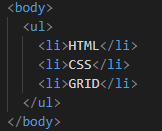
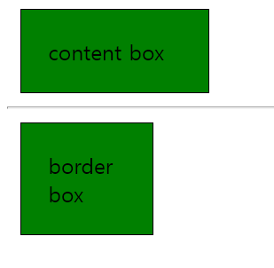
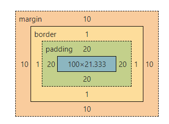
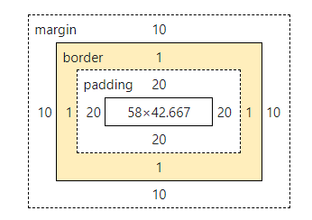

# Web

## 1. HTML 

+ [HTML MDN Docs](https://developer.mozilla.org/ko/)

+ HTML 문서의 기본구조 (!tab)

  + ```!DOCTYPE html```

  + ```html``` : 최상위 (root) 요소

    + ```lang = "en"```

  + ```head``` : 문서 메타데이터 요소

    + ```title```,  ```meta(encoding 등)```, ```style (CSS)```, ```link (외부 리소스)``` ,```script (JS)```
    + 일반적으로 브라우저에 나타나지 않음

  + ```body``` : 문서 본문 요소

    + 실제 화면 구성과 관련된 내용

    

+ [DOM](https://developer.mozilla.org/ko/docs/Web/API/Document_Object_Model/Introduction)

  + HTML 문서를 브라우저에서 렌더링 하기 위한 구조
    + HTML 문서에 대한 모델 구성
    + HTML 문서 내의 각 요소에 접근 / 수정에 필요한 property과 method를 제공

  + DOM 은 문서의 구조화된 표현(structured representation)을 제공하며 프로그래밍 언어가 DOM 구조에 접근할 수 있는 방법을 제공하여 그들이 문서 구조, 스타일, 내용 등을 변경할 수 있게 돕는다. (MDN 문서)
  
  + DOM 은 구조화된 nodes와 property 와 method 를 갖고 있는 objects로 문서를 표현한다. (MDN 문서)
  
  + 예 
  
    


### [1] [요소](https://developer.mozilla.org/ko/docs/Web/HTML/Element) (element)

+ 태그와 내용으로 구성

#### (1) 내용이 없는 태그

+ ```br, hr, img, input, link, meta```
+ 

#### (2) [시맨틱](https://developer.mozilla.org/ko/docs/Glossary/Semantics) 태그

+ HTML 5에서 의미론적 요소를 담은 태그 등장

+ ```div``` tag를 대체하여 사용

+ 장점

  + 요소의 의미가 명확해져, 코드의 가독성 높이고, 유지보수 용이
  + 검색 엔진은 의미론적 마크업(메타, 시맨틱 태그 등) 을 페이지의 검색 랭킹에 영향을 줄 수 있는 중요한 키워드로 간주 (검색엔진최적화([SEO](https://developer.mozilla.org/ko/docs/Glossary/SEO)))

+ 종류

  + ```header``` : 문서 전체나 섹션의 머리말

  + ```nav``` : 내비게이션

  + ```aside``` : 사이드에 위치한 공간 (메인 내용과 관련성 적은 내용)
    + 예 : 좌측의 게시판 목록, 우측의 날씨 정보 등

  + ```section``` : 문서의 일반적인 구분, 컨텐츠의 그룹을 표현
    + 예 : section 내부에 article 포함

  + ```article``` : 문서, 페이지, 사이트 안에서 독립적으로 구분되는 영역

  + ```footer``` : 문서 전체나 섹션의 마지막 부분

  + ```h1```

  + ```table```

#### (3) 주요 태그와 속성

+ table, form, input 안나옴


#### (4) 속성 (attribute)

+ 속성을 통해 태그의 부가적인 정보를 설정

+ 시작 태그에 작성

+ 이름과 값이 하나의 쌍으로 존재

  

#### (5) HTML Global Attribute

+ **```id```** : 문서 전체에서 유일한 고유 식별자 지정 ( 중복가능하지만 권장 x )
+ **```class```** : 공백으로 구분된 해당 요소의 클래스 목록
+ ```data-\*``` : 페이지에 개인 사용자 정의 데이터를 저장하기 위해 사용
+ ```style``` : inline 스타일
+ ```title``` : 요소에 대한 추가 정보 지정
+ ```tabindex``` : 요소의 탭 순서


### [2] 주요 태그와 속성

#### (1) 인라인 / 블록 요소


#### (2) 텍스트 요소

| 태그             | 설명                                                         |
| ---------------- | ------------------------------------------------------------ |
| ```a```          | ```href``` 속성을 활용하여 다른 URL로 연결하는 하이퍼링크 생성 |
| ```b / strong``` | 볼드 / 강조하고자 하는 요소                                  |
| ```i / em```     | 이탤릭 / 강조하고자 하는 요소                                |
| ```br```         | 텍스트 내 줄바꿈                                             |
| ```img```        | ```src``` 속성을 이용해 이미지 표현                          |
| ```span```       | 의미 없는 인라인 컨테이너 (```div```는 블록 컨테이너)        |
|                  |                                                              |


#### (3) 그룹컨텐츠

| 태그             | 설명                                                    |
| ---------------- | ------------------------------------------------------- |
| ```p```          | 하나의 문단 (paragraph)                                 |
| ```hr```         | 수평선 ( 문단 레벨 요소에서의 주제의 분리 )             |
| ```ol```         | 순서 있는 리스트                                        |
| ```ul```         | 순서 없는 리스트                                        |
| ```pre```        | HTML에 작성한 내용을 그대로 표현                        |
| ```blockquote``` | 텍스트가 긴 인용문으로 주로 들여쓰기를 한 것으로 표현됨 |
| ```div```        | 의미 없는 블록 레벨 컨테이너                            |


#### (4) Table (시험 x)

##### 1] 큰 영역

+ ```thead``` (header) : 내용들의 이름을 나타내는 태그
+ ```tbody``` (body) : 내용 값들있는 부분을 나타내는 태그
+ `tfoot` (footer) : 총계와 같은 것이 있는 마지막 부분을 나타내는 태그


##### 2] 세부 영역(구성)

+ `tr` : 행 작성

+ `td` : 열 작성으로 tr 태그 내부에 원하는 열 개수만큼 작성

  + ```<td colspan="2">``` 와 같이 속성을 이용해, 여러 열을 하나로 만들 수 있음

+ `th` : thead 작성시 td 대신 활용

+ `caption` : table의 제목

+ 예시

  ```HTML
  <table>
      <thead>
      	<tr>
          	<th> 이름 </th>
              <th> 과목 </th>
              <th> 점수 </th>
          </tr>
      </thead>
  
      
      <tbody>
          <tr>
              <td> 김철수 </td>
              <td> 수학 </td>
              <td> 100 </td>
      	</tr>
      </tbody>
      
      
      <tfoot>
      	<tr>
          	<td> 평균 </td>
              <td colspan="2"> 100 </td>
          </tr>
      </tfoot>
      
  </table>
  ```

  


#### (5) form (시험 x)


#### (6) input (시험 x)


## 2. CSS

+ 스타일을 지정하기 위한 언어

  + 선택하고 스타일을 지정

  + 선택자, 속성, 값 / selector, property, value 으로 구성됨

    ```html
    h1{
    	color(속성) : blue(값);
    	font-size : 15px;
    }
    ```

+ CSS with 개발자 도구
  + styles : 해당 요소에 선언된 모든 CSS
  + computed : 해당 요소에 최종 계산된 CSS


### [1] CSS 정의 방법

#### (1) 인라인

+ 태그에 직접 ```style``` 속성 이용
+ 예 `<h1 style = "color : blue; font-size : 15px;"> title 1 </h1>`

#### (2) 내부 참조 - \<style>

+ ```head``` 태그 내에 ```style```에 지정

#### (3) 외부 참조 - CSS 파일

+ 외부 CSS  파일을 ```head``` 내 `link` 를 통해 불러옴
+ 예 : `<link rel="stylesheet" href="style.css">`


### [2] CSS 선택자 (Selector)

#### (1) 기본 선택자

+ 전체 선택자
+ 요소 선택자 : HTML 태그를 직접 선택
+ 클래스 선택자 : `.` 문자로 시작해, 해당 클래스가 적용된 항목 선택
+ 아이디 선택자 : `#` 문자로 시작해, 해당 아이디가 적용된 항목 선택 
+ 속성 선택자
+ `id : #id / class : .class / tag : tag`
+ `style` 부분에 선택자에 마우스 올리면 selector specify  에 우선순위 (0,0,1) 나옴. 

#### (2) 결합자

+ 자손 결합자 ( ` ` ) : 하위 모든 요소

+ 자식 결합자( `>` ) : 바로 아래의 요소( 자식요소 )

+ 일반 형제 결합자 ( `~` ) : 형제 요소 중 뒤에 위치하는 요소 모두 선택

+ 인접 형제 결합자 (`+`) : 형제 요소 중 바로 뒤에 위치하는 요소 선택 

  +  바로 뒤 요소가 해당 요소 아니면 끝 / 그 뒤 것에 적용 x

     


#### (3) 의사 클래스 / 요소(Pseudo Class)

+ 링크, 동적 의사 클래스

+ 구조적 의사 클래스, 기타 의사 클래스, 의사 엘리먼트, 속성 선택자

  

#### (4)  요소 선택


### [3] CSS 적용 우선 순위 (cascading order)

+ 보통 작은 것이 우선 적용 됨

#### (1) 중요도

+ `!important`
+ 예 : `h2 {color : red !important;}`

#### (2) 우선 순위 (Specificity)

+ 인라인 > id > class, 속성, pseudo-class > 요소 > prseudo-element

#### (3) CSS 파일 로딩 순서

+ 같은 우선 순위에서 속성이 중복된다면, (style 에서) CSS가 나중에 선언된 것으로 적용됨


### [4] [상속](https://developer.mozilla.org/ko/docs/Web/CSS/inheritance)

#### (1) 상속 되는 것

+ Text 관련 요소
  + `font, color, text-align`
+ `opacity, visibility` 등


#### (2) 상속 안되는 것

+ Box model 관련 요소
  + `width, height, margin, padding, border, box-sizing, displaly`
+ position 관련 요소
  + `position, top/right/bottom/left, z-index` 등


### [5] CSS 기본 스타일

#### (1) [길이 단위](https://developer.mozilla.org/en-US/docs/Web/CSS/length) 

+ 고정 단위 (absolute length units)

  + `px` : 한 화소인 픽셀기준

+ 폰트 상대 단위 (font-relative length units)

  + `em` :  (부모요소에 대해)  상대적인 사이즈를 가짐
  + `%` : (부모요소에 대해) 백분율 단위 / 가변적인 레이아웃에서 사용

  + `rem` :  (부모요소의) 상속 영향 안받음 / 최상위 요소(`html`)의 사이즈(`16px`)를 기준으로 배수 단위


+ [`viewport`](https://developer.mozilla.org/en-US/docs/Web/CSS/Viewport_concepts) percentage length :
  + `viewport` :웹 페이지를 방문한 유저에게 바로 보이게 되는 웹 컨텐츠 영역 (디바이스 화면)
  + 디바이스의 `viewport`를 기준으로 상대적인 사이즈가 결정됨
  + `vw` : viewport의 initial [containing block](https://developer.mozilla.org/en-US/docs/Web/CSS/Containing_block) height 기준 1%
  + `vh` : viewport의 initial containing block width 기준 1%
  + `vi` : viewport의 initial containing block  size 기준 1% / root 요소의 inline 방향으로
  + `vb` : viewport의 initial containing block  size 기준 1% / root 요소의 block방향으로
  + `vmin` : min(`vw`, `vh`)
  + `vmax` :  max(`vw`, `vh`)


#### (2) [색상 단위](https://developer.mozilla.org/ko/docs/Web/CSS/color)

+ 색상 키워드

  + 대소 구분 x
  + 예 : ```red, blue, black, white``` 

+ RGB

  + 16진수 표기법 혹은 함수형 표기로 특정 색 표현

  + `color: #090;`

  + `color: rgb(34, 12, 64, 0.6);`

+ HSL 색상

  + 색상, 채도, 명도를 통해 특정 색 표현
  + `color: hsl(30, 100%, 50%, 0.6);`

+ `a` 는 alpha로 투명도 / rgba(), hsla() 로 활용 

+ 빨강색 예

  ```HTML
  p { color: red; }
  p { color: #f00; }
  p { color: #ff0000; }
  p { color: rgb(255,0,0); }
  p { color: rgb(100%, 0%, 0%); }
  p { color: hsl(0, 100%, 50%); }
  
  /* 50% 투명 */
  p { color: rgba(255, 0, 0, 0.5); }
  p { color: hsla(0, 100%, 50%, 0.5); }
  ```


+ **그외 p117**  : 텍스트 ( 서체, 자간 ) ,  color, background-imgae, background-color (내가적은 것)


#### (3) 자주 쓰이던 코드들 (내가 적은 것)

+ `text-decoration : none` : `a`  태그의 기본 속성 제거 ( 밑줄 )
+ `border-radius : 50% (4px / 4px;)` : box의 border를 둥글게
+ `line-height : 10px` : line의 height를 설정해서 수직정렬
+ `.class:hover{ cursor : pointer;}` : hover 시 cursor는 pointer(손가락 표시);


#### (4) [code shorthand](https://docs.emmet.io/cheat-sheet/) (내가 적은 것)

+ `tag1#id>tag2.class-name*3`

  ```html
  <tag1 id="id">
  	<tag2 class="name"></tag2>
      <tag2 class="name"></tag2>
      <tag2 class="name"></tag2>
  </tag1>
  ```


+ `text` : `tag{text}` 

  ```html
  <tag> text </tag>
  ```

  


+ 속성


## 2. CSS 원칙 1, 2, 3

### [1] 원칙 1 : [박스 모델](https://developer.mozilla.org/ko/docs/Web/CSS/CSS_Box_Model/Introduction_to_the_CSS_box_model) (box model)

#### (1) 원칙 1

+ 모든 html 요소는 박스 형태임

+ 위에서부터 아래로, 왼쪽에서 오른쪽으로 쌓임

  

#### (2) 4가지 요소

+ `margin` : 바깥 여백 영역

+ `border` : 테두리 영역 : 안쪽 여백 영역의 요소를 테두리까지 포함하는 크기로 확장

+ `padding` : 안쪽 여백 영역 /  배경색 가짐

+ `content` : 실제 내용 포함 / 배경색, 배경이미지 가짐

+ 

  

#### (3) 입력방식

+ 기본적으로 상우하좌 순인 시계방향으로 값을 설정

+ 기본 입력 법

  ```html
  .margin{
  	margin-top : 10px;
  	margin-right : 20px;
  	margin-bottom : 30px;
  	margin-left : 40px;
  }
  # 4방향 모두 적용
  .padding{
  	padding : 10px;
  }
  ```

  

#### (4) shorthand

+ 4개 입력시 : 상우하좌(시계방향)
  + `.margin-4{margin:10px 20px 30px 40px;}`
+ 3개 입력시 : 상 /좌우 /하 (확인필요)
  + `.margin-3{margin:10px 20px 30px;}`
+ 2개 입력시 : 상하 / 좌우
  + `.margin-2{margin:10px 20px;}`
+ 1개 입력시 : 전체
  + `.margin-1{margin:10px;}`


#### (5) box-sizing

+ 기본적으로 모든 요소의 box-sizing 은 content-box 기준

  + box의 `width, height`는 content-box 기준

  + padding을 제외한 순수 contents 영역만을 box로 지정

  + 기본적으로  ``box-sizing : content-box` 설정

    

+ 일반적으로는 border까지 border-box 로 설정해서 사용

  + box의 `width, height`가 border 포함 내부 기준
  + `box-sizing : border-box` 로 설정

+ 예

  ```html
  <style>
    .border-box{
      box-sizing: border-box;
    }
    .box{
      width:100px;
      margin:10px;
      padding:20px;
      border : 1px solid black;
      background-color: green;
    }
  </style>
  
  <div class="box"> content box </div>  
    <hr>
  <div class="box border-box"> border box </div>
  ```

  

+ (위) content box, border box 그림




+ (위) content box의 경우 width, height가 content box에 적용됨	




+ (위) border box의 경우 width, height가 border box 내부에 적용됨


#### (6) [마진 병합](https://developer.mozilla.org/ko/docs/Web/CSS/CSS_Box_Model/Mastering_margin_collapsing) (margin collapse)

+ 형제 요소 : 상하 관계에서 위쪽 요소의 mb, 아래 요소의 mt 상쇄가 일어남 (ok)
+ 부모자식 : body의 margin이 8, body 안 요소의 margin이 20 &rarr;  요소의 margin 은 20 (찾아보기)


### [2] 원칙 2 : [Display](https://developer.mozilla.org/ko/docs/Web/CSS/display)

#### (1) 원칙 2

+ display에 따라 크기와 배치가 달라짐
+ 종류
  + 인라인 / 블록 요소
  + 인라인-블록 요소 / none 요소


#### (2) [블록 요소](https://developer.mozilla.org/ko/docs/Web/HTML/Block-level_elements)

+ `display : block`

+ `div / ul , ol, li / p / hr / form / nav / section / table  ` 등

+ 줄 바꿈이 일어나는 요소

+ 화면 크기 전체의 가로 폭을 차지

  + 남은 부분에 자동으로 margin 부여

+ 블록 요소 안에 인라인 레벨 요소 들어갈 수 있음

  

  

#### (3) [인라인 요소](https://developer.mozilla.org/ko/docs/Web/HTML/Inline_elements)

+ `display : inline`
+ `span / a / img / input, label / b, em , i ,strong` 등
+ 줄 바꿈이 일어나지 않는 행의 일부 요소
+ content 너비만큼 가로 폭 차지
+ `width, height, margin-top, margin-bottom` 지정 불가
+ 상하 여백은 `line-height`로 지정 가능
+ `img` 의 경우 `width, height, margin, padding` 가질 수 있음
+ inline 아랫부분 미세공간 없애는 법
  + `display : block;` / `font-size : 0;` / `line-height : 0;`


#### (4) 정렬 방법

+ 블록 요소
  + 좌측 정렬 : `margin-right:auto; `
  + 우측 정렬 : `margin-left:auto;`
  + 가운데 정렬 :  `margin-right:auto; ` `margin-left:auto;`


+ 인라인 요소

  + 좌측 정렬 : `text-align:left`
  + 우측 정렬 : `text-algin:right`
  + 가운데 정렬 : `text-align;center`

  

+ 수직 정렬

  + `line-height` 를 이용해서 block 내부 텍스트를 수직 가운데 정렬
    + 예 : block height 는 70px고, 총 2줄이라면, `line-height : 35px;`


#### (5) inline-block

+ `display : inline-block`

+ inline 처럼 한줄에 표시 가능

+ block 처럼 `width, height, margin` 지정 가능

  

#### (6) none

+ `display : none`
+ 해당 요소를 화면에 표시하지 않고, 공간도 부여 x
+ 참고 : `visibility : hidden` 
  + 해당 요소가 공간 차지
  + 화면에 표시는 안됨 (공백표시)


+ 각각의 특징 / 어떻게 동작


### [3] 원칙 3 : [Position](https://developer.mozilla.org/ko/docs/Web/CSS/position)

#### (1) 원칙 3

+ `position` 으로 문서 상에서 **요소의 위치 기준**을 변경
+ `position : relative, absolue, fixed;` 
+ **static이 아닌** : position이 지정된 것
  + `relative, absolute, fixed` 중 하나 지정 된 것


#### (2) 종류

+ static (Normal Flow)

  + 모든 태그의 기본 값 / 아무 포지션 지정 안한 상태

  + 일반적인 요소의 배치 순서에 따름

  + 부모 요소 내에서 배치될 때는, 부모 요소의 위치를 기준으로 배치

    

+ relative (NF 유지)

  + 원래 위치 기준으로 위치 계산

  + 자기 자신의 static 위치를 기준으로 이동

  + 레이아웃에서 요소가 차지하는 공간은 static 일 때와 같음

    

+ absolute (Out of Flow)

  + 특정 부모 위치 기준으로 위치 계산
  + 요소를 일반적인 문서 흐름에서 제거
  + 레이아웃에 공간을 차지 안함 (Out of Flow)
  + static이 아닌 가장 가까이 있는 부모 요소 기준으로 이동 (없다면 body 기준)
  + block의 특성 없어짐 (margin 사라짐)

  

+ fixed (OF)

  + 요소를 일반적인 문서 흐름에서 제거

  + 레이아웃에 공간을 차지 안함 (Out of Flow)

  + viewport를 기준으로 이동 (스크롤 시에도 고정)

    

+ sticky

(찾아보기)


+ + 

## 3. CSS Layout

### [0] 기초

+ CSS layout techniques

  + `display, position, float, flexbox, grid, 기타`

+ layout : 각 구성요소를 제한된 공간 안에 효과적으로 배열하는 일

+ 

  

### [1] ~~Float~~ : (시험엔 안나옴)

(추가하기, 찾아보기)


### [2] Flex (여기 모든 것 다 알기) [MDN](https://developer.mozilla.org/ko/docs/Learn/CSS/CSS_layout/Flexbox) [Bootstrap](https://getbootstrap.com/docs/5.1/utilities/flex/)

#### (0) Flex box 기초

+ 


+ aling-content 는 빼고 생각 
+ direction, flex shorthand, align-items(self), justify-content 등 배운거 다


#### (1) flexbox 시작

+ 축 : main axis 와 cross axis로 구성됨
+ 구성 요소 
  + Flex container (부모) : `display : flex` 또는 `inline-flex`
  + Flex item (자식) : 컨테이너에 속한 박스 (컨텐츠)

+ Bootstrap code : `d-flex`
+ flex box는 Normal Flow를 벗어나기 용이하게 해줌
  + 수직 정렬
  + 아이템의 너비와 높이 / 간격을 동일하게 배치


#### (2) 배치 설정

+ `flex-direction`

  + main axis 방향 설정
  + `: row, column, row-reverse, column-reverse`;

+ `flex-wrap`

  + 아이템이 해당 줄을 벗어나는 경우 다음 줄에 배치
  + `: wrap, nowrap(default)`;

+ `flex-flow`

  + `flex-direction` 과 `flex-wrap` 를 합친 것
  + `: row nowrap;`

  

#### (3) 공간 나누기

+ `justify-content` (main axis)

  + main axis 기준으로 공간 배분

+ `align-content` (cross axis)

  + cross axis 기준으로 공간 배분

+ `style code`

  + `flex-start / flex-end / center / space-between / space-around / space-evenly`

+ Bootstrap code

  + `justify(align)-content-start / end / center / between / around / evenly`

  


#### (4) 정렬

+ `align-items(self)` (모든(개별) item를 cross axis 기준 정렬)
  + 해당 속성은 컨테이너에 적용 x / 개별 아이템에 적용 o
+ `style code`
  + `stretch(default:컨테이너 가득 채움) / flex-start / flex-end /center / baseline`


#### (5) 기타

+ `flex-grow`
  + 남은 영역을 아이템에 분배
  + `flex-grow : 0;` 남는 영역 채우지 않음
  + `flex-grow : 1;` 남는 영역 꽉 채움
  + `flex-grow : n(>1);` 남는 영역 n만큼 비율로 채움 
    + 여러 grow 있을 때 가중치
+ [`order`](https://developer.mozilla.org/ko/docs/Web/CSS/order)
  + 배치순서를 class로 부여
  + `order : ..., -3,-2,-1, 0, 1, 2, 3, 4, 5, 6, ...;`
  + default 는 0 이고, 작은 값의 요소부터 배치
  + 

#### (6) 활용

+ 수직 수평 가운데 정렬
  + `display : flex; justify-content : center; align-items : center; `


### [3] Grid


## 4. Bootstrap 

### [0] 시작 (내가 추가)

+ [CDN](https://getbootstrap.com/docs/5.1/getting-started/download/) 입력

  ```HTML
  # head
  <link href="https://cdn.jsdelivr.net/npm/bootstrap@5.1.3/dist/css/bootstrap.min.css" rel="stylesheet" integrity="sha384-1BmE4kWBq78iYhFldvKuhfTAU6auU8tT94WrHftjDbrCEXSU1oBoqyl2QvZ6jIW3" crossorigin="anonymous">
  
  # body
  <script src="https://cdn.jsdelivr.net/npm/bootstrap@5.1.3/dist/js/bootstrap.bundle.min.js" integrity="sha384-ka7Sk0Gln4gmtz2MlQnikT1wXgYsOg+OMhuP+IlRH9sENBO0LRn5q+8nbTov4+1p" crossorigin="anonymous"></script>
  ```


### [1] Utilities ( 내가 추가 )

#### (1) [spacing](https://getbootstrap.com/docs/5.1/utilities/spacing/)

+ 예 : `mt-5` (inline)

| box         | 위치                              | 크기               |
| ----------- | --------------------------------- | ------------------ |
| m : margin  | t / b : top / bottom              | 0 : 0 rem (0px)    |
| p : padding | s / e : left / right              | 1 : 0.25 rem (4px) |
|             | x / y : left, right / top, bottom | 2 : 0.5 rem (8px)  |
|             |                                   | 3 : 1 rem (16px)   |
|             |                                   | 4 : 1.5 rem (24px) |
|             |                                   | 5 : 3 rem (48px)   |


### [2] Custimize (내가 추가)

#### (1) [color](https://getbootstrap.com/docs/5.1/customize/color/)

+ `color : primary, secondary, success, danger, warning, info, light, dark, link ` / [색참고](https://getbootstrap.com/docs/5.1/components/buttons/)


## 5. Bootstrap Grid System (반응형 웹)

+ Grid system 이란 요소들의 디자인과 배치에 도움을 주는 시스템

+ 기본요소로는

  + column : 실제 컨텐츠를 포함하는 부분

  + gutter : 컬럼 사이의 간격 (공간)

  + container : 컬럼들을 담고 있는 공간

    

### [1] Bootstrap Grid System

+ Bootstrap Grid System 은 flexbox로 제작됨

+ ```container, rows, column``` 으로 컨텐츠 배치 및 정렬

+ **column : 12개 / grid breakpoints : 6개**

+ 예

  ```html
  <div class="container">
      div.row>div.col*3
  </div>
  ```

  

  

### [2] [breakpoints](https://getbootstrap.com/docs/5.0/layout/breakpoints/)

+ xs ( < 576px )

+ sm ( >=576px )

+ md ( >= 768px )

+ lg ( >= 992px )

+ xl ( >= 1200px )

+ xxl ( >= 1400px )

+ 예시코드

  ```html
  <div class="container">
      <div class="row">
         <div class="col-12 col-sm-6 col-md-4"> </div>
          제일 작은 경우 12칸 차지 /sm viewport에서 6칸 / md 에서 4칸 차지
         <div class="col"> </div> 
      </div>
  </div>
  ```

  

### [3] row (내가 추가)

+ ```class="row row-cols-n"``` 하면 한 row에 n개 컬럼씩 나오게 됨 (col에 하는 건 자리차지고/ 여기는 한줄에 표현되는 개수를 의미)
+ ```class="row row-cols-n row-cols-md-2 row-cols-lg-4"``` 하면 한 row에 n개 컬럼씩 나오게 됨 / md 이상이면 2개 / lg 이상이면 4개가 나오게 됨
+ 위의 방법으로 적을 경우 , 자식요소에 ```col``` 없어도 적용됨


### [4] [offset](https://getbootstrap.com/docs/4.0/layout/grid/#offset-classes) (내가 추가)

+ ```class="col-md-4 offset-md-4"``` 와 같이 같이 쓸 수 있음
  + offset 은 col 보다 앞에 적용됨 (위 처럼 뒤에 적어도 앞에 적용됨)


# 추가정리

## 1. 마크업

+ 각 태그별 속성
  + 인라인, 블록
  + ```li``` -> list-style과 같이 태그들의 속성
  + ```a``` 는 link 연결하는 것이므로 ```href``` 가 반드시 있어야


## 2. 스타일링

### [1] 레이아웃

> flex로 바꾸기 전에는 어떤 display를 가지고 있는지 분석, Box model을 통해 margin 등 조절

+ Flex
+ Bootstrap Grid system
+ position
  + 네모 위 네모 -> absolute
  + 브라우저 기준 -> fixed, sticky


### [2]스타일

+ color
+ size
+ 각 태그별 속성


+ **d-none** 기억


## 3.웹개발

animate css

마이리얼트립 최적화